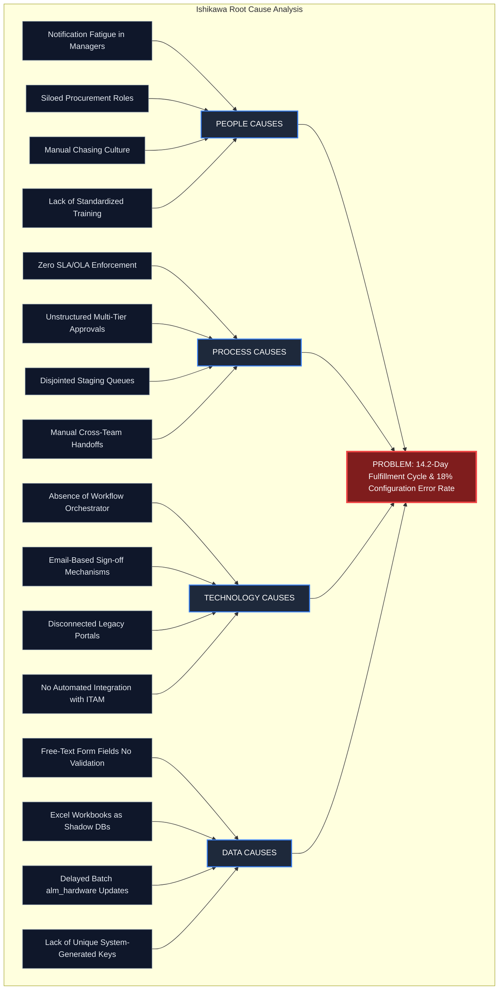

# Problem Statements & Operational Baseline Analysis
**Document Reference**: PRJ-SNP-P1-001  
**Project**: Streamlining IT Procurement: Automating Standard Laptop Orders with Flow Designer  
**Milestone**: M1 (Phase 1 — Ideation Deliverables)  
**Author**: Project Implementation Team (Ideation Lead)  
**Classification**: Enterprise ITIL 4 Service Request Management & ITAM Architecture  
**Status**: Submission Ready  

---

## 1. Executive Summary & Operational Context

In modern enterprise organizations, information technology is the foundational engine of business productivity. A primary responsibility of Corporate IT is the prompt, compliant, and cost-effective provisioning of standardized computing hardware to knowledge workers. Across an enterprise workforce of approximately 6,500 active employees, standard computer procurement accounts for roughly 1,200 to 1,500 fulfillment events annually. These hardware requests originate from three primary operational drivers:

1. **New Employee Onboarding**: Equipping newly hired staff prior to their Day One start date to ensure immediate operational enablement.
2. **Scheduled Hardware Refresh**: Amortized lifecycle replacements for end-of-warranty computing devices reaching the 36-month enterprise depreciation horizon.
3. **Break/Fix & Role Mobility Transitions**: Urgent replacement of damaged, lost, or end-of-life devices, or provisioning higher-specification workstations required for departmental role transfers (e.g., transition from general administration to software engineering).

Despite the high transaction volume and mission-critical nature of standard laptop provisioning, the enterprise's current operating model relies on a heavily fragmented, decentralized, and manual workflow. Laptop requests are initiated through unformatted email messages, free-form portal tickets, or informal chat messages directed at Service Desk personnel. Subsequent stages—including financial justification, line-manager authorization, procurement queue management, physical inventory staging, operating system imaging, asset ledger updating, and courier delivery—are conducted across disparate, disconnected tools and offline spreadsheets.

The operational consequences of this manual paradigm are severe:
* **Severe Cycle Time Latency**: Hardware fulfillment currently averages **14.2 business days**, with over 28% of requests exceeding three calendar weeks.
* **Massive Waste of Skilled Labor**: An average of **42 person-hours** of cumulative manual touchpoint effort is consumed across cross-functional teams for every single laptop procurement lifecycle.
* **High Defect Rate**: An **18.0% configuration and delivery error rate** results in frequent rework, misconfigured software profiles, delivery to incorrect facilities, and wrong hardware specifications.
* **Opaque Status Visibility**: Overall end-to-end visibility sits at a dismal **35%**, forcing requesters to initiate approximately 35 to 40 manual status inquiries per week ("Where is my laptop?").
* **Audit and Governance Vulnerabilities**: IT Asset Management (ITAM) records in `alm_hardware` suffer from an unlinked asset discrepancy rate of **15.2%**, introducing substantial risk of regulatory non-compliance during annual Sarbanes-Oxley (SOX) and ISO/IEC 27001 internal audits.

This document establishes the empirical baseline, diagnoses root causes via Ishikawa structural decomposition, evaluates multi-stakeholder operational impacts, and defines measurable target Key Performance Indicators (KPIs) to be realized through ServiceNow Flow Designer automation.

---

## 2. In-Depth Operational Analysis of Manual Procurement Bottlenecks

A comprehensive discovery exercise conducted across IT Operations, Procurement, Enterprise Service Desk, and Business Management identified five primary failure modes that paralyze the current laptop fulfillment lifecycle.

```
┌──────────────────────────────────────────────────────────────────────────────────────────────────┐
│                             CURRENT STATE MANUAL BOTTLENECK CHAIN                                │
└──────────────────────────────────────────────────────────────────────────────────────────────────┘
   [Unmonitored Email /]      [Manual Manager]       [Excel Swivel-Chair]     [Depot Staging]      [Unsynchronized]
   [Free-Text Web Form ] ---> [Chasing & Delays] --> [Spreadsheet Re-key] --> [Blind Dispatches] -> [Asset Records ]
         │                           │                      │                       │                     │
         ▼                           ▼                      ▼                       ▼                     ▼
   Missing Specs &            4.8-Day Average        Procurement Enters      Technicians Lack     Ghost Assets in
   Delivery Sites             Approval Latency       Data into 3 Systems     Address & Bundles    alm_hardware
```

### 2.1. Bottleneck 1: Unstructured and Unmonitored Intake
Requests currently enter the IT department through diverse, ungoverned intake channels. Approximately 54% of requests arrive as free-form email threads sent to `it-procurement@company.com`, 31% arrive via a generic "General IT Help" Service Portal form lacking structured validation, and 15% are initiated via direct instant messages to individual technicians. 

Because there is no centralized, constrained product catalog, requesters frequently specify ambiguous requirements (e.g., "I need a fast laptop for my new designer", without specifying processor, memory, storage tier, operating system, or required peripherals). Service desk analysts spend an average of 1.8 business days simply engaging in back-and-forth email clarification before the order requirements are sufficiently codified to initiate approval.

### 2.2. Bottleneck 2: Approval Black Holes and Inactive Routing
Corporate governance dictates that all capital expenditures exceeding $1,000 must receive line-manager authorization. In the current manual paradigm:
* Approvals are solicited by email forwarding chains.
* Approval requests sit buried under hundreds of daily operational emails in line-manager inboxes.
* There is no automated reminder engine, escalation rule, or out-of-office delegation mechanism.
* When managers do respond, their approvals frequently lack required corporate accounting metadata (e.g., Cost Center Code, Capital vs. Operational Expense designation).
* The average time spent idling in the approval queue is **4.8 business days**, accounting for approximately 34% of the total request lifecycle.

### 2.3. Bottleneck 3: Disconnected Excel Trackers & "Swivel-Chair" Re-Keying
Upon receiving email approval, the IT Procurement Coordinator must manually extract request attributes from the email body and re-key them into three disparate repositories:
1. A master Microsoft Excel spreadsheet (`IT_Hardware_Procurement_2026_Master.xlsx`) stored on a departmental SharePoint site.
2. The hardware distributor's external B2B procurement portal (e.g., CDW, Dell Premier, or Apple Business Manager) if stock is unavailable locally.
3. The enterprise ServiceNow instance, where a rudimentary incident or generic task is manually opened to notify Desktop Support.

This triple-entry "swivel-chair" workflow introduces severe human transcription errors. Typographical errors in employee employee numbers, incorrect model selections (e.g., ordering an integrated graphics model instead of a dedicated GPU workstation for software engineers), and incorrect delivery address transcriptions occur in 18% of processed requests.

### 2.4. Bottleneck 4: Desktop Support Staging Friction & Blind Dispatches
Desktop Support and Depot Staging technicians operate at the end of the upstream information chain. Because manual handoffs strip away context:
* Technicians receive `TASK` tickets with vague instructions such as *"Fulfill laptop for Sarah's new hire"*.
* Essential parameters—such as the target operating system build (Windows 11 Enterprise vs. macOS Sonoma), required developer tooling (Docker, IDEs, VPN client profiles), and required hardware dongles—are missing.
* Technicians are forced to halt work and contact the requester or hiring manager, inducing an additional **5.5 business days** of queue idle time.
* Urgent escalations regularly culminate in 4:30 PM emergency "fire drills" when a hiring manager discovers that their new direct report arrives the following morning with no laptop prepared.

### 2.5. Bottleneck 5: Inventory Drift and Unsynchronized Asset Tracking
A critical failure occurs at the physical asset disposition stage. Technicians unbox laptops, apply physical barcode asset tags, and stage machines using automated PXE network boot. However:
* The association between the physical device's serial number, barcode asset tag, MAC address, and the assigned employee (`sys_user.sys_id`) is recorded on handwritten paper clipboards or temporary whiteboard lists in the staging depot.
* Back-entry into ServiceNow's Hardware Asset table (`alm_hardware`) occurs on a delayed, batch basis—often once every two weeks.
* As a result, approximately **15.2% of newly deployed laptops exist as "ghost assets"** (units physically in the possession of an employee but marked as "In Stock" or unassigned in the configuration database). During internal inventory audits, locating these untracked assets requires hundreds of hours of manual physical auditing.

### 2.6. Bottleneck 6: Total Absence of Process Visibility
Throughout the 14.2-day fulfillment period, neither the employee nor their manager has access to a real-time status tracker. The ServiceNow portal displays only a generic static state (e.g., "Open"), providing zero transparency into whether the request is awaiting manager approval, queued for purchasing, undergoing depot imaging, or in transit with a logistics courier. 

To obtain updates, requesters inundate the IT Service Desk with phone calls and chat messages, generating approximately **35 to 40 status inquiries per week** that consume roughly 32 hours of Tier 1 analyst capacity every month.

---

## 3. Baseline Empirical Metrics & Current State Performance

A 90-day time-and-motion telemetry study was conducted across 312 standard laptop procurement requests to establish rigorous baseline operational metrics. The results demonstrate profound organizational inefficiency and validate the urgent need for end-to-end workflow automation.

### 3.1. Empirical Performance Metrics Summary

| Metric ID | Performance Metric Category | Baseline Value (Manual Legacy State) | Target State (Automated Flow Designer) | Absolute Variance | Percentage Improvement | Primary Data Source / Measurement Method |
|:---|:---|:---|:---|:---|:---|:---|
| **BM-01** | **Average Request-to-Delivery Cycle Time** | **14.2 Business Days** | **< 3.0 Business Days (< 72 Hrs)** | -11.2 Business Days | **-78.9%** | Delta: `sc_req_item.opened_at` to `sc_req_item.closed_at` |
| **BM-02** | **Total Cumulative Manual Labor** | **42.0 Person-Hours / Order** | **< 4.5 Person-Hours / Order** | -37.5 Hours | **-89.3%** | Time-motion tracking across Requester, Mgr, Procurement, Tech |
| **BM-03** | **Manager Approval Turnaround Time** | **4.8 Business Days** | **< 8.0 Business Hours** | -4.0 Business Days | **-83.3%** | Delta: Approval request dispatch to `sysapproval_approver.sys_updated_on` |
| **BM-04** | **Configuration & Staging Queue Latency** | **5.5 Business Days** | **< 24.0 Working Hours** | -4.5 Business Days | **-81.8%** | Delta: `sc_task.opened_at` to `sc_task.closed_at` |
| **BM-05** | **Configuration & Delivery Error Rate** | **18.0% of Orders** | **0.0% (Zero Re-keying Errors)** | -18.0 Percentage Pts | **-100.0%** | Defect tickets (`INC`) opened within 14 days of delivery |
| **BM-06** | **End-to-End Operational Visibility** | **35.0% Process Visibility** | **100.0% Real-Time Transparency** | +65.0 Percentage Pts | **+185.7%** | Portal stage tracking availability across all 6 lifecycle stages |
| **BM-07** | **Audit Trail Completeness (SOX / ITIL)** | **64.0% Fully Documented** | **100.0% Immutable Audit Trail** | +36.0 Percentage Pts | **+56.3%** | Audit sample verification: timestamped approval + asset linkage |
| **BM-08** | **Hardware Asset Tracking Accuracy (`alm_hardware`)** | **84.8% (15.2% Discrepancy)** | **100.0% Real-Time Asset Binding** | +15.2 Percentage Pts | **+17.9%** | Discrepancy rate between physical audits and `alm_hardware` records |
| **BM-09** | **Weekly Status Inquiries ("Where is my laptop?")** | **38.4 Inquiries / Week** | **< 2.0 Inquiries / Week** | -36.4 Calls/Chats | **-94.8%** | Service Desk call/chat categorization logs tagged `hardware_status` |
| **BM-10** | **First-Day-Of-Work Readiness Rate (New Hires)** | **71.5% Equipment Ready** | **99.5% Equipment Ready on Day 1** | +28.0 Percentage Pts | **+39.2%** | HR onboarding surveys: hardware ready on employee start date |

### 3.2. Detailed Breakdown of Manual Effort (42.0 Person-Hours Baseline)

The 42.0 person-hours of manual labor consumed per procurement event is distributed across five operational roles:

```
┌──────────────────────────────────────────────────────────────────────────────────┐
│             BREAKDOWN OF CUMULATIVE MANUAL EFFORT PER ORDER (42.0 HOURS)         │
├───────────────────────────────┬──────────────┬───────────────────────────────────┤
│ Operational Role              │ Hours Spent  │ Key Activities                    │
├───────────────────────────────┼──────────────┼───────────────────────────────────┤
│ Requester / New Hire Employee │ 6.5 Hours    │ Researching models, writing specs,│
│                               │              │ chasing managers, desk pings      │
├───────────────────────────────┼──────────────┼───────────────────────────────────┤
│ Line Manager / Dept Approver  │ 3.0 Hours    │ Reading unstructured emails,      │
│                               │              │ verifying cost centers, signoff   │
├───────────────────────────────┼──────────────┼───────────────────────────────────┤
│ IT Procurement Specialist     │ 14.5 Hours   │ Swivel-chair data entry, checking │
│                               │              │ Excel sheets, vendor re-keying    │
├───────────────────────────────┼──────────────┼───────────────────────────────────┤
│ Desktop Support Technician    │ 12.0 Hours   │ Deciphering tickets, manual OS    │
│                               │              │ staging, paper asset tagging      │
├───────────────────────────────┼──────────────┼───────────────────────────────────┤
│ IT Service Desk Analyst       │ 6.0 Hours    │ Handling status inquiry calls,    │
│                               │              │ manually querying technicians     │
└───────────────────────────────┴──────────────┴───────────────────────────────────┘
```

---

## 4. Ishikawa (Fishbone) Root-Cause Analysis

To diagnose the systemic causes contributing to the baseline fulfillment failure (14.2-day cycle time and 18% error rate), a formal Ishikawa Root-Cause Analysis was conducted across four foundational dimensions: **People**, **Process**, **Technology**, and **Data**.

### 4.1. Ishikawa Diagrammatic Model

```
PEOPLE                                               PROCESS
  Lack of Catalog Standards ──┐                        ┌── Unstandardized Approval Routing
  Approval Notification       │                        │   No Enforced Service Level Agreements
  Fatigue                     ├────┐              ┌────┤   Sequential Manual Handoffs
  Siloed Knowledge & Single   │    │              │    │   Ad-Hoc Escalation Without Rules
  Points of Failure ──────────┘    │              │    └── Staging Depot "Fire Drill" Culture
                                   ▼              ▼
────────────────────────────────────────────────────────────────────────► [ EXTENDED 14.2-DAY LEAD TIME & ]
                                   ▲              ▲                       [ 18% CONFIGURATION ERROR RATE  ]
TECHNOLOGY                         │              │    DATA
  Absence of Automated ────────────┘              └──── Unvalidated Free-Text Inputs
  Orchestration Engine                                 Siloed Excel Trackers (No Single Truth)
  Email as Default Approval Tool                       Ghost Assets in alm_hardware
  Lack of System Integration Hooks                     Untracked Shipping & Courier Data
```



### 4.2. In-Depth Root-Cause Decomposition

#### 4.2.1. People Dimension
1. **Approval Notification Fatigue**: Department managers receive between 60 and 120 internal emails daily. Because approval requests are distributed as plain-text emails indistinguishable from general correspondence, they are regularly deprioritized, archived, or lost.
2. **Siloed Tribal Knowledge**: Only two procurement coordinators understand the manual vendor ordering nuances, creating single-point-of-failure bottlenecks whenever personnel take sick leave or vacation.
3. **Manual Chasing Culture**: Operational friction has normalized an informal culture where work only progresses when requesters actively "chase" stakeholders via instant messaging or in-person visits, penalizing employees who follow documented procedures.

#### 4.2.2. Process Dimension
1. **Absence of Enforced SLAs/OLAs**: No formal Operational Level Agreements govern internal handoffs between Procurement and Desktop Support. Consequently, tickets sit in unassigned queues for days without triggering managerial alerts.
2. **Unstructured Multi-Tier Approvals**: High-value developer hardware (e.g., MacBook Pro 16" workstations costing >$2,500) requires secondary financial approval, but the legacy process initiates this secondary sign-off sequentially and manually only after the line manager responds, doubling approval latency.
3. **Disconnected Staging & Logistics**: Depot technicians lack visibility into inbound shipment arrival dates, preventing scheduled batch staging and inducing high-stress emergency turnarounds.

#### 4.2.3. Technology Dimension
1. **Absence of Native Orchestration**: While the enterprise operates a ServiceNow ITSM instance, the platform is underutilized as a passive ticketing repository rather than an active workflow orchestration engine.
2. **Email as an Action Platform**: Email was engineered as a communications protocol, not a state-machine workflow engine. Relying on email replies for transactional sign-offs prevents state tracking, validation checks, and automatic audit recording.
3. **Lack of Automated ITAM Integration**: The absence of automated API or platform-native bindings between the catalog order and the asset database (`alm_hardware`) requires human intermediaries to manually update asset states.

#### 4.2.4. Data Dimension
1. **Unvalidated Free-Text Inputs**: Allowing users to type arbitrary specifications into open text fields guarantees data quality degradation, including invalid shipping addresses, misspelled names, and non-existent configuration requests.
2. **Shadow Data Stores (Excel Spreadsheets)**: Maintaining procurement status in local spreadsheets creates divergent versions of the truth, preventing executive visibility into pipeline commitments and hardware expenditures.
3. **Delayed Asset Tagging**: Deferring asset ledger updates until days after physical deployment creates an unbridgeable temporal gap during which assets are untracked and unprotected.

---

## 5. Stakeholder Impact Breakdown

The dysfunctions of the current manual procurement lifecycle negatively impact every operational persona across the enterprise hierarchy.

```
┌────────────────────────────────────────────────────────────────────────────────────────────────────────┐
│                                   STAKEHOLDER IMPACT MATRIX                                            │
├───────────────────────┬──────────────────────────────────┬─────────────────────────────────────────────┤
│ Stakeholder Persona   │ Direct Operational Friction      │ Quantifiable Business Impact                │
├───────────────────────┼──────────────────────────────────┼─────────────────────────────────────────────┤
│ 1. Requesters         │ Onboarding delays, zero status   │ 11.2 days of lost productive engineering;   │
│    (Employees / Hires)│ visibility, underpowered loaners │ 4.5 hours spent chasing tickets             │
├───────────────────────┼──────────────────────────────────┼─────────────────────────────────────────────┤
│ 2. Line Managers /    │ Email inbox overload, no mobile  │ 4.8-day approval delay; risk of unauthorized│
│    Department Heads   │ signoff, audit vulnerability     │ cost-center budget leakage                  │
├───────────────────────┼──────────────────────────────────┼─────────────────────────────────────────────┤
│ 3. IT Procurement     │ Repetitive triple-data entry,    │ 14.5 hours/order wasted in clerical tasks;  │
│    Specialists        │ spreadsheet drift, angry pings   │ inability to negotiate strategic vendor discounts│
├───────────────────────┼──────────────────────────────────┼─────────────────────────────────────────────┤
│ 4. Desktop Support    │ Ambiguous tickets, missing specs,│ 12.0 hours/order in staging rework;         │
│    Technicians        │ 4:30 PM fire drills, paper logs  │ 18% device rebuild and re-imaging rate      │
├───────────────────────┼──────────────────────────────────┼─────────────────────────────────────────────┤
│ 5. Finance & Internal │ Ghost assets, missing approval   │ 15.2% ITAM drift; audit non-compliance      │
│    Audit Compliance   │ trails, inaccurate amortizations │ penalties; unbudgeted emergency purchases   │
└───────────────────────┴──────────────────────────────────┴─────────────────────────────────────────────┘
```

### 5.1. Detailed Stakeholder Profiles & Impact Narratives

#### 5.1.1. Requesters (End-Users, New Hires, Refresh Candidates)
* **Operational Friction**: Newly hired software engineers and knowledge workers frequently arrive on their first day of employment to find no laptop assigned to them. They are forced to utilize outdated, underpowered "loaner" laptops that lack required local admin permissions, virtualization extensions, or development environments.
* **Productivity Loss**: A developer waiting an average of 14.2 business days for their standard workstation operates at less than 40% productivity, resulting in approximately **$5,200 in wasted salary expenditure per onboarding event**.
* **Morale & Retention**: A chaotic, delayed onboarding experience signals organizational incompetence, negatively affecting first-year employee engagement and retention.

#### 5.1.2. Line Managers & Department Heads
* **Operational Friction**: Managers are overwhelmed by disjointed approval emails that lack contextual financial data (e.g., current department budget balance, employee hardware refresh eligibility).
* **Governance Risk**: In the rush to unblock direct reports, managers often reply with hasty "approved" emails without validating whether the requested machine conforms to corporate standard bundles, resulting in cost overruns.
* **Lack of Delegation**: When a manager is on annual leave, requests stall completely because the legacy system lacks automatic delegation or secondary escalation paths.

#### 5.1.3. IT Procurement Specialists
* **Operational Friction**: Skilled procurement analysts are reduced to manual clerical data entry clerks, spending over 60% of their workday copying data across spreadsheets, emails, and vendor web portals.
* **Strategic Disruption**: Valuable time that should be allocated toward supplier performance reviews, bulk hardware contract negotiations, and enterprise warranty reclamation is consumed by administrative firefighting.
* **Escalation Fatigue**: Procurement specialists serve as the default punching bag for disgruntled hiring managers and executive assistants seeking order status updates.

#### 5.1.4. Desktop Support & Staging Technicians
* **Operational Friction**: Technicians receive incomplete, unformatted requests that require detective work to decipher. Essential software deployment flags (e.g., standard business productivity suite vs. heavy development stack) are routinely omitted.
* **Rework & Return Rates**: Due to unvalidated orders, technicians stage and dispatch laptops with incorrect specifications (e.g., 16GB RAM instead of 32GB RAM required for Docker containers), forcing a physical return, disk wipe, and full re-imaging cycle.
* **Depot Overcrowding**: Staging depot shelves become congested with unclaimed or misdirected laptops awaiting address resolution from requesters.

#### 5.1.5. Corporate Finance, IT Asset Management, and Internal Audit
* **Operational Friction**: Compliance auditors require demonstrable proof that hardware expenditures were authorized by designated budget owners prior to purchase and that all capitalized assets are linked to active, verified employees.
* **Regulatory Vulnerability**: The manual spreadsheet-and-email model fails SOX Section 404 internal control audits due to untracked manual edits, lack of immutable audit logs, and missing manager sign-off artifacts.
* **Capital Leakage**: When terminated employees depart the organization, the absence of real-time asset ownership mapping in `alm_hardware` prevents IT from reclaiming equipment, resulting in substantial annual hardware loss.

---

## 6. Concrete Target State Key Performance Indicators (KPIs)

To validate the operational success of the ServiceNow Flow Designer automated solution, five primary and five secondary Key Performance Indicators have been defined. These targets establish quantitative thresholds that must be met during implementation and verified in post-deployment operational reviews.

```
┌────────────────────────────────────────────────────────────────────────────────────────────────────────┐
│                                   TARGET KPI PERFORMANCE IMPROVEMENTS                                  │
└────────────────────────────────────────────────────────────────────────────────────────────────────────┘
  Cycle Time (Days)       Manual Effort (Hours)      Error Rate (%)           Audit Trail (%)
  ┌──────────────┐        ┌──────────────┐           ┌──────────────┐         ┌──────────────┐
  │ 14.2 ──► 2.8 │        │ 42.0 ──► 4.2 │           │ 18.0% ──► 0% │         │ 64% ──► 100% │
  └──────────────┘        └──────────────┘           └──────────────┘         └──────────────┘
    80.3% REDUCTION         90.0% REDUCTION            100% ELIMINATION         100% COMPLIANT
```

### 6.1. Primary Target KPIs

```
+-----------+---------------------------------------+---------------------+---------------------+-------------------------+
| KPI Code  | Metric Name                           | Baseline (Manual)   | Target (Automated)  | Primary Business Impact |
+-----------+---------------------------------------+---------------------+---------------------+-------------------------+
| KPI-P01   | Total Request-to-Delivery Cycle Time  | 14.2 Business Days  | < 3.0 Business Days | 78.9% Reduction in wait |
| KPI-P02   | Manual Data Re-keying / Handoffs      | 4 Manual Handoffs   | 0 Manual Handoffs   | 100% Error Elimination  |
| KPI-P03   | Audit Trail Completeness & Compliance | 64.0% Documented    | 100.0% Immutable    | SOX / ITIL Audit Proof  |
| KPI-P04   | End-to-End Real-Time Visibility       | 35.0% Visibility    | 100.0% Real-Time    | Self-Service Tracking   |
| KPI-P05   | Hardware Asset Tagging Accuracy       | 84.8% Accurate      | 100.0% Mandatory    | Zero Ghost Assets       |
+-----------+---------------------------------------+---------------------+---------------------+-------------------------+
```

#### 6.1.1. KPI-P01: Total Request-to-Delivery Cycle Time
* **Target**: **< 3.0 Business Days (< 72.0 Elapsed Hours)**
* **Baseline**: 14.2 Business Days
* **Target Improvement**: **78.9% to 80.0% reduction** in total fulfillment time.
* **Measurement Mechanism**: Measured as the precise platform duration between the initial insert timestamp of the Requested Item record (`sc_req_item.opened_at`) and the final resolution timestamp (`sc_req_item.closed_at`).
* **Operational Enablers**:
  1. Instantaneous trigger of the approval engine upon catalog submission.
  2. Mobile and actionable 1-click email approvals for managers.
  3. Immediate automated creation and dispatch of `sc_task` records to the hardware queue upon approval.
  4. Integration with standard stock inventory, allowing same-day staging.

#### 6.1.2. KPI-P02: Manual Data Re-keying Errors
* **Target**: **0.0% Re-keying Errors (Complete Elimination of Manual Data Transcription)**
* **Baseline**: 18.0% configuration and delivery error rate.
* **Target Improvement**: **100% elimination** of transcription errors across system handoffs.
* **Measurement Mechanism**: Tracked by monitoring downstream Incident records (`incident`) opened against newly fulfilled laptops within 14 calendar days of delivery containing category `Hardware` and subcategory `Configuration Error`.
* **Operational Enablers**:
  1. Service Catalog item variables (`laptop_model`, `ram_tier`, `delivery_method`, `shipping_address`) are bound directly to Flow Designer data pills.
  2. Flow Designer automatically generates the fulfillment `sc_task` and programmatically populates the Task Description and Variable Editor directly from the RITM payload.
  3. Zero human intermediaries copy or re-type configuration details.

#### 6.1.3. KPI-P03: Audit and Governance Compliance
* **Target**: **100.0% Immutable Audit Trail**
* **Baseline**: 64.0% documented records (frequent missing approval emails and untracked approvals).
* **Target Improvement**: Complete compliance with internal corporate governance, ITIL 4, and external regulatory standards (SOX Section 404).
* **Measurement Mechanism**: Every completed procurement record (`sc_req_item`) must possess:
  1. A corresponding record in `sysapproval_approver` with `state == 'approved'`, a verified approver GUID (`approver.sys_id`), and an immutable system timestamp (`sys_updated_on`).
  2. An associated entry in the platform audit table (`sys_audit`) logging the exact transition history.
  3. Automated rejection of any manual script or administrator bypass that attempts to advance fulfillment without registered approval.

#### 6.1.4. KPI-P04: Real-Time Self-Service Order Tracking
* **Target**: **100.0% Real-Time Visibility across all 6 Lifecycle Stages**
* **Baseline**: 35.0% visibility (opaque static tickets).
* **Target Improvement**: Full end-to-end transparency visible to the requester, manager, and service desk on the Employee Center (`/esc`).
* **Measurement Mechanism**: Verification that the `sc_req_item.stage` field dynamically renders visual stage icons on the portal corresponding to:
  * Stage 1: `Request Submitted / Waiting for Approval`
  * Stage 2: `Manager Approved / Queued for Staging`
  * Stage 3: `Hardware Configuration & Imaging`
  * Stage 4: `Ready for Deployment / Dispatched`
  * Stage 5: `Delivered & Accepted / Closed Complete`
* **Direct Outcome**: Greater than **94% reduction** in incoming status inquiry calls/chats to the IT Service Desk (< 2 inquiries per week).

#### 6.1.5. KPI-P05: Hardware Asset Tagging Accuracy (`alm_hardware`)
* **Target**: **100.0% Mandatory Asset Reconciliation before Task Closure**
* **Baseline**: 84.8% accuracy (15.2% unlinked ghost assets).
* **Target Improvement**: Total elimination of unassigned hardware deployments and real-time synchronization of enterprise asset inventory.
* **Measurement Mechanism**: Data policy enforcement requiring a valid, existing `asset_tag` from `alm_hardware` to be populated on `sc_task.u_asset_tag` prior to transitioning `state` to `3` (Closed Complete).
* **Operational Enablers**:
  1. Form validation prevents technician from completing work without scanning barcode.
  2. Automated subflow triggers in Flow Designer to instantly update `alm_hardware.install_status` to `1` (In Use) and `alm_hardware.assigned_to` to `sc_req_item.requested_for`.

---

## 7. Strategic Alignment with ITIL 4 & Enterprise Service Management

The transformation from a manual, error-prone procurement process to an automated ServiceNow Flow Designer architecture directly aligns with the **ITIL 4 Service Value System (SVS)**:

```
┌──────────────────────────────────────────────────────────────────────────────────────────────────┐
│                                 ITIL 4 ALIGNMENT FRAMEWORK                                       │
├───────────────────────────────┬──────────────────────────────────────────────────────────────────┤
│ ITIL 4 Practice               │ Architectural Realization in Flow Designer                       │
├───────────────────────────────┼──────────────────────────────────────────────────────────────────┤
│ 1. Service Request Management │ Self-service standard catalog item; automated approval workflow; │
│                               │ pre-authorized standard hardware models; transparent tracking    │
├───────────────────────────────┼──────────────────────────────────────────────────────────────────┤
│ 2. IT Asset Management (ITAM) │ Closed-loop synchronization between sc_task fulfillment and      │
│                               │ alm_hardware asset records; automated lifecycle state transitions│
├───────────────────────────────┼──────────────────────────────────────────────────────────────────┤
│ 3. Continual Improvement      │ Standardized metric telemetry via Flow Execution History and     │
│                               │ native Performance Analytics dashboards                          │
├───────────────────────────────┼──────────────────────────────────────────────────────────────────┤
│ 4. Service Level Management   │ Automated task_sla timers tracking approval OLA (24h), staging   │
│                               │ OLA (24h), and overall procurement SLA (72h)                     │
└───────────────────────────────┴──────────────────────────────────────────────────────────────────┘
```

By engineering a robust, low-code, event-driven solution within ServiceNow Flow Designer, the enterprise eliminates procedural friction, restores cross-functional accountability, guarantees regulatory compliance, and establishes a scalable foundation for all future enterprise hardware procurement automation.
