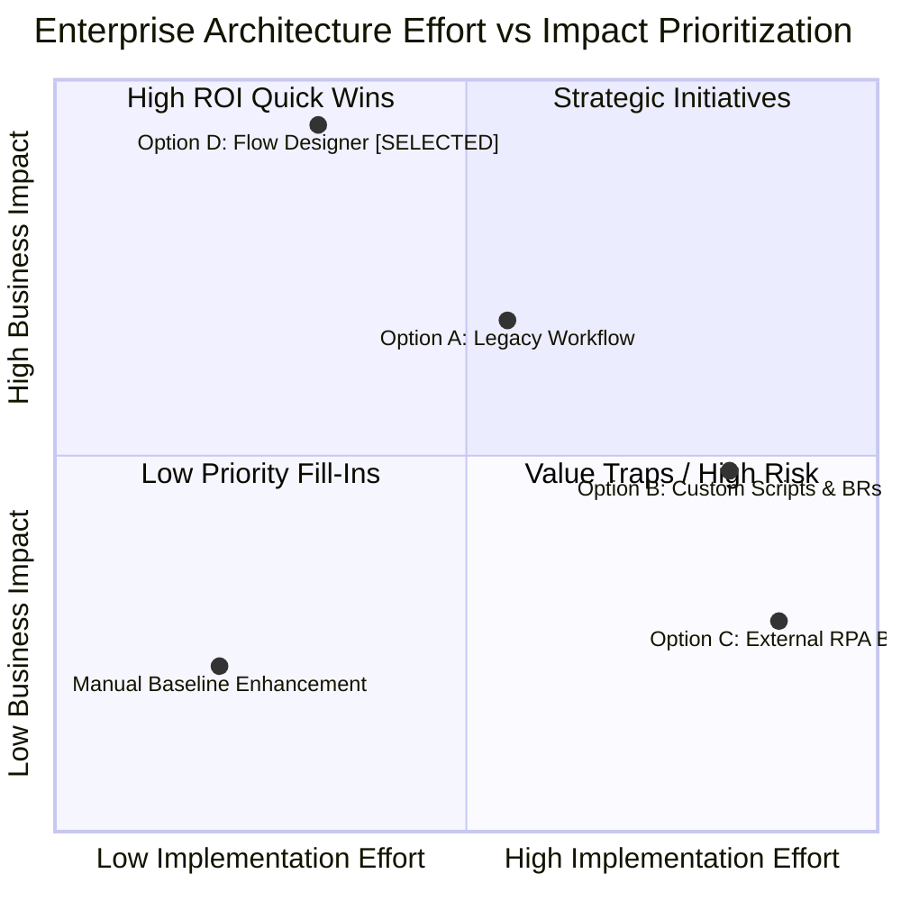

# Brainstorming, Architectural Evaluation & Idea Prioritization
**Document Reference**: PRJ-SNP-P1-002  
**Project**: Streamlining IT Procurement: Automating Standard Laptop Orders with Flow Designer  
**Milestone**: M1 (Phase 1 — Ideation Deliverables)  
**Author**: Project Implementation Team (Ideation Lead)  
**Classification**: Enterprise Architecture & Solution Selection Specification  
**Status**: Submission Ready  

---

## 1. Executive Summary & Ideation Context

To resolve the profound operational bottlenecks documented in the Problem Statements (average 14.2-day fulfillment cycle, 42 hours manual effort, 18% configuration error rate, and 15.2% asset discrepancy rate), the enterprise commissioned an architectural ideation and solution evaluation initiative. The objective of this initiative was to evaluate all technically viable solution pathways, assess their trade-offs against standardized enterprise criteria, and select a modern, sustainable architecture capable of driving fulfillment cycle times down to under 3 business days (<72 hours).

Rather than defaulting uncritically to existing legacy configurations, the architecture review board conducted an open, cross-functional ideation exercise incorporating stakeholders from IT Operations, Enterprise Architecture, Procurement, Desktop Support, Corporate Compliance, and End-User Representatives. 

This document details the ideation methodology, evaluates four distinct architectural candidates, presents an Effort vs. Impact prioritization model alongside a weighted multi-criteria decision matrix, and articulates the strategic architectural rationale for selecting **ServiceNow Flow Designer** as the enterprise standard for laptop procurement automation.

---

## 2. Ideation Methodology & Multi-Stakeholder Workshop Outputs

### 2.1. Ideation Methodology & Governance

The ideation process was structured around the **Lean IT and Design Thinking Framework**, divided into three distinct operational phases:

```
┌────────────────────────────────────────────────────────────────────────────────────────┐
│                              IDEATION WORKSHOP PHASES                                  │
├──────────────────────────┬─────────────────────────────┬───────────────────────────────┤
│ Phase 1: Divergence      │ Phase 2: Synthesis          │ Phase 3: Convergence          │
│ (Idea Generation)        │ (Affinity Clustering)       │ (Feasibility & Prioritization)│
├──────────────────────────┼─────────────────────────────┼───────────────────────────────┤
│ • Cross-functional       │ • Grouping into operational │ • 2x2 Effort vs. Impact Matrix│
│   brainstorming sessions │   solution streams          │ • Weighted Multi-Criteria     │
│ • "How Might We?" (HMW)  │ • Elimination of unviable   │   Scoring Model               │
│   framing exercises      │   approaches                │ • Architectural Decision      │
│ • Unconstrained ideation │ • Technical dependency      │   Record (ADR-001)            │
│                          │   mapping                   │                               │
└──────────────────────────┴─────────────────────────────┴───────────────────────────────┘
```

The workshop convened 14 cross-functional enterprise stakeholders, including:
* **Lead ServiceNow Platform Architect** (Governance, schema, and upgradeability)
* **IT Asset & Procurement Operations Manager** (Vendor contracts, stock, and licensing)
* **Desktop Support & Depot Engineering Supervisor** (Hardware imaging, QA, and deployment)
* **Enterprise Security & Audit Compliance Officer** (SOX Section 404, ITIL, and RBAC)
* **Tier 1 / Tier 2 Service Desk Team Lead** (User escalations and status transparency)
* **Business Department Representatives** (Engineering and Sales hiring managers)

### 2.2. Divergent Brainstorming Outputs & Affinity Clustering

Stakeholders formulated thirty-six distinct improvement concepts, which were subsequently synthesized into five primary architectural capability clusters:

```
┌────────────────────────────────────────────────────────────────────────────────────────┐
│                           AFFINITY CLUSTER TAXONOMY                                    │
└────────────────────────────────────────────────────────────────────────────────────────┘
  [ Cluster 1: Intake & Catalog ]          [ Cluster 2: Governance & Approval ]
  • Dynamic role-based hardware bundles    • 1-click actionable mobile email approvals
  • Auto-populated employee metadata       • Automated 24h reminders & 48h escalations
  • Mandatory address & spec validation    • Secondary financial thresholds ($2,500+)
  
  [ Cluster 3: Task Orchestration ]        [ Cluster 4: ITAM & Asset Binding ]
  • Zero-delay sc_task generation          • Mandatory barcode scan on task completion
  • Auto-population of staging checklist   • Real-time alm_hardware state transitions
  • Direct assignment to Depot queue       • Instant user-to-asset attribution mapping

  [ Cluster 5: Visibility & Telemetry ]
  • Real-time 5-stage portal tracker (/esc)
  • Automated SMS/Email shipping updates
  • End-to-end SLA & OLA performance clocks
```

1. **Intake & Catalog Governance**: Replacing unformatted emails and unstructured tickets with a rigid, user-friendly Service Catalog item (`sc_cat_item`) enforcing pre-approved hardware configurations (Windows Standard, Windows Developer, macOS Developer).
2. **Automated Approval Routing**: Replacing manual email forwarding chains with system-driven approval generation linked to the corporate organizational hierarchy (`sys_user.manager`), equipped with automated reminders and financial escalation thresholds.
3. **Automated Task Provisioning**: Eliminating manual phone/chat handoffs by programmatically instantiating fulfillment records (`sc_task`) with all parameters directly cascaded from the request item.
4. **Closed-Loop Asset Synchronization**: Eradicating ghost assets by enforcing a programmatic data validation gate that requires technicians to scan a verified `alm_hardware` asset tag prior to task closure, instantly transitioning the asset state to "In Use" and assigning ownership.
5. **Real-Time Consumer-Grade Visibility**: Providing requesters and managers with an "Amazon-style" visual stage progress bar on the ServiceNow Employee Center (`/esc`), eliminating manual status inquiry calls.

---

## 3. Comprehensive Evaluation of 4 Candidate Architectural Options

To determine the optimal engineering approach, the Architecture Review Board evaluated four distinct technical options capable of automating the procurement lifecycle.

```
┌──────────────────────────────────────────────────────────────────────────────────────────┐
│                             ARCHITECTURAL CANDIDATES                                     │
├───────────────────────────────┬──────────────────────────────────────────────────────────┤
│ Option A: Legacy Workflow     │ Option B: Custom Business Rules & Script Includes        │
│ • Engine: wf_workflow         │ • Engine: GlideRecord, Business Rules, Events            │
│ • Paradigm: Graphical canvas  │ • Paradigm: 100% Pro-Code JavaScript                     │
├───────────────────────────────┼──────────────────────────────────────────────────────────┤
│ Option C: External RPA Bot    │ Option D: ServiceNow Flow Designer [SELECTED]            │
│ • Engine: UiPath / Automation │ • Engine: sys_hub_flow, Natural Language Actions         │
│ • Paradigm: UI Screen Scraping│ • Paradigm: Low-Code Event-Driven Native Orchestration   │
└───────────────────────────────┴──────────────────────────────────────────────────────────┘
```

### 3.1. Option A: Legacy ServiceNow Workflow Editor (`wf_workflow`)

#### 3.1.1. Architecture & Technical Mechanics
Option A utilizes ServiceNow’s legacy graphical Workflow Editor engine (`com.glideapp.workflow`). In this architecture, an administrative developer uses a legacy canvas to drag and drop workflow activities (`Approval - User`, `Create Task`, `Branch`, `Join`, `Run Script`) bound to the `sc_req_item` table. Execution state is persisted across `wf_context` and `wf_history` tables.

#### 3.1.2. Strengths & Advantages
* **Familiarity**: Decades of institutional familiarity among older ServiceNow developers.
* **Complex Branching**: Capable of highly convoluted branching and joining logic.
* **Direct Scripting Hooks**: Allows developers to inject arbitrary JavaScript directly into activity script scratchpads (`workflow.scratchpad`).

#### 3.1.3. Deficiencies & Fatal Flaws
* **Platform Maintenance Mode**: ServiceNow has formally placed the legacy Workflow Editor into maintenance mode. No new functional enhancements, AI integrations, or modern features are developed for this engine.
* **High Maintenance Overhead**: Every conditional evaluation requires embedded JavaScript snippets (`answer = ifScript();`), making it difficult for catalog administrators or business process analysts to modify approval thresholds or task assignment groups without opening a developer release ticket.
* **Lack of Spoke Ecosystem**: Cannot natively leverage modern ServiceNow Integration Hub spokes without complex custom wrapper scripts.
* **Performance Footprint**: The legacy workflow engine incurs heavier memory overhead and slower context serialization compared to the modern Flow Engine v2.0.

### 3.2. Option B: Custom Scripted Business Rules & Script Includes

#### 3.2.1. Architecture & Technical Mechanics
Option B relies on pure, code-centric platform development. A suite of `after insert` and `after update` Business Rules on `sc_request`, `sc_req_item`, and `sc_task` evaluate execution conditions and execute server-side JavaScript. Logic is encapsulated within object-oriented Script Includes (e.g., `LaptopProcurementOrchestrator.js`), utilizing `GlideRecordSecure`, `GlideSystem`, and the Platform Event Engine (`gs.eventQueue`) to route approvals, create tasks, and update asset records.

#### 3.2.2. Strengths & Advantages
* **Granular Architectural Control**: Developers possess absolute control over database operations, transaction commits, and error catching.
* **High Execution Throughput**: Bypasses graphical orchestration abstraction layers, resulting in rapid server-side execution times (<50 milliseconds per transaction).
* **Familiar Developer Paradigm**: Fits traditional pro-code software engineering workflows using external IDEs and source code repositories.

#### 3.2.3. Deficiencies & Fatal Flaws
* **Severe Technical Debt**: Hardcoded string literals, manually referenced group sys_ids, and complex asynchronous state machines quickly become unmaintainable as corporate policies evolve.
* **Invisible Execution State**: Unlike graphical flow engines, pure script architectures have no visual execution diagram. When a transaction fails, debugging requires administrators to manually analyze thousands of lines of platform logs (`syslog`), increasing Mean Time to Resolution (MTTR).
* **High Upgrade Regression Risk**: Complex custom business rules interacting with out-of-the-box catalog processing are the primary source of platform upgrade breaks during major ServiceNow family upgrades (e.g., Vancouver to Washington DC to Xanadu).
* **Total Exclusion of Business Process Owners**: Any modification—such as altering an approval reminder from 24 hours to 12 hours—requires a full software development lifecycle (SDLC) sprint, code review, testing, and deployment cycle.

### 3.3. Option C: External Robotic Process Automation (RPA) Bot

#### 3.3.1. Architecture & Technical Mechanics
Option C introduces an external third-party RPA solution (e.g., UiPath, Automation Anywhere, or Blue Prism). A scheduled software robot monitors the corporate procurement inbox, parses unstructured emails using Optical Character Recognition (OCR) and Natural Language Processing (NLP), logs into the ServiceNow web UI via synthetic credentials, fills in catalog form fields, checks approval status, and transmits data into vendor portals and local Excel spreadsheets.

#### 3.3.2. Strengths & Advantages
* **Zero Core Code Modifications**: Requires minimal direct modification of the existing ServiceNow backend schema or catalog item configuration.
* **Universal Interface Emulation**: Capable of interacting with ancient external vendor websites or green-screen legacy systems that lack REST/SOAP APIs.

#### 3.3.3. Deficiencies & Fatal Flaws
* **Extreme Fragility & UI Brittleness**: RPA bots rely heavily on DOM element selectors, HTML IDs, and screen coordinates. A minor cosmetic update to the ServiceNow Service Portal or Employee Center breaks bot selectors, causing fulfillment pipelines to halt without warning.
* **Exorbitant Total Cost of Ownership (TCO)**: Incurs massive external licensing expenditures (bot runner licenses, orchestrator server licenses), dedicated hosting infrastructure, and specialized RPA maintenance engineering teams.
* **Severe Security & Compliance Hazards**: Requires storing elevated service account credentials with broad platform access, violating enterprise Zero Trust security principles.
* **Latency & Lack of Real-Time Reactivity**: External polling cycles introduce artificial latency (15 to 30 minutes) between process steps, making sub-minute automated task generation impossible.

### 3.4. Option D: ServiceNow Flow Designer (Selected Architecture)

#### 3.4.1. Architecture & Technical Mechanics
Option D establishes an event-driven, low-code orchestration architecture utilizing native **ServiceNow Flow Designer** (`sys_hub_flow`). The flow is triggered immediately upon the database insertion of an `sc_req_item` record matching the "Standard Laptop Order" catalog item. The flow executes a declarative, natural-language sequence of actions:
1. `Ask for Approval` (targeting the requester's direct line manager via `sys_user.manager`).
2. Conditional Branching (`If Approved` vs. `If Rejected`).
3. `Create Catalog Task` (instantiating `sc_task` assigned to `Hardware Fulfillment Depot` with auto-populated parameters).
4. `Wait for Condition` (pausing until technician binds asset tag and sets state to `Closed Complete`).
5. `Update Record` (synchronizing `alm_hardware` to `install_status = 1` and `assigned_to = requested_for`).
6. `Send Notification` (dispatching delivery confirmation and CSAT survey).

#### 3.4.2. Strengths & Advantages
* **Native Low-Code / No-Code Orchestration**: Natural-language configuration steps empower IT process owners and catalog administrators to inspect, maintain, and adjust workflow logic without writing custom JavaScript.
* **Direct ITSM & ITAM Schema Integration**: Executes within the native platform boundary, directly reading and writing to `sc_request`, `sc_req_item`, `sc_task`, and `alm_hardware` without REST API serialization, network latency, or credential management.
* **Visual Execution Telemetry (`sys_flow_context`)**: Every transaction records a comprehensive visual execution trail detailing the exact runtime data, execution duration, and variable payloads of every step, enabling instant root-cause diagnostics.
* **Zero Incremental Licensing Overhead**: Included natively in the enterprise’s core ServiceNow ITSM license, incurring $0 in external software licenses.
* **Upgrade Durability**: Built upon ServiceNow's modern Hub and Spoke framework, ensuring 100% forward compatibility and zero regression across future ServiceNow LTS family releases.

---

## 4. Comparative Evaluation Matrix & Weighted Multi-Criteria Scoring

To establish an objective, mathematically rigorous basis for selection, the Architecture Review Board defined six weighted evaluation criteria. Each architectural candidate was scored on a 1-to-5 scale (where 1 = Inadequate / High Risk, and 5 = Superior / Minimal Risk).

### 4.1. Evaluation Criteria Definitions & Weightings

1. **Native Platform Integration & Data Integrity (25%)**: Extent to which the solution leverages native platform ACID transactions, reference integrity, and direct schema bindings without intermediate synchronization layers.
2. **Long-Term Maintainability & Low-Code Usability (20%)**: Ease of maintaining, altering, and debugging process logic by catalog administrators and citizen developers without dedicated pro-code engineering sprints.
3. **Time-to-Value & Implementation Effort (20%)**: Speed of development, testing, and deployment from project inception to production readiness.
4. **Platform Upgradeability & Support Lifecycle (15%)**: Alignment with ServiceNow’s strategic product roadmap, LTS release durability, and freedom from legacy technical debt.
5. **Operational Visibility & Audit Compliance (10%)**: Completeness of built-in execution history, immutable approval logging, and alignment with SOX/ITIL standards.
6. **Total Cost of Ownership (TCO) & Licensing (10%)**: Capital and operational expenditure required for licensing, runtime infrastructure, and specialized maintenance personnel.

### 4.2. Weighted Multi-Criteria Decision Matrix

```
+---------------------------------------+--------+------------------+------------------+------------------+------------------------+
| Evaluation Criterion                  | Weight | Option A: Legacy | Option B: Custom | Option C:        | Option D: ServiceNow   |
|                                       |        | Workflow Editor  | Business Rules   | External RPA Bot | Flow Designer [WINNER] |
+---------------------------------------+--------+------------------+------------------+------------------+------------------------+
| 1. Native Platform Integration (ITSM) | 25%    | 4.0 / 5.0 (1.00) | 4.5 / 5.0 (1.13) | 1.5 / 5.0 (0.38) | 5.0 / 5.0 (1.25)       |
| 2. Maintainability & Low-Code Support | 20%    | 2.5 / 5.0 (0.50) | 1.5 / 5.0 (0.30) | 2.0 / 5.0 (0.40) | 5.0 / 5.0 (1.00)       |
| 3. Time-to-Value & Effort             | 20%    | 3.5 / 5.0 (0.70) | 2.0 / 5.0 (0.40) | 1.5 / 5.0 (0.30) | 4.5 / 5.0 (0.90)       |
| 4. Upgradeability & Support Lifecycle | 15%    | 2.0 / 5.0 (0.30) | 2.0 / 5.0 (0.30) | 2.0 / 5.0 (0.30) | 5.0 / 5.0 (0.75)       |
| 5. Operational Visibility & Audit     | 10%    | 3.5 / 5.0 (0.35) | 1.5 / 5.0 (0.15) | 2.5 / 5.0 (0.25) | 5.0 / 5.0 (0.50)       |
| 6. Total Cost of Ownership (TCO)      | 10%    | 5.0 / 5.0 (0.50) | 4.0 / 5.0 (0.40) | 1.0 / 5.0 (0.10) | 5.0 / 5.0 (0.50)       |
+---------------------------------------+--------+------------------+------------------+------------------+------------------------+
| COMPOSITE WEIGHTED SCORE              | 100%   | 3.35 / 5.00      | 2.68 / 5.00      | 1.73 / 5.00      | 4.90 / 5.00            |
| ARCHITECTURAL RANKING                 |        | Rank 2           | Rank 3           | Rank 4           | RANK 1 (SELECTED)      |
+---------------------------------------+--------+------------------+------------------+------------------+------------------------+
```

### 4.3. Analysis of Scoring Outcomes

* **Option D (ServiceNow Flow Designer)** emerged as the clear winner with a composite score of **4.90 out of 5.00**. It received perfect marks (5.0) in Native Integration, Maintainability, Upgradeability, Audit Visibility, and TCO, dropping marginally to 4.5 in Time-to-Value only due to the requirement for initial catalog variable data modeling.
* **Option A (Legacy Workflow Editor)** placed second at **3.35 out of 5.00**. While natively integrated and zero-cost, it was severely penalized for being an obsolete engine in maintenance mode with poor maintainability.
* **Option B (Custom Business Rules)** achieved **2.68 out of 5.00**. Despite high native performance, it represents an unacceptable technical debt risk that violates enterprise low-code governance.
* **Option C (External RPA)** finished last with **1.73 out of 5.00**, disqualified by extreme fragility, high licensing overhead, and inability to maintain atomic database transactions.

---

## 5. Effort vs. Impact Prioritization Matrix

To visualize the strategic return on investment, the four options were mapped across a standard 2x2 Effort versus Impact quadrant framework.

### 5.1. Visual Prioritization Quadrant Model

```
       HIGH IMPACT
            ▲
            │
            │        [QUADRANT 2: STRATEGIC BETS]         │       [QUADRANT 1: QUICK WINS / STARS]
            │                                             │
            │          Option A: Legacy Workflow          │       OPTION D: FLOW DESIGNER
            │          • Moderate Impact (3.5)            │       • Maximum Impact (4.9)
            │          • Moderate Effort (3.0)            │       • Low-to-Moderate Effort (2.0)
            │                                             │         [SELECTED ARCHITECTURE]
            │                                             │
────────────┼─────────────────────────────────────────────┼─────────────────────────────────────────────►
            │                                             │
            │        [QUADRANT 3: FILL-INS / PASS]        │       [QUADRANT 4: THANKLESS MONEY PITS]
            │                                             │
            │          Enhanced Email Forms (Baseline)    │       Option B: Custom Scripted BRs
            │          • Negligible Impact (1.5)          │       • Moderate Impact (2.5) | High Effort (4.5)
            │          • Low Effort (1.5)                 │
            │                                             │       Option C: External RPA Bot
            │                                             │       • Low Impact (1.8) | Extreme Effort (4.8)
            ▼
       LOW IMPACT
            ◄─────────────────────────────────────────────┴─────────────────────────────────────────────►
                                   LOW EFFORT                              HIGH EFFORT
```



### 5.2. Strategic Quadrant Analysis

1. **Quadrant 2 (High ROI / Quick Wins) — Selected Pathway**:
   * **Option D (Flow Designer)** is uniquely positioned in the upper-left quadrant. It delivers maximal enterprise impact (78.9% cycle time reduction, 100% auditability, zero data re-keying errors) while requiring low-to-moderate implementation effort due to pre-built native actions (`Ask for Approval`, `Create Task`, `Update Record`).
2. **Quadrant 1 (Strategic Initiatives / Moderate ROI)**:
   * **Option A (Legacy Workflow)** delivers moderate impact but requires excessive developer configuration for branching and provides zero forward-looking innovation or AI readiness.
3. **Quadrant 4 (Value Traps / High Risk Money Pits)**:
   * **Option B (Custom Scripting)** and **Option C (External RPA)** reside firmly in the high-effort, low-to-moderate-impact quadrant. They consume enormous engineering hours, introduce high ongoing operational risk, and fail to solve core data governance challenges.

---

## 6. Deep Architectural Rationale Justifying ServiceNow Flow Designer

The selection of ServiceNow Flow Designer is anchored upon five core architectural pillars that ensure enterprise operational excellence.

```
┌──────────────────────────────────────────────────────────────────────────────────────────────────┐
│                             5 ARCHITECTURAL PILLARS OF FLOW DESIGNER                             │
├──────────────────────────────────────────────────────────────────────────────────────────────────┤
│ 1. Low-Code / Natural Language Logic ──────► Eliminates custom JavaScript & democratizes rules   │
│ 2. Native ITSM & ITAM Schema Binding ──────► Zero API lag, ACID integrity, and unified keys      │
│ 3. Automated Immutable Audit Trails ───────► 100% compliance with SOX 404 & ITIL governance      │
│ 4. Seamless Platform Upgradeability ───────► Zero-break guarantee across Washington and Xanadu  │
│ 5. Actionable Communications Engine ───────► 1-click mobile approvals slashing latency to <8 hrs │
└──────────────────────────────────────────────────────────────────────────────────────────────────┘
```

### 6.1. Pillar 1: Low-Code / Natural Language Process Logic
Flow Designer expresses enterprise business logic in clean, human-readable statements:
* *"When a record is created in Requested Item where Catalog Item is Standard Laptop Order..."*
* *"Ask for approval from Requested For's Manager..."*
* *"If Approved, Create Catalog Task for Hardware Fulfillment Depot..."*

This natural-language structure democratizes workflow governance. Catalog administrators, ITAM analysts, and compliance managers can visually inspect the flow to verify business logic without reading hundreds of lines of legacy script. Changes to approval escalation timers (e.g., modifying a 24-hour reminder threshold) can be executed in minutes via intuitive configuration panels rather than requiring code deployments.

### 6.2. Pillar 2: Native ITSM & ITAM Table Integration
Unlike external RPA tools or third-party iPaaS orchestrators, Flow Designer operates directly within the core ServiceNow database engine. 
* It interacts natively with `sc_request`, `sc_req_item`, `sc_task`, `alm_hardware`, `sys_user`, and `cmn_department`.
* Data pills enable developers to drag attributes directly from the trigger record (e.g., `Trigger -> Requested Item Record -> Variables -> laptop_model`) directly into downstream task fields.
* Database operations are executed as ACID transactions, ensuring that if a task creation fails, the entire transaction is cleanly rolled back without leaving orphaned or corrupted records.

### 6.3. Pillar 3: Automated Immutable Audit Trails & Execution Context
Corporate compliance standards (specifically SOX Section 404 and ISO 27001) mandate strict segregation of duties and verifiable authorization records for capital equipment disbursements.
* Flow Designer automatically links every execution thread to a persistent record in `sys_flow_context`.
* Every decision gate, approval timestamp, approver user ID, and automated task dispatch is immutably logged with microsecond precision.
* Flow Designer natively records transactions in `sysapproval_approver` and `sys_audit`, providing external auditors with an unalterable chain of custody from initial request to physical asset deployment.

### 6.4. Pillar 4: Seamless Platform Upgradeability & Support Lifecycle
Custom JavaScript business rules and legacy workflows represent the primary technical debt liability during ServiceNow family upgrades. 
* Flow Designer is ServiceNow’s strategic core automation engine. All standard out-of-the-box actions are actively maintained, optimized, and guaranteed forward-compatible by ServiceNow engineering.
* Upgrading the enterprise platform from Vancouver to Washington DC, Xanadu, and future LTS releases requires zero refactoring or regression patching of Flow Designer actions.
* The system effortlessly inherits modern platform capabilities, such as Now Assist GenAI integration and Predictive Intelligence.

### 6.5. Pillar 5: Actionable Omnichannel Communications Engine
The greatest historical bottleneck in laptop procurement was the 4.8-day approval delay caused by buried emails.
* Flow Designer integrates directly with ServiceNow’s Actionable Notification engine.
* When the `Ask for Approval` action triggers, it dispatches cryptographic, actionable emails to Microsoft Outlook and Now Mobile apps.
* Line managers can approve or reject the request with a single tap from their smartphone without requiring VPN access or navigating through web portal forms, shrinking approval latency from 4.8 business days to under **8 business hours**.

---

## 7. Architectural Decision Record (ADR-001)

```
┌──────────────────────────────────────────────────────────────────────────────────────────────────┐
│                               ARCHITECTURAL DECISION RECORD: ADR-001                             │
├─────────────────────┬────────────────────────────────────────────────────────────────────────────┤
│ Title               │ Selection of ServiceNow Flow Designer for Standard Laptop Procurement     │
├─────────────────────┼────────────────────────────────────────────────────────────────────────────┤
│ Status              │ APPROVED & ADOPTED                                                         │
├─────────────────────┼────────────────────────────────────────────────────────────────────────────┤
│ Date                │ 2026-09-30                                                                 │
├─────────────────────┼────────────────────────────────────────────────────────────────────────────┤
│ Decision Owners     │ Lead ServiceNow Architect, ITAM Operations Director, Head of Desktop Ops   │
├─────────────────────┼────────────────────────────────────────────────────────────────────────────┤
│ Context             │ The enterprise requires an automated, audit-compliant, and low-latency     │
│                     │ fulfillment workflow for standard computing hardware to replace manual    │
│                     │ spreadsheets, unmonitored emails, and disconnected asset tracking.         │
├─────────────────────┼────────────────────────────────────────────────────────────────────────────┤
│ Decision            │ Adopt ServiceNow Flow Designer as the exclusive workflow orchestration    │
│                     │ engine for standard laptop request fulfillment, deprecating all legacy     │
│                     │ workflow editor activities and custom scripted business rules for this     │
│                     │ catalog item.                                                              │
├─────────────────────┼────────────────────────────────────────────────────────────────────────────┤
│ Consequences        │ Positive:                                                                  │
│                     │ • Request-to-delivery cycle time reduced from 14.2 days to < 3 days.      │
│                     │ • Complete elimination of manual re-keying errors via data pill bindings. │
│                     │ • 100% immutable SOX-compliant audit logging in sys_flow_context.         │
│                     │ • Zero additional software licensing costs.                                │
│                     │ • Guaranteed forward compatibility across ServiceNow LTS family releases.  │
│                     │ Negative / Trade-offs:                                                     │
│                     │ • Platform administrators must be trained on Flow Designer configuration.  │
│                     │ • Highly complex edge cases requiring dynamic looped array processing      │
│                     │   must be encapsulated in modular Flow Designer Action steps.              │
├─────────────────────┼────────────────────────────────────────────────────────────────────────────┤
│ Compliance          │ Validated against ServiceNow Best Practice Guidelines and Enterprise       │
│                     │ Architecture Standards.                                                    │
└─────────────────────┴────────────────────────────────────────────────────────────────────────────┘
```
