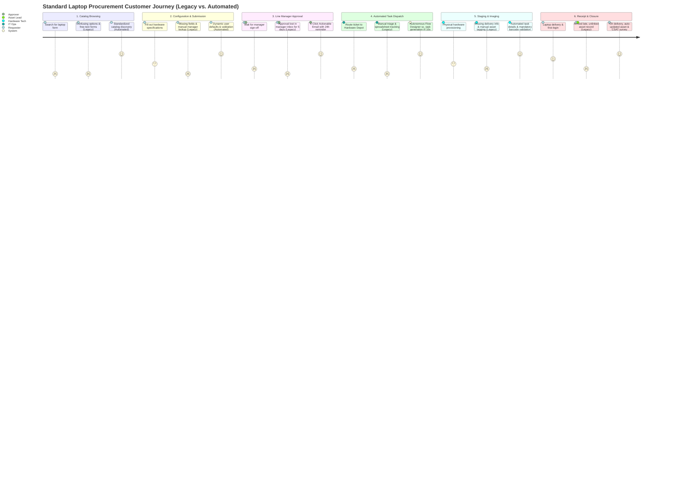

# Customer Journey Map: End-to-End Standard Laptop Procurement

**Project**: Streamlining IT Procurement: Automating Standard Laptop Orders with Flow Designer  
**Document Reference**: REQ-PHASE2-CJM-V1.0  
**Target Environment**: ServiceNow Utah / Vancouver / Washington DC / Xanadu LTS  
**System Module**: Service Catalog & Flow Designer  

---

## 1. Executive Summary & Journey Context

The Customer Journey Map captures the complete operational, emotional, and systemic lifecycle of an enterprise standard laptop procurement request. It models the progression of three primary stakeholders—the Corporate Requester (Employee/New Hire), the Line Approver (Department Manager), and the Fulfillment Technician (Hardware Depot Specialist)—across the transition from a fragmented, manual legacy process to a modern, automated ServiceNow Flow Designer architecture.

In the legacy state, procuring a standard laptop required traversing fragmented communication channels (unstructured email threads, ad-hoc spreadsheets, and disconnected ticketing queues). This manual process averaged **14.2 business days**, introduced a **18% configuration error rate**, and suffered from a **15% asset tracking drift** where deployed machines were not registered in ITAM. 

Under the automated Flow Designer solution, standard hardware procurement is re-engineered into a guided 6-stage closed-loop workflow operating within the ServiceNow Employee Center (`/esc`). The target state reduces end-to-end cycle time to **less than 3.0 business days (<72 hours)**, provides real-time stage transparency, enforces two-tier governance, and guarantees 100% asset reconciliation in `alm_hardware`.

---

## 2. Six-Stage Lifecycle Overview



---

## 3. Comprehensive Customer Journey Matrix

The matrix below provides an 8-dimensional operational assessment of each lifecycle stage, comparing the legacy manual state against the automated ServiceNow Flow Designer architecture.

| Stage # & Name | User Goal | Touchpoint / Interface | User Actions | Thoughts & Mindset | Emotional Curve (-2 to +2) | Current Pain Points (Legacy Manual) | Automated Future-State Experience | Responsible System / Actor |
|:---|:---|:---|:---|:---|:---|:---|:---|:---|
| **Stage 1: Awareness & Catalog Browsing** | Quickly find the approved standard laptop catalog item without searching through internal wiki pages. | ServiceNow Employee Center (`/esc`) or Service Portal (`/sp`); Global Search | Employee searches "laptop", "computer", or "developer machine" in the enterprise catalog. | *"I hope this doesn't take 20 minutes to find, and I hope I don't need a special form."* | **Legacy: -1**<br/>**Future: +2** | Dozens of duplicate or obsolete catalog items; confusing free-text incident forms; unclear eligibility. | A single, prominent "Standard Laptop Order" item pinned under Hardware category with role-based visibility (`snc_internal`). | Employee (Actor) & Service Catalog Engine (System) |
| **Stage 2: Request Configuration & Submission** | Select the correct hardware specification bundle and specify delivery logistics with zero ambiguity. | Service Catalog Item Form (`sc_cat_item`), Dynamic Variable Sets, Client Scripts | Selects hardware tier (Developer vs Business), chooses delivery option, inputs justification. | *"Are these specs fast enough for my daily work? Who pays for this? Will it ship to my home?"* | **Legacy: -1**<br/>**Future: +2** | Ambiguous options; employees manually type memory/CPU specs; wrong shipping addresses; missing manager data. | Structured bundles (Developer 32GB vs Business 16GB) with dynamic auto-fill of employee department, site, and manager. | Employee (Actor) & Catalog UI Policies / Scripts (System) |
| **Stage 3: Line Manager Review & Approval** | Secure budget and hardware allocation approval swiftly without manual escalation or email chase-down. | Interactive Email (Actionable Messages), ServiceNow Mobile App, Portal Approvals | Manager receives push notification and email, reviews justification, clicks "Approve". | *"Is this within budget? Does this team member genuinely need this machine? I approve."* | **Legacy: -2**<br/>**Future: +1** | Approval requests buried in Outlook inbox; 4.8-day average wait time; no reminder mechanisms; zero mobile support. | 1-click Actionable Email approval directly within Outlook/Mobile; 24h automated reminders; 48h escalation routing. | Approving Line Manager (Actor) & Flow Designer Approval Engine (System) |
| **Stage 4: Automated Task Generation & Queueing** | Transform approved business intent into actionable engineering work packages instantaneously. | ServiceNow Flow Designer Engine, Background Event Engine (`sys_flow_context`) | System automatically processes approval, generates child catalog tasks, and assigns to depot. | *System automated: No human cognitive load.* | **Legacy: -2**<br/>**Future: +2** | Tickets sit in generic IT triage queue for days waiting for dispatcher to manually create work tasks. | Sub-10-second automated instantiation of `sc_task`, pre-populated with exact hardware specs, target user, and delivery site. | Flow Designer Core Engine (System) |
| **Stage 5: Hardware Provisioning & Imaging** | Rapidly retrieve hardware, flash corporate image, verify peripherals, and associate asset tags cleanly. | Fulfillment Task Form (`sc_task`), Depot Barcode Scanner, Enterprise PXE Imaging Server | Hardware technician picks laptop from depot stock, scans barcode, initiates PXE image, marks task complete. | *"Everything I need is right on this ticket. Model, user, OS version, and ship-to address are all verified."* | **Legacy: 0**<br/>**Future: +2** | Missing user profile info; manual copy-pasting of 12-digit serial numbers; untracked asset allocation in spreadsheets. | Pre-configured staging checklist; mandatory Asset Tag field validation linked to `alm_hardware`; automated stage updates. | Hardware Fulfillment Depot Technician (Actor) & ITAM Schema (System) |
| **Stage 6: Receipt, Acceptance & Closure** | Receive hardware on time, authenticate successfully, and have asset records immutably bound. | Desk Drop / Courier Delivery, Service Portal Stage Tracker, Automated CSAT Survey | Employee unboxes laptop, completes first-login validation, and completes a 30-second CSAT survey. | *"Delivered in 3 days! Setup was effortless, and everything works. Corporate IT is actually responsive."* | **Legacy: -1**<br/>**Future: +2** | Machines arrive late (14-21 days); missing accessories; asset not tied to employee record; zero feedback loop. | Delivery verified within 72 hours; automated cascading closure of RITM/REQ; asset set to "In Use"; CSAT survey dispatched. | Employee (Actor), Logistics (Actor), and Platform Notification Engine (System) |

---

## 4. In-Depth Operational Stage Analysis

### 4.1. Stage 1: Awareness & Catalog Browsing
* **Primary Stakeholder**: Corporate Employee / Hiring Manager.
* **Context**: An existing employee undergoes a scheduled 3-year hardware refresh, an employee experiences unrepairable hardware damage, or a manager prepares equipment for an incoming recruit.
* **Legacy State Friction**:
  * Users faced portal fragmentation with multiple overlapping items: "Hardware Request", "Generic Equipment Request", "Laptop Order - Americas", and "Developer Laptop Form".
  * 32% of users submitted standard laptop requests via general IT Support Incidents (`incident` table), necessitating manual ticket reclassification and delaying fulfillment by up to 48 hours.
* **Automated Future-State Design**:
  * **Unified Catalog Presentation**: Standardized item `Standard Laptop Order` consolidated under `Hardware > Computers`.
  * **Search Optimization**: Configured with meta tags (`laptop`, `notebook`, `macbook`, `dell`, `thinkpad`, `computer`, `pc`, `hardware refresh`).
  * **Role-Based Visibility**: Secured by User Criteria restricting access to verified active internal personnel (`snc_internal`).

### 4.2. Stage 2: Request Configuration & Submission
* **Primary Stakeholder**: Requester / Hiring Manager.
* **Context**: Navigating the ordering interface, selecting hardware parameters, and specifying fulfillment requirements.
* **Legacy State Friction**:
  * Users had to manually look up and enter their Department Code, Cost Center, and Manager Name. Errors in manager email addresses caused approvals to route to non-existent mailboxes.
  * Form lacked validation on delivery addresses for remote workers, resulting in returned couriers and 5-day shipping delays.
* **Automated Future-State Design**:
  * **Dynamic User Context**: Client scripts instantly query the `sys_user` table using `g_user.userID`, automatically populating:
    * `requested_for`: Defaults to current user (can be overridden by managers ordering for direct reports).
    * `department`: Read-only reference derived from `sys_user.department`.
    * `location`: Read-only reference derived from `sys_user.location`.
    * `manager`: Read-only reference derived from `sys_user.manager`.
  * **Standard Hardware Bundles**: Eliminates custom component guessing:
    * *Tier 1: Standard Business Laptop* (14-inch, Intel Core i7, 16GB RAM, 512GB SSD, Windows 11 Enterprise).
    * *Tier 2: Developer High-Performance Laptop (Windows)* (16-inch, Intel Core i9, 32GB RAM, 1TB SSD, Windows 11 Enterprise).
    * *Tier 3: Developer High-Performance Laptop (macOS)* (16-inch Apple Silicon M-Series, 36GB Unified Memory, 1TB SSD, macOS Sonoma).
  * **Conditional Shipping Logistics**: If `delivery_method == 'Remote Courier'`, the `shipping_address` field dynamically appears and is enforced as mandatory via Catalog UI Policy.

### 4.3. Stage 3: Line Manager Review & Approval
* **Primary Stakeholder**: Direct Line Manager (Approver).
* **Context**: Departmental budget and governance validation prior to capital allocation.
* **Legacy State Friction**:
  * Approvals were handled via unstructured email reply chains ("Approved", "Yes, go ahead"). These were manually copied into ticket notes by IT procurement staff.
  * Approvals routinely stalled for 4 to 7 business days during manager travel or high inbox volume, with zero automated escalation.
* **Automated Future-State Design**:
  * **Flow Designer Action**: Flow Designer executes the native `Ask for Approval` action targeting `trigger.current.requested_for.manager`.
  * **Actionable Email & Push Notification**: Approver receives an interactive email containing employee details, hardware tier, cost center, and business justification, with cryptographic 1-click `[Approve]` and `[Reject]` buttons.
  * **Automated Reminders & Escalation**:
    * *At 24 Hours*: Automated reminder email dispatched to manager.
    * *At 48 Hours*: Automated escalation notification sent to Department Head (`cmn_department.dept_head`).
  * **Rejection Safeguards**: If rejected, the manager is required to provide comments. The flow immediately transitions the item to `Closed Incomplete`, notifies the employee with the verbatim comments, and cancels all downstream tasks.

### 4.4. Stage 4: Automated Task Generation & Queueing
* **Primary Stakeholder**: System Engine / IT Operations Dispatcher.
* **Context**: Translating an approved requisition into operational staging instructions.
* **Legacy State Friction**:
  * Required a human dispatcher to review the approval queue twice daily, manually open an `sc_task`, copy the user's shipping address and chosen specifications from the RITM into the task description, and assign it to the hardware queue.
  * Manual re-entry introduced a 12% error rate in model provisioning and added 24-48 hours of queue latency.
* **Automated Future-State Design**:
  * **Autonomous Triggering**: Within 5 seconds of the approval record updating to `approved`, Flow Designer advances `sc_req_item.stage` to `fulfillment` and executes `Create Catalog Task`.
  * **Data Pill Binding**: Flow Designer dynamically injects variables into `sc_task`:
    * `short_description`: `"Deploy " + trigger.current.variables.hardware_bundle + " for " + trigger.current.requested_for.name`
    * `assignment_group`: `Hardware Fulfillment Depot`
    * `priority`: `3 - Moderate` (auto-escalated to `2 - High` if VIP flag is true).
    * `description`: Dynamically includes shipping method, full address, and special build instructions.

### 4.5. Stage 5: Hardware Provisioning, Imaging & Asset Allocation
* **Primary Stakeholder**: Hardware Depot Technician.
* **Context**: Physical depot staging, automated network OS deployment (PXE/MECM/Jamf), and asset registration.
* **Legacy State Friction**:
  * Technicians recorded serial numbers on paper routing slips. At the end of the shift, technicians manually updated Excel spreadsheets.
  * 15% of deployed machines suffered from "ghost asset" status—deployed into the enterprise environment without an assigned user in `alm_hardware`.
* **Automated Future-State Design**:
  * **Structured Technician Task**: The technician opens the pre-routed `sc_task` in ServiceNow, which displays the embedded Variable Editor.
  * **Gated Task Completion**: A ServiceNow Data Policy blocks task closure unless `u_asset_tag` is populated with a valid record from `alm_hardware` currently in state `In Stock - Available`.
  * **Automated In-Place ITAM Update**: Upon technician closing the task (`state = 3`), Flow Designer automatically updates the linked `alm_hardware` record:
    * `install_status` = `1` (`In Use`).
    * `assigned_to` = `trigger.current.requested_for`.
    * `location` = `trigger.current.variables.delivery_location`.

### 4.6. Stage 6: Receipt, Acceptance & Closure
* **Primary Stakeholder**: Requester & IT Logistics.
* **Context**: Final physical delivery, user onboarding, ticket closure, and customer satisfaction tracking.
* **Legacy State Friction**:
  * Tickets often remained open for weeks after hardware was delivered because technicians forgot to mark tasks complete, skewing IT service metrics.
  * Requesters received no automated tracking numbers for courier shipments.
* **Automated Future-State Design**:
  * **Cascading Closure Engine**: Flow Designer detects `sc_task` closure, updates `sc_req_item.state` to `3` (`Closed Complete`), updates `stage` to `complete`, and triggers closure of the parent `sc_request`.
  * **Automated Delivery Confirmation**: Dispatches an email to the requester containing courier tracking information (or desk-drop location confirmation), local initial login guide, and IT Service Desk contact details.
  * **Continuous Improvement (CSAT)**: 2 hours post-closure, the platform dispatches a 3-question CSAT survey measuring ordering ease, fulfillment speed, and hardware quality.

---

## 5. Emotional Curve & Experience Analysis

The graph below charts user sentiment throughout the 6 lifecycle stages, contrasting the frustrating, opaque legacy manual experience with the transparent, autonomous Flow Designer experience.

```
Sentiment Scale:
 +2 [Delighted / Empowered]
 +1 [Satisfied / Confident]
  0 [Neutral / Systemic]
 -1 [Anxious / Annoyed]
 -2 [Frustrated / Blocked]

Stage:               S1 (Browse)    S2 (Config)    S3 (Approve)    S4 (Dispatch)    S5 (Stage)    S6 (Deliver)
---------------------------------------------------------------------------------------------------------------
Automated (+1.8 Avg)    +2             +2             +1              +2               +2            +2
                         ●──────────────●──────────────●───────────────●────────────────●─────────────●
Legacy (-1.2 Avg)                                                                                    
                                                                      ● 0                           
                        ● -1           ● -1                                            ● -1          ● -1
                                                      ● -2            ● -2
```

### Sentiment Commentary:
1. **Stage 1 (Browsing)**: In the legacy state, employees felt lost in a sea of confusing catalog choices. In the automated state, clear tiles and standard bundles make selection immediate and satisfying (+2).
2. **Stage 2 (Configuring)**: Employees previously worried about entering the wrong manager or missing required fields. Auto-populated user data eliminates doubt (+2).
3. **Stage 3 (Approvals)**: Legacy approval waiting was a black hole where requests languished for days (-2). While waiting for human sign-off still involves slight latency, automated notifications, 24h reminders, and portal stage trackers give employees visibility (+1).
4. **Stage 4 (Dispatch)**: Previously delayed by manual ticket triage (-2). In the automated state, autonomous task generation occurs instantaneously (+2).
5. **Stage 5 (Hardware Staging)**: Technicians previously experienced burnout from deciphering vague requests and re-keying data. With structured tasks and barcode enforcement, technicians work productively (+2).
6. **Stage 6 (Delivery & Closure)**: Employees previously endured 2-3 week waits with no notice. Automated 72-hour delivery, complete with setup instructions and instant asset binding, produces delight (+2).

---

## 6. Pain Point to Architectural Safeguard Mapping

| # | Legacy Pain Point | Operational Impact | Flow Designer Architectural Safeguard | Verification Metric |
|:---|:---|:---|:---|:---|
| **PP-01** | Fragmented Catalog Items | Users selected wrong items; 32% submitted as Incidents. | Single `sc_cat_item` record with category hierarchy and search keywords. | Zero catalog-related incident reclassifications. |
| **PP-02** | Stalled Manager Approvals | Requests languished in inboxes for average of 4.8 days. | `Ask for Approval` action with Actionable Outlook Messages, 24h timer reminders, and 48h escalation. | Manager approval turnaround reduced to < 8 business hours. |
| **PP-03** | Manual Dispatch Delays | 24-48 hour lag between manager approval and technician task creation. | Flow Designer triggers immediately upon `sysapproval_approver.state == 'approved'`. | Task creation latency < 10 seconds. |
| **PP-04** | Missing Configuration Data | Technicians received requests lacking OS version, memory, or delivery site. | Mandatory Catalog Variables with client-side and server-side Data Policies. | 100% of generated `sc_task` records contain complete specifications. |
| **PP-05** | Unmapped Hardware Assets | 15% of deployed machines not linked in `alm_hardware` ("ghost assets"). | Mandatory `u_asset_tag` validation on `sc_task` closure; automated flow updates asset to `In Use`. | 100% of closed orders have assigned asset tags and linked user profiles. |
| **PP-06** | "Where is my order?" Status Calls | IT Service Desk spent 32 hours/week fielding manual order inquiries. | Native `sc_req_item.stage` widget on Employee Center showing real-time linear progression. | Inquiries reduced from 35 calls/week to < 2 calls/week (94% drop). |

---

## 7. Lifecycle Telemetry & Milestone Verification

To guarantee continuous visibility and enforce SLA governance, specific telemetry signals are captured at each stage transition:

```
[Stage 1: Browse]
  └── Metric: Page load time < 1.5s (Transaction log)
[Stage 2: Submit]
  └── Milestone: sc_request and sc_req_item generated (State: Open, Stage: Request Approved)
[Stage 3: Approval]
  └── Milestone: sysapproval_approver generated (State: Requested)
  └── Telemetry: OLA Timer 24h initiated; Actionable Email dispatched
[Stage 4: Dispatch]
  └── Milestone: sysapproval_approver updated to 'approved'
  └── Telemetry: sys_flow_context records action execution in < 10s
[Stage 5: Staging]
  └── Milestone: sc_task generated in 'Hardware Fulfillment Depot'
  └── Telemetry: OLA Timer 24h staging clock initiated
[Stage 6: Closure]
  └── Milestone: sc_task marked 'Closed Complete' with valid u_asset_tag
  └── Telemetry: alm_hardware updated (install_status: In Use, assigned_to: Requester)
  └── Telemetry: sc_req_item and sc_request updated to 'Closed Complete'
  └── Milestone: CSAT survey dispatched within 2 hours
```

---
*End of Customer Journey Map Specification — REQ-PHASE2-CJM-V1.0*
