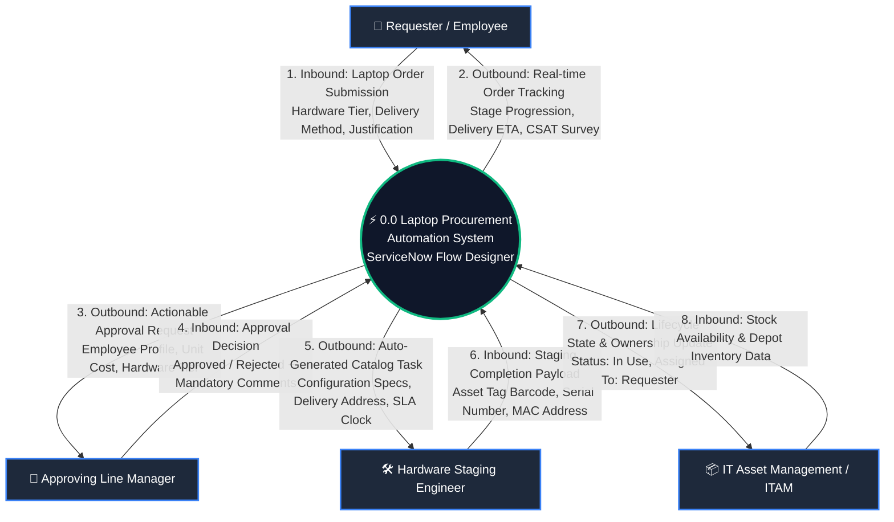
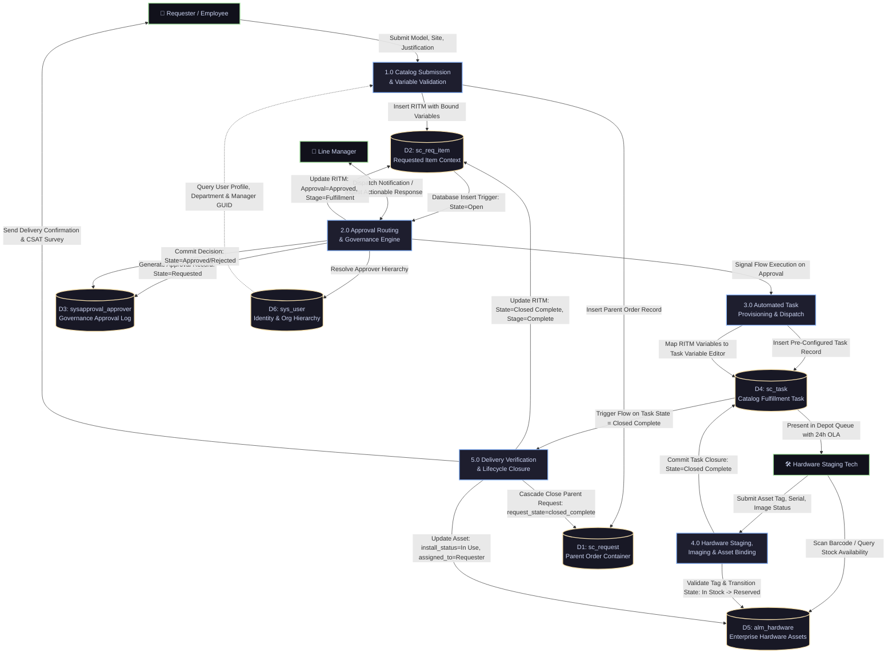

# Data Flow Diagrams (DFD) & Agile User Stories

**Project**: Streamlining IT Procurement: Automating Standard Laptop Orders with Flow Designer  
**Document Reference**: REQ-PHASE2-DFD-US-V1.0  
**Target Environment**: ServiceNow Utah / Vancouver / Washington DC / Xanadu LTS  
**System Module**: Service Catalog, Flow Designer, ITAM (`alm_hardware`)  

---

## 1. Executive Summary

This deliverable provides the comprehensive data architectural model and functional specification for the automated Standard Laptop Procurement system. It articulates the precise information exchanges, transformations, database interactions, and user requirements driving the automated workflow.

The document is organized into three major sections:
1. **Data Flow Architecture**: High-fidelity Level 0 Context Diagram and Level 1 Functional Decomposition Diagram rendered in Mermaid format.
2. **ServiceNow Core Data Dictionary**: Schema specifications for all primary transactional, governance, asset, and foundational tables.
3. **Agile Epics & User Stories**: 8 detailed user stories structured across 3 epics totaling 26 story points, complete with MoSCoW prioritization and Gherkin acceptance criteria (Given-When-Then).

---

## 2. Data Flow Architecture

### 2.1. DFD Level 0: Enterprise Context Diagram

The Level 0 Context Diagram establishes the operational system boundary. It defines the four external human and systemic entities interacting with the **0.0 Laptop Procurement Automation System** (powered by ServiceNow Flow Designer) and illustrates all inbound and outbound data streams.



#### Inbound & Outbound Data Stream Catalog (Level 0)

| Stream ID | Direction | External Entity | Payload Description | Triggering Event / Frequency |
|:---|:---|:---|:---|:---|
| **DS-01** | Inbound | Requester / Employee | Catalog submission parameters: `requested_for`, `hardware_bundle`, `delivery_method`, `shipping_address`, `business_justification`. | On-demand submission via Service Portal (`/esc`). |
| **DS-02** | Outbound | Requester / Employee | Real-time stage progression updates (`waiting_for_approval`, `fulfillment`, `delivery`, `complete`), shipment tracking number, first-login setup guide, and post-delivery CSAT survey. | Event-driven on flow stage changes and task closure. |
| **DS-03** | Outbound | Approving Line Manager | Actionable approval payload: Requester name, department, cost center, hardware specifications, total unit cost, justification text, and cryptographic 1-click decision tokens. | Flow action `Ask for Approval` on RITM insert. |
| **DS-04** | Inbound | Approving Line Manager | Approval decision token (`approved` or `rejected`), digital signature timestamp, and required rejection rationale comments. | Manager action via Outlook Actionable Message, ServiceNow Mobile, or Portal. |
| **DS-05** | Outbound | Hardware Staging Engineer | Pre-populated fulfillment task (`sc_task`): Hardware bundle specifications, OS build version, delivery destination, SLA deadline (24 hours), and parent RITM link. | Automatic generation upon successful approval. |
| **DS-06** | Inbound | Hardware Staging Engineer | Physical staging completion payload: Scanned `u_asset_tag`, verified manufacturer serial number, network MAC address, and checklist completion confirmation. | Technician marks `sc_task` as Closed Complete. |
| **DS-07** | Outbound | IT Asset Management (ITAM) | Relational database write updating `alm_hardware`: Transition `install_status` from `6` (In Stock) to `1` (In Use), clear `substatus`, set `assigned_to` = Requester GUID, update `location`. | Transactional commit on `sc_task` closure. |
| **DS-08** | Inbound | IT Asset Management (ITAM) | Hardware catalog metadata, model product numbers (`cmdb_hardware_product_model`), active depot stock levels, and available asset tag pools. | Real-time query during form rendering and asset allocation. |

---

### 2.2. DFD Level 1: Functional Process Decomposition Diagram

The Level 1 Diagram decomposes the system into five discrete automated and human processing stages, detailing their bidirectional interactions with ServiceNow core database stores.



#### Detailed Process Specifications (Level 1)

* **Process 1.0: Catalog Submission & Variable Validation**
  * *Input Data*: User input selections from Service Portal form; session context from `g_user`.
  * *Transformation Logic*: Validates mandatory fields; evaluates client-side catalog UI policies; queries `sys_user` for requester's manager, department, and location.
  * *Output Data*: Atomically creates parent `sc_request` and child `sc_req_item` with bound variable dictionary.
* **Process 2.0: Approval Routing & Governance Engine**
  * *Input Data*: Newly inserted `sc_req_item` record; `requested_for.manager` pointer.
  * *Transformation Logic*: Executes Flow Designer `Ask for Approval` action; generates actionable email with cryptographic tokens; initiates 24h reminder and 48h escalation timers; evaluates branch (Approved vs. Rejected).
  * *Output Data*: Updated `sysapproval_approver` record; updated `sc_req_item.approval` (`approved`/`rejected`) and `stage` (`fulfillment`/`request_cancelled`).
* **Process 3.0: Automated Task Provisioning & Dispatch**
  * *Input Data*: Approval signal from Process 2.0; RITM variable dictionary.
  * *Transformation Logic*: Executes Flow Designer `Create Catalog Task` action; binds hardware model, delivery method, and address into `sc_task.description`; assigns to `Hardware Fulfillment Depot` group; initiates 24h staging OLA clock.
  * *Output Data*: Inserted `sc_task` record in `Open` state.
* **Process 4.0: Hardware Staging, Imaging & Asset Binding**
  * *Input Data*: Depot technician inputs (scanned asset tag barcode, serial number, imaging status).
  * *Transformation Logic*: Data Policy verifies asset tag existence and `install_status == 6` (In Stock) in `alm_hardware`; technician executes automated PXE OS flash; marks task `Closed Complete`.
  * *Output Data*: `sc_task.state` updated to `3` (`Closed Complete`); asset temporarily marked `Reserved`.
* **Process 5.0: Delivery Verification & Lifecycle Closure**
  * *Input Data*: Completion event of child `sc_task`.
  * *Transformation Logic*: Flow Designer detects task completion; writes final updates to `alm_hardware` (`install_status = 1` - In Use, `assigned_to = sc_req_item.requested_for`); updates `sc_req_item.state = 3` (`Closed Complete`); triggers parent `sc_request` cascading closure; dispatches delivery email and 2h delayed CSAT survey.
  * *Output Data*: Fully closed request container; reconciled asset record; CSAT survey record.

---

## 3. ServiceNow Core Data Dictionary & Schema Specifications

The automated procurement solution strictly utilizes standard, out-of-the-box ServiceNow ITSM and ITAM tables. No custom tables are introduced, preserving seamless platform upgradeability across LTS releases.

### 3.1. Request Table (`sc_request`)
Extends `task`. Acts as the commercial order container for shopping cart checkouts, billing, and high-level tracking.

| Field Name | Column Label | Type | Length / Ref | Mand. | Choice Values / System Rules | Description & Automation Behavior |
|:---|:---|:---|:---|:---:|:---|:---|
| `sys_id` | Sys ID | `sys_id` | 32 hex | Yes | System generated GUID | Primary key. |
| `number` | Number | `string` | 40 | Yes | Read-only; Prefix `REQ` | Unique auto-generated request number (e.g., `REQ0010042`). |
| `requested_for` | Requested For | `reference` | `sys_user` | Yes | Foreign key to `sys_user` | Employee who will receive and utilize the ordered hardware. |
| `opened_by` | Opened By | `reference` | `sys_user` | Yes | Defaults to current session | User who submitted the catalog item. |
| `approval` | Approval | `choice` | 40 | Yes | `not_requested`, `requested`, `approved`, `rejected` | Aggregated approval status across child requested items. |
| `request_state` | Request State | `choice` | 40 | Yes | `in_process`, `closed_complete`, `closed_cancelled` | State of overall request container. Closed automatically when all child RITMs close. |
| `price` | Total Price | `currency` | Decimal(15,2)| No | Calculated sum | Aggregate monetary cost of all ordered items in cart. |
| `opened_at` | Opened | `glide_date_time` | N/A | Yes | Auto-stamped | Timestamp marking requisition entry into the platform. |
| `closed_at` | Closed | `glide_date_time` | N/A | No | Auto-stamped | Timestamp set when parent request reaches terminal state. |

---

### 3.2. Requested Item Table (`sc_req_item`)
Extends `task`. Represents the specific standard laptop ordered and serves as the operational execution context for Flow Designer.

| Field Name | Column Label | Type | Length / Ref | Mand. | Choice Values / System Rules | Description & Automation Behavior |
|:---|:---|:---|:---|:---:|:---|:---|
| `sys_id` | Sys ID | `sys_id` | 32 hex | Yes | System generated GUID | Primary key. |
| `number` | Number | `string` | 40 | Yes | Read-only; Prefix `RITM` | Unique auto-generated item number (e.g., `RITM0010085`). |
| `request` | Parent Request | `reference` | `sc_request` | Yes | Foreign key | Direct relational link to parent `sc_request` container. |
| `cat_item` | Catalog Item | `reference` | `sc_cat_item` | Yes | Foreign key | References "Standard Laptop Order" catalog definition. |
| `state` | State | `choice` | 40 | Yes | `1` (Open), `2` (Work in Progress), `3` (Closed Complete), `4` (Closed Incomplete), `7` (Closed Skipped) | Core execution state. Managed directly by Flow Designer actions. |
| `stage` | Stage | `choice` | 40 | Yes | `request_approved`, `waiting_for_approval`, `fulfillment`, `delivery`, `complete` | Linear progress stage displayed to end-users on Service Portal stage tracker. |
| `approval` | Approval | `choice` | 40 | Yes | `not_requested`, `requested`, `approved`, `rejected` | Direct item approval status updated by `Ask for Approval` flow action. |
| `configuration_item` | Configuration Item | `reference` | `cmdb_ci_computer` | No | Foreign key | Linked CMDB CI representing the computer asset once imaged. |
| `context` | Flow Context | `reference` | `sys_flow_context` | System | Foreign key | Pointer to the active Flow Designer execution engine instance. |
| `work_notes` | Work Notes | `journal_input` | 4000 | No | Audit journal | System audit entries logged during flow branch execution. |

---

### 3.3. Catalog Task Table (`sc_task`)
Extends `task`. Represents the physical fulfillment work unit assigned to the Hardware Depot engineering team.

| Field Name | Column Label | Type | Length / Ref | Mand. | Choice Values / System Rules | Description & Automation Behavior |
|:---|:---|:---|:---|:---:|:---|:---|
| `sys_id` | Sys ID | `sys_id` | 32 hex | Yes | System generated GUID | Primary key. |
| `number` | Number | `string` | 40 | Yes | Read-only; Prefix `TASK` | Unique auto-generated task number (e.g., `TASK0010231`). |
| `request_item` | Requested Item | `reference` | `sc_req_item` | Yes | Foreign key | Pointer back to parent RITM record. |
| `assignment_group` | Assignment Group | `reference` | `sys_user_group` | Yes | Foreign key | Populated by Flow Designer to `Hardware Fulfillment Depot`. |
| `assigned_to` | Assigned To | `reference` | `sys_user` | No | Foreign key | Individual technician who claims the task from the depot queue. |
| `short_description` | Short Description | `string` | 160 | Yes | Dynamic string | E.g., `Deploy Developer Standard (Windows) for Alex Chen`. |
| `description` | Description | `string` | 4000 | Yes | Dynamic multi-line text | Formatted instructions containing model, delivery method, and address. |
| `state` | State | `choice` | 40 | Yes | `1` (Open), `2` (Work in Progress), `3` (Closed Complete), `4` (Closed Incomplete) | Operational staging state. Monitored by `Wait for Condition` flow step. |
| `priority` | Priority | `choice` | 40 | Yes | `1` (Critical), `2` (High), `3` (Moderate), `4` (Low) | Default `3` (Moderate); escalated to `2` (High) for VIP requesters. |
| `u_asset_tag` | Asset Tag | `string` | 40 | Yes* | Must match `alm_hardware.asset_tag` | *Enforced mandatory via Data Policy prior to setting state to `Closed Complete`. |

---

### 3.4. Hardware Asset Table (`alm_hardware`)
Extends `alm_asset`. Represents physical enterprise hardware inventory and tracking records.

| Field Name | Column Label | Type | Length / Ref | Mand. | Choice Values / System Rules | Description & Automation Behavior |
|:---|:---|:---|:---|:---:|:---|:---|
| `sys_id` | Sys ID | `sys_id` | 32 hex | Yes | System generated GUID | Primary key. |
| `asset_tag` | Asset Tag | `string` | 40 | Yes | Unique index string | Barcoded enterprise asset tag (e.g., `AST-009482`). |
| `serial_number` | Serial Number | `string` | 100 | Yes | Unique manufacturer string | Machine serial number flashed in BIOS / chassis. |
| `model` | Model | `reference` | `cmdb_hardware_product_model` | Yes | Foreign key | Product model pointer (e.g., `Dell Latitude 7440`, `MacBook Pro 16"`). |
| `install_status` | Status | `choice` | 40 | Yes | `1` (In Use), `2` (In Maintenance), `6` (In Stock), `7` (Retired) | Physical lifecycle state. Transitions from `6` to `1` upon flow completion. |
| `substatus` | Substatus | `choice` | 40 | No | `available`, `reserved`, `pending_install`, `defective` | Granular operational state. Cleared to `NULL` when asset enters `In Use`. |
| `assigned_to` | Assigned To | `reference` | `sys_user` | Cond. | Foreign key | Populated with `sc_req_item.requested_for` upon closure. |
| `location` | Location | `reference` | `cmn_location` | Yes | Foreign key | Physical office building, remote home dispatch, or depot rack. |

---

### 3.5. Approvals Table (`sysapproval_approver`)
Governs formal organizational sign-offs for compliance and auditing.

| Field Name | Column Label | Type | Length / Ref | Mand. | Choice Values / System Rules | Description & Automation Behavior |
|:---|:---|:---|:---|:---:|:---|:---|
| `sys_id` | Sys ID | `sys_id` | 32 hex | Yes | System generated GUID | Primary key. |
| `sysapproval` | Document ID | `reference` | `sc_req_item` / `task` | Yes | Polymorphic task pointer | Points to the target `sc_req_item` requiring signoff. |
| `approver` | Approver | `reference` | `sys_user` | Yes | Foreign key | The manager or director designated to review the request. |
| `state` | State | `choice` | 40 | Yes | `not_requested`, `requested`, `approved`, `rejected`, `cancelled` | Approval status. Updated via Actionable Message or Portal. |
| `comments` | Comments | `journal_input` | 4000 | Cond. | Mandatory if rejected | Explanatory rationale provided by approver. |
| `iteration` | Iteration | `integer` | N/A | System | Default `1` | Tracks approval loops in multi-tier workflows. |

---

### 3.6. User & Organization Tables (`sys_user` & `cmn_department`)
Foundation tables providing identity, organizational hierarchy, and reporting structures.

| Table Name | Field Name | Type | Reference / Rule | Description & Usage |
|:---|:---|:---|:---|:---|
| `sys_user` | `sys_id` | `sys_id` | GUID | Unique user primary key. |
| `sys_user` | `user_name` | `string(40)` | Unique Login ID | Corporate SSO username (e.g., `alex.chen`). |
| `sys_user` | `email` | `string(100)` | Valid Email | Corporate email address for actionable notifications. |
| `sys_user` | `manager` | `reference` | `sys_user` | Direct line manager; resolved by Flow Designer approval engine. |
| `sys_user` | `department`| `reference` | `cmn_department` | Department hierarchy used for financial cost-center mapping. |
| `sys_user` | `vip` | `boolean` | `true`/`false` | Flag triggering expedited priority handling in Flow Designer. |
| `cmn_department` | `dept_head` | `reference` | `sys_user` | Department head; fallback escalation approver if manager is inactive. |

---

## 4. Agile Epics & User Stories

### Epic Structure Overview
* **Epic 1: Self-Service Catalog & Intake Experience** (5 Story Points)
  * Focuses on simplifying discovery, enforcing mandatory input validation, and auto-populating user profile metadata.
* **Epic 2: Automated Governance, Approval & Notifications** (11 Story Points)
  * Focuses on two-tier manager approvals, actionable email integration, 24h reminders, and rejection handling.
* **Epic 3: Automated Fulfillment, Asset Lifecycle & Delivery** (10 Story Points)
  * Focuses on autonomous task generation, mandatory asset tag binding, cascading record closure, and CSAT dispatch.
* **Total Story Points**: **26 Story Points**

```
+---------------------------------------------------------------------------------------------------+
| SPRINT STORY POINT DISTRIBUTION (26 TOTAL POINTS)                                                 |
+---------------------------------------------------------------------------------------------------+
| [Epic 1: Intake]       █████ (5 pts - 19%)                                                        |
| [Epic 2: Governance]   ███████████ (11 pts - 42%)                                                 |
| [Epic 3: Fulfillment]  ██████████ (10 pts - 39%)                                                  |
+---------------------------------------------------------------------------------------------------+
```

---

### 4.1. Epic 1: Self-Service Catalog & Intake Experience

#### User Story US-01: Intuitive Catalog Item Selection
* **Story ID**: US-01
* **Epic**: Epic 1: Self-Service Catalog & Intake Experience
* **MoSCoW Priority**: **Must Have**
* **Story Points**: 3 Points
* **User Story Statement**:
  > *As an* employee requiring a standard computer,  
  > *I want to* select a pre-configured laptop model from the Service Catalog,  
  > *So that* I do not have to guess hardware specifications or submit unstructured free-text tickets.

* **Acceptance Criteria (Gherkin)**:
  ```gherkin
  Feature: Standard Laptop Catalog Selection
    As an employee
    I want to browse standard laptop models
    So that I can request the right equipment for my job role

    Scenario: User browses available standard laptop models
      Given I am logged into the Employee Center portal (/esc) as an active employee
      When I navigate to "Hardware" > "Computers" > "Standard Laptop Order"
      Then I should see three pre-approved hardware tiers:
        | Bundle Name                      | Screen Size | CPU / RAM / Storage              | Default OS        |
        | Standard Business (Windows)      | 14-inch     | Intel Core i7 / 16GB / 512GB SSD | Windows 11 Ent    |
        | Developer Standard (Windows)     | 16-inch     | Intel Core i9 / 32GB / 1TB SSD   | Windows 11 Ent    |
        | Developer Standard (macOS)       | 16-inch     | Apple M3 Pro / 36GB / 1TB SSD    | macOS Sonoma      |
      And each model must display its standard delivery SLA (72 business hours).

    Scenario: Validation prevents submission without delivery method
      Given I am on the "Standard Laptop Order" catalog form
      When I select a hardware bundle but leave "Delivery Method" unselected
      And I click the "Order Now" button
      Then the system prevents form submission
      And displays a field validation error: "Delivery Method is mandatory."
  ```
* **Technical Implementation Notes**: Defined in `sc_cat_item` with three variable choices under `hardware_bundle`. Client script enforces mandatory checks prior to checkout.

---

#### User Story US-02: Automatic Profile & Manager Resolution
* **Story ID**: US-02
* **Epic**: Epic 1: Self-Service Catalog & Intake Experience
* **MoSCoW Priority**: **Must Have**
* **Story Points**: 2 Points
* **User Story Statement**:
  > *As a* requester,  
  > *I want* my department, office location, and manager to be pre-populated on the request form,  
  > *So that* I save time and eliminate data entry errors.

* **Acceptance Criteria (Gherkin)**:
  ```gherkin
  Feature: Automatic User Profile Resolution
    As a requester
    I want my corporate profile details auto-populated
    So that I don't have to manually lookup my manager or cost center

    Scenario: Form initializes with logged-in user profile
      Given I open the "Standard Laptop Order" catalog form
      When the form completes client-side loading
      Then the "Requested For" field defaults to my current user account
      And "Department", "Office Site", and "Line Manager" are dynamically populated from my sys_user record
      And the "Line Manager" field is locked as read-only to prevent unauthorized tampering.

    Scenario: Manager submits request on behalf of a direct report
      Given I have the permission to order on behalf of others
      When I change the "Requested For" field to team member "Alex Chen"
      Then the form dynamically clears and updates "Department", "Office Site", and "Line Manager" to match "Alex Chen"
      And the "Line Manager" field reflects Alex's direct manager.
  ```
* **Technical Implementation Notes**: Catalog Client Script `onLoad` and `onChange(requested_for)` executes `g_scratchpad` or GlideAjax query to resolve user record attributes cleanly without synchronous freezes.

---

### 4.2. Epic 2: Automated Governance, Approval & Notifications

#### User Story US-03: Automated Line-Manager Approval Routing
* **Story ID**: US-03
* **Epic**: Epic 2: Automated Governance, Approval & Notifications
* **MoSCoW Priority**: **Must Have**
* **Story Points**: 5 Points
* **User Story Statement**:
  > *As a* governance officer,  
  > *I want* standard laptop requests to be automatically routed to the requester's direct manager via Flow Designer,  
  > *So that* unapproved hardware expenditure is prevented and a strict audit trail is maintained.

* **Acceptance Criteria (Gherkin)**:
  ```gherkin
  Feature: Automated Line-Manager Approval Routing
    As an IT governance officer
    I want Flow Designer to route approval requests to direct managers
    So that all hardware procurements are authorized

    Scenario: Successful creation and notification of approval record
      Given a new standard laptop order is submitted creating record "RITM0010085"
      When Flow Designer triggers on RITM insert
      Then an approval record is inserted into sysapproval_approver with:
        | Field       | Value                                      |
        | sysapproval | Pointer to RITM0010085                     |
        | approver    | Pointer to requester's sys_user.manager    |
        | state       | requested                                  |
      And RITM0010085 stage updates to "waiting_for_approval"
      And an actionable approval email containing hardware tier, price, and justification is sent to the manager.

    Scenario: Manager approves via actionable email
      Given an approval record exists in state "requested"
      When the manager clicks "Approve" within the actionable email client
      Then the sysapproval_approver state transitions to "approved"
      And Flow Designer advances execution to the fulfillment branch
      And RITM0010085 approval field updates to "approved".
  ```
* **Technical Implementation Notes**: Uses Flow Designer core action `Ask for Approval` bound to data pill `Trigger -> Requested Item Record -> Requested For -> Manager`.

---

#### User Story US-04: Approval Rejection & Request Termination
* **Story ID**: US-04
* **Epic**: Epic 2: Automated Governance, Approval & Notifications
* **MoSCoW Priority**: **Must Have**
* **Story Points**: 3 Points
* **User Story Statement**:
  > *As a* line manager,  
  > *I want to* reject a laptop request with mandatory explanatory comments,  
  > *So that* unwarranted requests are terminated immediately and the requester is informed of the business reason.

* **Acceptance Criteria (Gherkin)**:
  ```gherkin
  Feature: Approval Rejection Handling
    As an approving line manager
    I want to reject unjustified laptop requests
    So that departmental budget is protected

    Scenario: Manager rejects request with justification comments
      Given a pending approval record exists in sysapproval_approver for RITM0010085
      When the manager selects "Reject" and provides comment "Existing laptop is only 14 months old; refresh denied."
      Then sysapproval_approver state transitions to "rejected"
      And Flow Designer updates RITM0010085 state to "Closed Incomplete" (State = 4)
      And updates RITM stage to "Request Cancelled"
      And logs the verbatim rejection comments in RITM work notes
      And sends a notification email to the requester containing the manager's rejection reason
      And halts all downstream fulfillment task creation.
  ```
* **Technical Implementation Notes**: Flow Designer conditional `If Approval State == Rejected` branch executes `Update Record (RITM)` and `Send Email` actions before terminating the flow.

---

#### User Story US-05: Automated Approval Escalation & Reminder
* **Story ID**: US-05
* **Epic**: Epic 2: Automated Governance, Approval & Notifications
* **MoSCoW Priority**: **Should Have**
* **Story Points**: 3 Points
* **User Story Statement**:
  > *As an* IT service owner,  
  > *I want* automated reminder notifications sent to managers who have not acted on an approval within 24 hours,  
  > *So that* orders do not stagnate in manager inboxes.

* **Acceptance Criteria (Gherkin)**:
  ```gherkin
  Feature: Approval Reminder & Escalation
    As an IT service owner
    I want automated reminders sent to approvers
    So that procurement lead times remain under 72 hours

    Scenario: Automated reminder dispatched after 24 hours
      Given an approval record for RITM0010085 has remained in state "requested" for 24 business hours
      When the Flow Designer timer action fires
      Then a reminder email with subject "[REMINDER] Action Required: Laptop Approval for Alex Chen" is sent to the manager
      And a work note is added to RITM0010085: "24-hour approval reminder notification dispatched to manager."

    Scenario: Approval escalates to Department Head at 48 hours
      Given an approval has remained in state "requested" for 48 business hours
      When the escalation timer fires
      Then Flow Designer creates an additional approval record for the Department Head (cmn_department.dept_head)
      And dispatches an urgent escalation notification.
  ```
* **Technical Implementation Notes**: Implemented via Flow Designer `Wait for Condition` / `Timer` action or Flow Designer approval timeout subflow.

---

### 4.3. Epic 3: Automated Fulfillment, Asset Lifecycle & Delivery

#### User Story US-06: Automated Catalog Task (`sc_task`) Creation
* **Story ID**: US-06
* **Epic**: Epic 3: Automated Fulfillment, Asset Lifecycle & Delivery
* **MoSCoW Priority**: **Must Have**
* **Story Points**: 3 Points
* **User Story Statement**:
  > *As a* hardware technician,  
  > *I want* a pre-populated fulfillment task generated in my group queue immediately upon manager approval,  
  > *So that* my team can begin staging without manual ticket triage or data re-entry.

* **Acceptance Criteria (Gherkin)**:
  ```gherkin
  Feature: Automated Catalog Task Generation
    As a hardware depot technician
    I want fulfillment tasks generated automatically upon approval
    So that I can immediately begin staging hardware

    Scenario: Flow Designer instantiates staging task upon approval
      Given RITM0010085 transitions to approval state "approved"
      When Flow Designer enters the fulfillment branch
      Then an sc_task record is created within 10 seconds with:
        | Field            | Value                                                              |
        | request_item     | RITM0010085                                                        |
        | assignment_group | Hardware Fulfillment Depot                                         |
        | priority         | 3 (Moderate)                                                       |
        | short_description| Deploy Developer Standard (Windows) for Alex Chen                  |
        | state            | 1 (Open)                                                           |
      And the task Variable Editor displays all submitted catalog variables
      And RITM0010085 stage updates to "fulfillment".
  ```
* **Technical Implementation Notes**: Flow Designer action `Create Catalog Task` binds data pills from trigger RITM and sets assignment group.

---

#### User Story US-07: Mandatory Asset Tag Binding on Task Completion
* **Story ID**: US-07
* **Epic**: Epic 3: Automated Fulfillment, Asset Lifecycle & Delivery
* **MoSCoW Priority**: **Must Have**
* **Story Points**: 5 Points
* **User Story Statement**:
  > *As an* IT asset manager,  
  > *I want* technicians to be required to enter a valid in-stock Asset Tag before closing an `sc_task`,  
  > *So that* physical hardware is never deployed untracked and asset records reflect real-time allocation.

* **Acceptance Criteria (Gherkin)**:
  ```gherkin
  Feature: Mandatory Asset Tag Binding
    As an IT asset manager
    I want mandatory asset validation before task closure
    So that 100% of deployed laptops are tracked in ITAM

    Scenario: Task closure aborted when Asset Tag is missing
      Given an active staging sc_task for RITM0010085
      When the technician attempts to change state to "Closed Complete" with "u_asset_tag" empty
      Then the system blocks record save
      And displays an error: "Asset Tag is mandatory to close this task."

    Scenario: Successful asset reconciliation on task completion
      Given an active staging sc_task for RITM0010085
      When the technician enters a valid in-stock asset tag "AST-009482"
      And sets state to "Closed Complete"
      Then the task saves successfully
      And the linked record in alm_hardware is updated:
        | Field          | Value                                   |
        | install_status | 1 (In Use)                              |
        | substatus      | NULL                                    |
        | assigned_to    | Pointer to RITM requested_for user      |
        | location       | Pointer to RITM delivery location       |
      And an audit line is created in sys_audit verifying asset transfer.
  ```
* **Technical Implementation Notes**: Enforced via ServiceNow Data Policy on `sc_task` combined with Flow Designer `Update Record` action targeting `alm_hardware`.

---

#### User Story US-08: Order Stage Transparency & Cascading Closure
* **Story ID**: US-08
* **Epic**: Epic 3: Automated Fulfillment, Asset Lifecycle & Delivery
* **MoSCoW Priority**: **Should Have**
* **Story Points**: 2 Points
* **User Story Statement**:
  > *As a* requester,  
  > *I want* the Service Portal to show my request progressing through stages and close automatically when delivered,  
  > *So that* I always know the status of my laptop and receive delivery instructions.

* **Acceptance Criteria (Gherkin)**:
  ```gherkin
  Feature: Cascading Closure and Stage Transparency
    As an employee requester
    I want real-time portal tracking and delivery closure
    So that I have full visibility of my order status

    Scenario: All staging tasks complete and order closes cleanly
      Given all child sc_task records for RITM0010085 are in state "Closed Complete"
      When Flow Designer executes the final stage actions
      Then RITM0010085 state transitions to "Closed Complete" (State = 3)
      And RITM0010085 stage transitions to "complete"
      And parent request REQ0010042 transitions to "closed_complete"
      And an email notification with asset tag AST-009482, serial number, and onboarding setup guide is sent to the requester
      And an automated CSAT survey trigger is queued for dispatch within 2 hours.
  ```
* **Technical Implementation Notes**: Flow Designer `Wait for Condition` action unblocks upon `sc_task` closure, executes `Update Record (RITM)` and `Update Record (REQ)`, and fires event `sc_req_item.laptop_delivered`.

---

## 5. Requirements Traceability Matrix (User Stories vs System Components)

| User Story ID | MoSCoW | Points | Target Tables | Primary Flow Designer Action / System Component | Upstream Dependency |
|:---|:---:|:---:|:---|:---|:---|
| **US-01** | Must | 3 | `sc_cat_item`, `item_option_new` | Service Catalog Item & Variable Sets | Catalog taxonomy setup |
| **US-02** | Must | 2 | `sys_user`, `cmn_department` | Catalog Client Script (`onLoad`, `onChange`) | Corporate LDAP / SSO sync |
| **US-03** | Must | 5 | `sc_req_item`, `sysapproval_approver`| Flow Action: `Ask for Approval` | US-01, US-02 |
| **US-04** | Must | 3 | `sc_req_item`, `sysapproval_approver`| Flow Action: `Update Record` + `Send Email` | US-03 |
| **US-05** | Should | 3 | `sysapproval_approver`, `sysevent` | Flow Action: `Wait for Condition` / Timer Subflow | US-03 |
| **US-06** | Must | 3 | `sc_task`, `sc_req_item` | Flow Action: `Create Catalog Task` | US-03 (Approval) |
| **US-07** | Must | 5 | `sc_task`, `alm_hardware` | Data Policy + Flow Action: `Update Record (alm_hardware)` | US-06 |
| **US-08** | Should | 2 | `sc_req_item`, `sc_request`, `asmt_metric_type` | Flow Action: `Update Record` + Cascading Close Engine | US-06, US-07 |

---
*End of DFD and User Stories Deliverable — REQ-PHASE2-DFD-US-V1.0*
