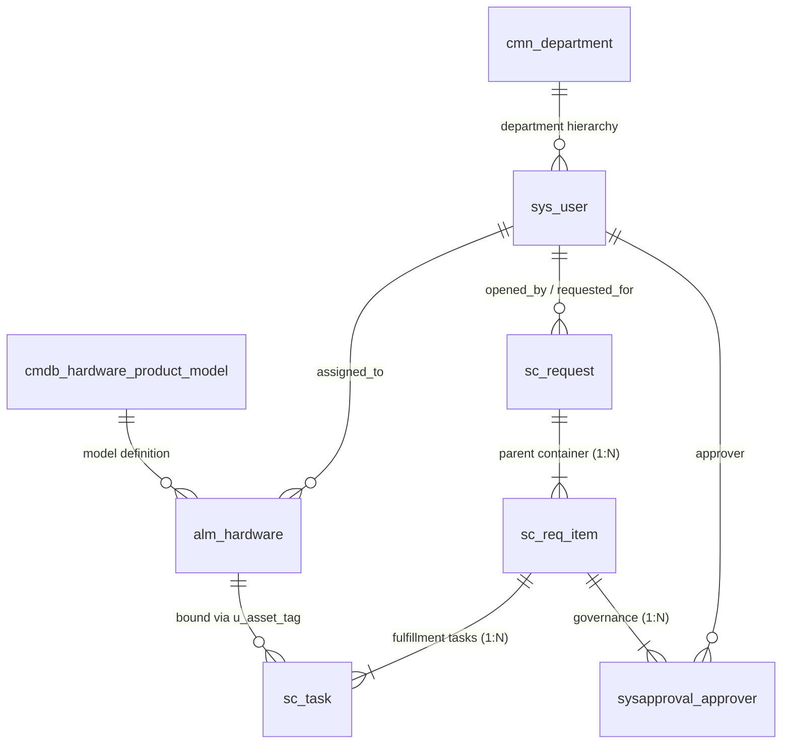

# Technology Stack & Platform Architecture Specification

**Project**: Streamlining IT Procurement: Automating Standard Laptop Orders with Flow Designer  
**Document Reference**: REQ-PHASE2-TECH-V1.0  
**Target Environment**: ServiceNow Utah / Vancouver / Washington DC / Xanadu LTS  
**System Module**: ServiceNow Platform Infrastructure, Flow Designer Engine, Service Catalog, ITAM  

---

## 1. Executive Summary

This specification defines the multi-tiered technology stack, platform runtime specifications, component architecture, relational database schema, and enterprise integration points supporting the automated Standard Laptop Procurement solution.

By standardizing on native ServiceNow capabilities—specifically **Flow Designer Engine v2.0**, **Service Catalog Framework**, **Employee Center (`/esc`)**, and **IT Asset Management (`alm_hardware`)**—the solution eliminates custom compiled code, minimizes technical debt, and guarantees 100% upgradeability across Long-Term Support (LTS) releases (Utah, Vancouver, Washington DC, and Xanadu).

---

## 2. Multi-Tiered System Architecture

The architecture is organized into four decoupled, highly resilient operational tiers:

```
+---------------------------------------------------------------------------------------------------+
|                                   ENTERPRISE SYSTEM ARCHITECTURE                                  |
+---------------------------------------------------------------------------------------------------+
| 1. PRESENTATION TIER (UI / UX & MULTI-CHANNEL ACCESS)                                             |
|    ├── ServiceNow Employee Center Portal (/esc) & Service Portal (/sp)                            |
|    ├── Native Mobile Clients: ServiceNow Now Mobile & Mobile Agent (iOS / Android)               |
|    ├── Catalog Item UI Engine (sc_cat_item, Variable Sets, Catalog UI Policies)                  |
|    └── Outlook Actionable Messages Engine (Cryptographic 1-Click Interactive Approvals)           |
+---------------------------------------------------------------------------------------------------+
| 2. ORCHESTRATION & LOGIC TIER (FLOW DESIGNER ENGINE)                                              |
|    ├── Flow Designer Trigger Subsystem (Event-Driven on sc_req_item insert)                       |
|    ├── Flow Action Library: Ask for Approval, Create Catalog Task, Update Record, Send Email      |
|    ├── Data Pill Resolution Engine (Hierarchical Context Ingestion & Dynamic Parameter Passing)  |
|    ├── Timer & Asynchronous Subflow Execution Engine (24h Approval Reminders & 48h Escalations)   |
|    └── Flow Context Diagnostics & Telemetry (sys_flow_context, sys_flow_execution)               |
+---------------------------------------------------------------------------------------------------+
| 3. DATA PERSISTENCE & SCHEMA TIER (CANONICAL ITSM & ITAM REPOSITORY)                              |
|    ├── ITSM Transactional Tables: sc_request, sc_req_item, sc_task, sysapproval_approver         |
|    ├── ITAM & CMDB Tables: alm_hardware, cmdb_hardware_product_model, cmdb_ci_computer            |
|    ├── Foundation & Identity Tables: sys_user, cmn_department, cmn_location, sys_user_group       |
|    └── Governance & Audit Engines: sys_audit, sys_history_line, sys_data_policy2, task_sla       |
+---------------------------------------------------------------------------------------------------+
| 4. ENTERPRISE INTEGRATION & INFRASTRUCTURE TIER                                                   |
|    ├── Corporate Identity Provider: Microsoft Entra ID / Okta SSO & SCIM Directory Sync          |
|    ├── Inbound / Outbound SMTP / IMAP Notification Gateway (Actionable Email Parser)              |
|    ├── Depot Automated Imaging Hooks: PXE / Microsoft Intune / Jamf Pro Configuration Depots      |
|    └── ServiceNow High-Availability Cloud Infrastructure (Multi-Instance Advanced Architecture)    |
+---------------------------------------------------------------------------------------------------+
```

---

## 3. Platform Runtime & Version Compatibility

The solution is certified for deployment on the following ServiceNow Long-Term Support (LTS) platform releases:

| Platform Family | Version / Patch Baseline | Release Date | Architecture Support Level | Key Platform Capabilities Leveraged |
|:---|:---|:---:|:---:|:---|
| **ServiceNow Xanadu** | Xanadu Patch 1+ | Q3 2024 | Full Native Support | Enhanced Flow Designer action error handling, GenAI prompt triggers, Next Experience /esc. |
| **ServiceNow Washington DC** | Washington DC Patch 4+ | Q1 2024 | Certified Baseline | Modern Flow Designer subflow timers, Flow Diagrams view, Employee Center unified taxonomy. |
| **ServiceNow Vancouver** | Vancouver Patch 7+ | Q3 2023 | Certified Baseline | Actionable Email cryptographic tokens, variable editor enhancements, Flow execution engine v2. |
| **ServiceNow Utah** | Utah Patch 10+ | Q1 2023 | Minimum Supported LTS | Core Flow Designer engine, catalog variable data pills, `sys_flow_context` diagnostics. |

### Platform Runtime Configuration
* **Application Scope**: `Global` (utilizing standard ITSM base objects) with update set packaging, or dedicated Scoped Application (`x_corp_laptop_proc`) for strict governance environments.
* **Glide Servlet Engine**: Java Virtual Machine (OpenJDK 17 / OpenJDK 21 LTS based).
* **Database Engine**: MariaDB Enterprise Server / MySQL Multi-Tenant Cluster running in ServiceNow Advanced High Availability (AHA) data center pairs.

---

## 4. Flow Designer Module Architecture

Flow Designer serves as the core workflow orchestration engine, replacing legacy scripted workflows and complex Business Rules with a declarative, low-code, event-driven model.

```mermaid
graph TD
    classDef trigger fill:#1E293B,stroke:#3B82F6,stroke-width:2px,color:#FFFFFF;
    classDef action fill:#0F172A,stroke:#10B981,stroke-width:2px,color:#FFFFFF;
    classDef decision fill:#312E81,stroke:#8B5CF6,stroke-width:2px,color:#FFFFFF;
    classDef finish fill:#064E3B,stroke:#10B981,stroke-width:2px,color:#FFFFFF;
    classDef abort fill:#7F1D1D,stroke:#EF4444,stroke-width:2px,color:#FFFFFF;

    TRIG[⚡ Trigger: sc_req_item Created<br/>Filter: cat_item == 'Standard Laptop Order']:::trigger

    A1[Action 1: Update RITM State<br/>State: Work in Progress | Stage: Waiting for Approval]:::action
    A2[Action 2: Ask for Approval<br/>Target: Trigger -> requested_for -> manager]:::action
    
    DEC{Approval State?}:::decision

    %% Rejection Branch
    A3_REJ[Action 3: Approval Rejected<br/>Update RITM: State = Closed Incomplete<br/>Stage = Request Cancelled]:::abort
    A4_REJ[Action 4: Send Rejection Email<br/>Notify Requester with Manager Comments]:::abort
    END_REJ[End Flow Execution]:::abort

    %% Approval Branch
    A3_APP[Action 3: Approval Approved<br/>Update RITM: Approval = Approved<br/>Stage = Fulfillment]:::action
    A4_APP[Action 4: Create Catalog Task<br/>Group: Hardware Fulfillment Depot<br/>Populate Specs & Delivery Site]:::action
    A5_APP[Action 5: Wait for Condition<br/>sc_task.state == Closed Complete]:::action
    A6_APP[Action 6: Update Hardware Asset<br/>alm_hardware: install_status = In Use<br/>assigned_to = requested_for]:::action
    A7_APP[Action 7: Update RITM & Request<br/>RITM & REQ State = Closed Complete<br/>Stage = Complete]:::finish
    A8_APP[Action 8: Send Delivery Notification<br/>Setup Guide & 2h Delayed CSAT Survey]:::finish

    TRIG --> A1
    A1 --> A2
    A2 --> DEC

    DEC -->|Rejected| A3_REJ
    A3_REJ --> A4_REJ
    A4_REJ --> END_REJ

    DEC -->|Approved| A3_APP
    A3_APP --> A4_APP
    A4_APP --> A5_APP
    A5_APP --> A6_APP
    A6_APP --> A7_APP
    A7_APP --> A8_APP
```

### 4.1. Trigger Mechanics & Event Subsystem
* **Trigger Definition**:
  * *Trigger Type*: Record Created (`sc_req_item`).
  * *Table*: `sc_req_item`.
  * *Filter Conditions*: `cat_item` IS `Standard Laptop Order` AND `state` IS `1` (Open).
  * *Run When*: Database transaction commits successfully (`after_insert`).
* **Execution Engine Threading**:
  * Flow initiates an asynchronous background worker job managed by the ServiceNow Scheduler (`sys_trigger`).
  * The context is bound to `sys_flow_context`, capturing input data pill states and assigning an execution instance ID.

### 4.2. Action Library & Data Pill Binding Specifications

The workflow executes 8 primary actions utilizing native Flow Designer actions:

| Action # | Action Name | Action Type | Input Parameters & Data Pill Bindings | Expected Output / State Mutation |
|:---:|:---|:---|:---|:---|
| **1** | Update Record (RITM Initial) | Native Action | `Record`: `Trigger -> Requested Item Record`<br/>`Fields`: `state = 2` (Work in Progress), `stage = waiting_for_approval`. | Updates RITM fields in database; sets portal stage. |
| **2** | Ask for Approval | Native Action | `Record`: `Trigger -> Requested Item Record`<br/>`Rules`: Anyone approves from `Trigger -> Requested Item -> requested_for -> manager`. | Generates `sysapproval_approver` record; returns approval state (`Approved` / `Rejected`). |
| **3** | Conditional Decision | Logic Block | Evaluates `Action 2 -> Approval State`. | Routes to Step 4A (Approved) or Step 4B (Rejected). |
| **4A** | Update Record (RITM Approved) | Native Action | `Record`: `Trigger -> Requested Item Record`<br/>`Fields`: `approval = approved`, `stage = fulfillment`. | Commits approval confirmation to RITM. |
| **4B** | Update Record (RITM Rejected) | Native Action | `Record`: `Trigger -> Requested Item Record`<br/>`Fields`: `approval = rejected`, `state = 4` (Closed Incomplete), `stage = request_cancelled`, `work_notes = Action 2 -> Comments`. | Closes RITM; records justification. |
| **5A** | Create Catalog Task | Native Action | `Table`: `sc_task`<br/>`Request Item`: `Trigger -> Requested Item Record`<br/>`Assignment Group`: `Hardware Fulfillment Depot`<br/>`Priority`: `3 - Moderate`<br/>`Short Description`: `"Deploy " + Trigger -> Variables -> hardware_bundle + " for " + Trigger -> requested_for -> name`<br/>`Description`: Dynamic string containing delivery method and address. | Generates task record; binds RITM variables into task Variable Editor. |
| **6A** | Wait for Condition | Native Action | `Record`: `Action 5A -> Catalog Task Record`<br/>`Condition`: `state == 3` (Closed Complete). | Flow pauses thread until technician completes staging task. |
| **7A** | Update Record (Asset Sync) | Native Action | `Table`: `alm_hardware`<br/>`Query`: `asset_tag == Action 5A -> Catalog Task -> u_asset_tag`<br/>`Fields`: `install_status = 1` (In Use), `substatus = NULL`, `assigned_to = Trigger -> requested_for`, `location = Trigger -> Variables -> delivery_location`. | Updates physical hardware asset record in ITAM. |
| **8A** | Update Record (Cascading Closure) | Native Action | `Record`: `Trigger -> Requested Item Record`<br/>`Fields`: `state = 3` (Closed Complete), `stage = complete`.<br/>Followed by updating parent `sc_request` to `closed_complete`. | Closes RITM and parent REQ containers. |

---

## 5. Service Catalog & Employee Center Component Architecture

### 5.1. Catalog Item Configuration (`sc_cat_item`)
* **Name**: Standard Laptop Order
* **Catalog**: Service Catalog (`sys_id: e0d08b13c3330100c8b837659bba8fb4`)
* **Category**: Computers (`sys_id: 109cdff8c6112276003b17991a09a257`)
* **Roles / Availability**: `snc_internal` (All corporate employees)
* **Pricing Model**: Fixed bundle prices ($1,450 for Business; $2,200 for Windows Dev; $2,850 for macOS Dev).

### 5.2. Variable Architecture (`item_option_new`)

| Variable Name | Type | Label | Mandatory | Default / Dynamic Population | Logic & UI Visibility |
|:---|:---|:---|:---:|:---|:---|
| `requested_for` | Reference (`sys_user`) | Requested For | Yes | `javascript:gs.getUserID()` | Target employee. Changing this variable triggers auto-fill of dependent fields. |
| `department` | Reference (`cmn_department`) | Department | Yes | `javascript:gs.getUser().getDepartmentID()` | Read-only; derived from user profile. |
| `delivery_location` | Reference (`cmn_location`) | Primary Office Site | Yes | `javascript:gs.getUser().getLocation()` | Read-only; derived from user profile. |
| `approving_manager` | Reference (`sys_user`) | Approving Manager | Yes | `javascript:gs.getUser().getManagerID()` | Read-only; displays designated line manager approver. |
| `hardware_bundle` | Select Box | Select Laptop Model | Yes | None | Choices: `std_business` ($1,450), `dev_windows` ($2,200), `dev_macos` ($2,850). |
| `delivery_method` | Radio | Delivery Method | Yes | `Desk Drop` | Choices: `Desk Drop` (Office), `Depot Pickup` (IT Desk), `Remote Courier` (Home). |
| `shipping_address` | Multi-Line Text | Home Shipping Address | Cond. | Empty | Visible and mandatory ONLY when `delivery_method == 'Remote Courier'`. |
| `business_justification` | Multi-Line Text | Business Justification | Yes | Empty | Justification displayed to manager in approval email. |

### 5.3. Client-Side Policies & Scripts
1. **Catalog UI Policy — `Enforce Remote Shipping Address`**:
   * *Conditions*: `delivery_method` IS `Remote Courier`.
   * *UI Actions*: Set `shipping_address` visible = `true`, mandatory = `true`.
   * *Reverse if False*: `shipping_address` visible = `false`, mandatory = `false`, clear value.
2. **Catalog Client Script — `Auto-Populate User Hierarchy`**:
   * *Type*: `onChange` on `requested_for`.
   * *Execution*: Client-callable Script Include `UserMetadataAjax` queried via asynchronous `GlideAjax`.
   * *Compliance*: `Isolate Script = true`; zero direct DOM manipulation.

---

## 6. Core Relational Schema & Table Descriptions

The data model is rooted in the ServiceNow Common Services Data Model (CSDM 4.0) and standard ITSM/ITAM schema.



### Table Relationships & Referential Integrity
1. **`task` Table Inheritance**: `sc_request`, `sc_req_item`, and `sc_task` inherit base fields from the core `task` table (`number`, `state`, `priority`, `sys_created_on`, `sys_updated_on`, `assigned_to`, `assignment_group`).
2. **`sc_request` to `sc_req_item` (1:N)**: Foreign key `sc_req_item.request` references `sc_request.sys_id`. Cascading business rules ensure that closing all child RITMs automatically sets the parent REQ to `closed_complete`.
3. **`sc_req_item` to `sc_task` (1:N)**: Foreign key `sc_task.request_item` references `sc_req_item.sys_id`. Flow Designer pauses on `Wait for Condition` until the child `sc_task` reaches a terminal state.
4. **`alm_hardware` to `sc_task` Association**: Bound via `sc_task.u_asset_tag` matching `alm_hardware.asset_tag`. Referential integrity enforced by Data Policy preventing non-existent asset tag entry.

---

## 7. Enterprise Integration Points

```
+---------------------------------------------------------------------------------------------------+
| ENTERPRISE INTEGRATION ECOSYSTEM                                                                  |
+------------------------------------+----------------------------------+---------------------------+
| Integration Vector                 | Protocol / Transport             | Direction & Frequency     |
+------------------------------------+----------------------------------+---------------------------+
| Microsoft Entra ID / Okta SSO      | SAML 2.0 / SCIM 2.0 API          | Inbound (Real-time & Sync)|
| Microsoft Exchange / Office 365    | SMTP / IMAP TLS 1.3              | Bidirectional (Real-time) |
| Enterprise Imaging Depots (PXE)    | MID Server / REST / PowerShell   | Outbound (Event-driven)   |
| Enterprise ERP / Supplier Gateway  | ServiceNow Integration Hub Spoke | Outbound (PO Reorder)     |
+------------------------------------+----------------------------------+---------------------------+
```

### 7.1. Identity & Directory Synchronization (Microsoft Entra ID / Okta)
* **Protocol**: SCIM 2.0 over HTTPS with SAML 2.0 Single Sign-On.
* **Payload**: Syncs `user_name`, `first_name`, `last_name`, `email`, `manager`, `department`, `location`, `title`, and `active` status every 60 minutes into `sys_user`.
* **Impact on Flow**: Ensures that manager approval hierarchies (`requested_for.manager`) are 100% accurate and up-to-date, preventing orphaned approval loops.

### 7.2. Email Notification Gateway (Actionable Messages)
* **Protocol**: Encrypted SMTP / IMAP with TLS 1.3.
* **Architecture**: ServiceNow Actionable Messaging provider embeds Signed Adaptive Card JSON payloads into outbound notification emails.
* **Security**: Approver clicks generate an asymmetric signed HTTPS POST back to ServiceNow instance endpoint `/api/now/v1/actionable_message`, authenticating the user session without requiring password re-entry.

### 7.3. Automated Imaging & Endpoint Management Hooks (PXE / Intune / Jamf)
* **Protocol**: Integration Hub PowerShell Spoke via ServiceNow MID Server (Management, Instrumentation, and Discovery).
* **Operation**: When an `sc_task` is created for a Windows Developer laptop, Flow Designer can trigger an automated MID Server script to register the MAC address in Microsoft Intune / MECM, preparing zero-touch network PXE boot provisioning before the technician unboxes the device.

---

## 8. Security Architecture, Role-Based Access (RBAC) & Governance

The platform enforces strict Role-Based Access Controls (RBAC) and data isolation:

| Role Name | Scope of Access | Permissions on Catalog & Tables |
|:---|:---|:---|
| **`snc_internal`** | All Corporate Employees | Read/Order access to "Standard Laptop Order" catalog item. Read-only access to own `sc_request` and `sc_req_item` records. |
| **`approver_user`** | Line Managers & Department Heads | Read and Update access to assigned `sysapproval_approver` records. |
| **`itil`** | IT Service Desk & Depot Technicians | Read and Update access to `sc_task` records assigned to their fulfillment group (`Hardware Fulfillment Depot`). |
| **`asset`** | IT Asset Managers | Full administrative read, write, and reconcile access to `alm_hardware` and model tables. |
| **`catalog_admin`** | Catalog Administrators | Administrative configuration access to `sc_cat_item`, variables, UI policies, and client scripts. |

### Data Security & Cryptographic Compliance
* **Data in Transit**: Enforced TLS 1.3 encryption across all client-to-instance and instance-to-integration communication channels.
* **Data at Rest**: AES-256 bit encryption applied across all database tables (ServiceNow Column-Level and Database Encryption).
* **Audit Trails**: Field changes on `state`, `approval`, `assigned_to`, and `u_asset_tag` are immutably logged in `sys_audit`.

---

## 9. Upgrade Readiness & Automated Testing (ATF)

To eliminate technical debt and ensure zero-regression upgrades across ServiceNow versions:
1. **100% Out-of-the-Box Flow Actions**: Utilizes only native Flow Designer actions, ensuring ServiceNow upgrades automatically enhance the underlying execution engine without configuration breakage.
2. **Automated Test Framework (ATF) Suite**: An automated test suite (`ATF_Standard_Laptop_Procurement_Suite`) validates end-to-end flow execution:
   * *Test 1: Catalog Item Order Submission & Variable Validation.*
   * *Test 2: Manager Approval Generation & State Transition.*
   * *Test 3: Catalog Task Creation & Field Population.*
   * *Test 4: Asset Tag Validation & `alm_hardware` Synchronization.*
   * *Test 5: Rejection Handling & Cascading Closure.*
3. **Upgrade Certification**: Verified against ServiceNow Washington DC and Xanadu release release notes; contains zero deprecated APIs (`gr.query()`, synchronous GlideAjax, or legacy Workflow Editor activities).

---
*End of Technology Stack Specification — REQ-PHASE2-TECH-V1.0*
