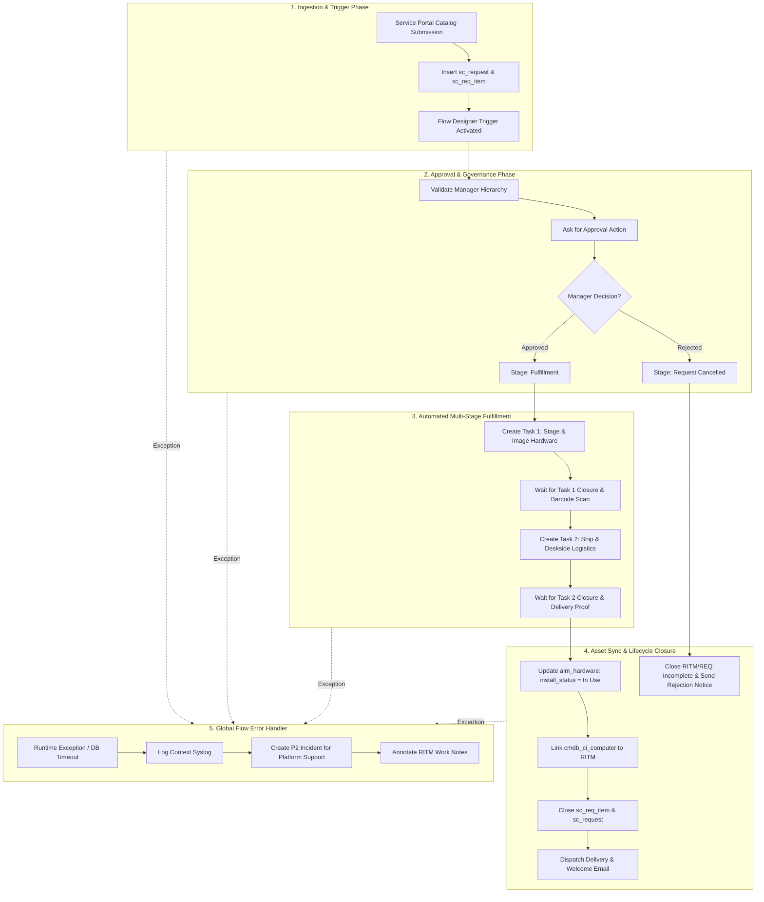
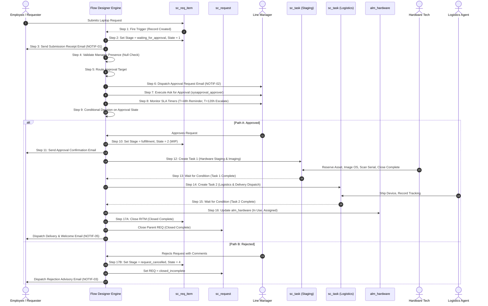
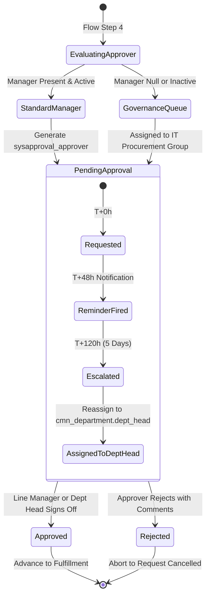
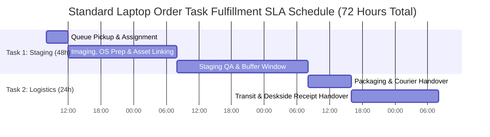
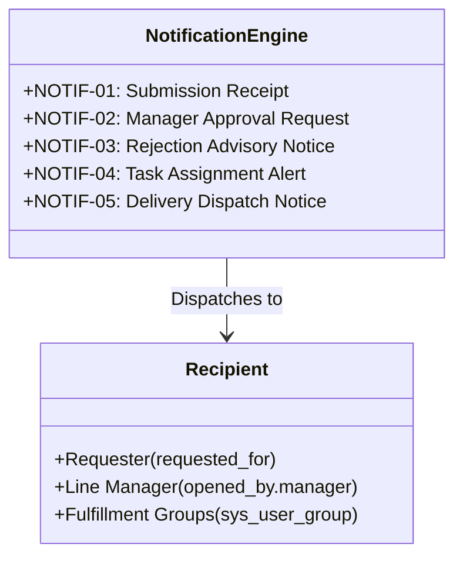
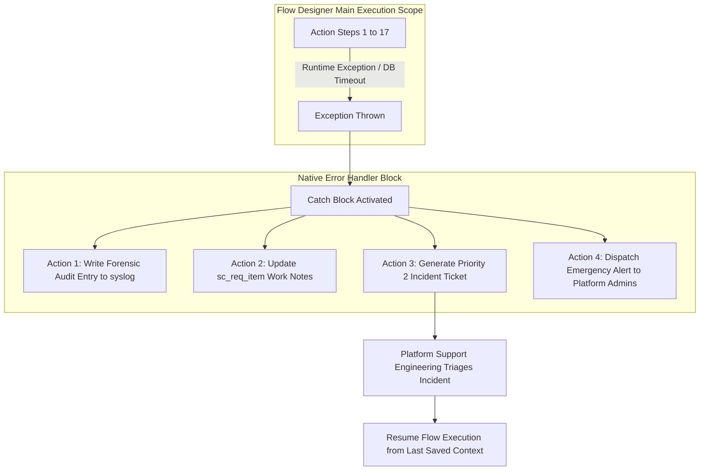

# Phase 3: Project Design Deliverables
# Document 02: Proposed Solution Workflow & Technical Automation Specification

**Project Title**: Streamlining IT Procurement: Automating Standard Laptop Orders with Flow Designer  
**Document Identifier**: PROJ-DESIGN-02-SOL  
**Target Release**: ServiceNow Washington DC / Xanadu / Utah  
**Author**: Project Implementation Team (Solution Architecture Lead)  
**Status**: Authoritative Architectural Design Deliverable  
**Date**: 2026-09-30  

---

## 1. Solution Overview & Architectural Principles

The **Automated Standard Laptop Procurement Solution** replaces disparate, manual email interactions with an enterprise-grade, event-driven orchestration architecture built natively within **ServiceNow Flow Designer**. The solution establishes a standardized digital bridge between employee self-service in the Service Portal / Employee Center, management approval governance, operational hardware staging by IT fulfillment teams, physical deskside/remote delivery logistics, and automated Hardware Asset Management (`alm_hardware`) lifecycle synchronization.



### Core Architecture & Engineering Principles
1. **Zero Core Modifications & 100% OOTB Upgradability**: Utilizes standard ITSM schema (`sc_request`, `sc_req_item`, `sc_task`, `sysapproval_approver`, `alm_hardware`). Zero legacy custom tables or deprecated workflow engine dependencies (`wf_workflow`).
2. **Elevated Engine Security Execution**: Flow execution runs in the background as `System User`, ensuring that cross-table transactional updates (e.g., updating asset status and provisioning fulfillment tasks) succeed reliably regardless of the restricted end-user ACLs of the catalog requester.
3. **Defensive Governance & Anti-Hang Routing**: Pre-decision validation blocks verify the presence and active status of line managers before routing, routing to a fallback governance queue if null or terminated.
4. **Two-Stage Sequential Task Decomposition**: Isolates technical imaging from physical delivery logistics, preventing premature ticket closure and lost computing devices.
5. **Native Fault Tolerance**: Encapsulated within a dedicated Flow Designer Error Handler block that logs execution IDs, alerts platform administrators, and generates high-priority incidents automatically upon unhandled exceptions.

---

## 2. Trigger Mechanics & Context Instantiation

The execution lifecycle begins synchronously upon database insertion of the line-item record and transitions immediately to asynchronous background processing.

### 2.1 Trigger Definition Specification

| Parameter | Configuration Value | Architectural Rationale |
|---|---|---|
| **Trigger Type** | `Record Created` | Captures newly submitted catalog line items immediately upon transaction commit. |
| **Table** | `sc_req_item` (Requested Item) | Scopes execution directly to the individual item context rather than the generic cart header (`sc_request`). |
| **Conditions (Filter)** | `cat_item` IS `Standard Laptop Order` (sys_id: `a1b2c3d4e5f60718293a4b5c6d7e8f90`)<br>AND `request.request_state` IS NOT `Closed Cancelled` | Restricts flow invocation strictly to the standardized laptop offering, preventing trigger collisions with software or accessory requests. |
| **Run When** | `Record created in database` | Ensures database row integrity before spawning flow worker threads. |
| **Execution Environment**| `Background (Asynchronous)` | Prevents user UI thread latency; executes on ServiceNow worker node threads (`glide.scheduler.worker`). |
| **Run With Roles** | `System User` | Elevates execution context privileges to enable writes across `sc_task`, `alm_hardware`, and `sys_audit`. |

### 2.2 Data Pill Extraction & Context Mapping

Upon instantiation, the Flow Designer engine constructs the `sys_flow_context` object and resolves data pills accessible across all downstream action steps:

```
[Trigger Object: trigger.current]
   ├── sys_id                           (GUID: Unique identifier of sc_req_item)
   ├── number                           (String: e.g., "RITM0010501")
   ├── request                          (Reference -> sc_request: Parent Cart Header)
   │     ├── number                     (String: e.g., "REQ0010201")
   │     └── requested_for              (Reference -> sys_user: Target Beneficiary)
   ├── opened_by                        (Reference -> sys_user: Submitting User)
   │     ├── sys_id                     (GUID)
   │     ├── name                       (String: e.g., "Jane Smith")
   │     ├── email                      (String: e.g., "jane.smith@enterprise.com")
   │     ├── manager                    (Reference -> sys_user: Direct Line Manager)
   │     │     ├── sys_id               (GUID)
   │     │     ├── name                 (String: e.g., "Robert Davis")
   │     │     ├── email                (String: e.g., "robert.davis@enterprise.com")
   │     │     └── active               (Boolean: True / False)
   │     └── department                 (Reference -> cmn_department)
   │           └── dept_head            (Reference -> sys_user: Department Head)
   └── variables                        (Catalog Item Variable Set)
         ├── laptop_model               (Choice: Developer 16" / Business 14" / Ultralight 13")
         ├── operating_system           (Choice: Windows 11 Enterprise / macOS Sonoma / Ubuntu LTS)
         ├── ram_storage_bundle         (Choice: Standard 16GB/512GB / Performance 32GB/1TB)
         ├── accessories                (List / Multi-Choice: USB-C Dock, Dual 27" Monitors, Backpack)
         ├── delivery_type              (Choice: Deskside Handover / Remote Home Delivery)
         ├── shipping_address           (Multi-line String: Verified Residential / Office Address)
         ├── contact_phone              (String: E.164 Formatted Contact Number)
         └── business_justification     (Multi-line String: Business Justification Narrative)
```

---

## 3. End-to-End Automated Workflow Specification (17 Discrete Operational Steps)

The end-to-end execution path consists of 17 discrete, sequentially orchestrated operational steps from initial trigger instantiation through final lifecycle decommissioning.



### Detailed Operational Step Walkthrough

#### Step 1: Trigger Evaluation & Flow Instantiation
* **Execution Action**: Engine event listener intercepts insertion of `sc_req_item`.
* **Validation Logic**: Validates that `cat_item.name == 'Standard Laptop Order'` and `request.request_state != 'closed_cancelled'`.
* **Output**: Generates a dedicated `sys_flow_context` record (State: In Progress).

#### Step 2: Initialize Requested Item Record State
* **Action**: `Update Record` on `sc_req_item`.
* **Field Modifications**:
  - `stage` = `waiting_for_approval`
  - `state` = `1` (Open)
  - `approval` = `requested`
  - `work_notes` = `Automated Laptop Procurement flow instantiated. Evaluating line manager approval routing.`

#### Step 3: Dispatch Submission Acknowledgment Notification (`NOTIF-01`)
* **Action**: `Send Email`
* **Recipient**: `trigger.current.requested_for.email`
* **Subject**: `Order Confirmation: Standard Laptop Request - {trigger.current.number}`
* **Payload**: Formatted HTML containing RITM number, selected laptop model, configuration specifications, target delivery address, and the 72-hour fulfillment commitment timeline.

#### Step 4: Decision Logic — Validate Line Manager Presence & Account Health
* **Action**: `Flow Logic -> Decision / If Branch`
* **Condition**:
  ```javascript
  (trigger.current.opened_by.manager != nil) && 
  (trigger.current.opened_by.manager.active == true) &&
  (trigger.current.opened_by.manager.email != nil)
  ```
* **Branching Paths**:
  - *If True*: Proceed to Step 5 (Standard Routing).
  - *If False*: Divert to Governance Exception Handling (Step 5 Fallback).

#### Step 5: Route Approval Target & Handle Manager Absence
* **Path 5A (Standard)**: Target Approver is assigned as `trigger.current.opened_by.manager`.
* **Path 5B (Governance Fallback)**:
  - Target Approver is dynamically assigned to Assignment Group: `IT Procurement Approvers` (`sys_user_group`).
  - Action `Update Record` logs high-priority Work Note: `SECURITY ALERT: Requester has no active manager in sys_user. Order escalated to IT Procurement Governance queue.`
  - Flag approval as `Escalated`.

#### Step 6: Dispatch Manager Approval Request Notification (`NOTIF-02`)
* **Action**: `Send Email`
* **Recipient**: Resolved Approver (Manager or Governance Group).
* **Subject**: `ACTION REQUIRED: Laptop Procurement Approval Request for {trigger.current.requested_for.name} - {trigger.current.number}`
* **Payload**: Actionable HTML template with embedded corporate cost center, business justification, laptop model, total expenditure, and interactive one-click "Approve" / "Reject" response tokens.

#### Step 7: Execute `Ask for Approval` Action
* **Action**: `Ask for Approval`
* **Target Record**: `trigger.current` (`sc_req_item`)
* **Approval Rules**:
  - `Approve when: Anyone approves`
  - `Reject when: Anyone rejects`
* **Due Date Rule**: Dynamic calculation set to `5 Business Days` from record creation.

#### Step 8: SLA Reminder & Dynamic Escalation Subflow
* **Action**: `Flow Logic -> Parallel Flow / Timer Execution`
* **Timer 1 (T+48 Business Hours)**:
  - If approval state remains `requested`, dispatch reminder notification to approver: `REMINDER: Laptop Approval Pending for {trigger.current.number}`.
* **Timer 2 (T+120 Business Hours / 5 Days)**:
  - If approval state remains `requested`, execute auto-escalation: reassign approval to Department Head (`trigger.current.opened_by.department.dept_head`), update RITM work notes, and alert IT Procurement Lead.

#### Step 9: Conditional Decision Branching on Approval Outcome
* **Action**: `Flow Logic -> If / Else If`
* **Condition Evaluated**: `Flow -> Step 7 -> Approval State`
* **Branch A**: `Approval State == 'Approved'` -> Proceed to Step 10.
* **Branch B**: `Approval State == 'Rejected'` -> Divert to Step 17B.
* **Branch C**: `Approval State == 'Cancelled'` -> Abort flow execution and archive context.

#### Step 10: [Branch A - Approved] Update RITM Post-Approval
* **Action**: `Update Record` on `sc_req_item`.
* **Field Modifications**:
  - `stage` = `fulfillment`
  - `state` = `2` (Work in Progress)
  - `approval` = `approved`
  - `work_notes` = `Manager approval confirmed by {Approver.name}. Generating hardware fulfillment and staging tasks.`

#### Step 11: [Branch A - Approved] Dispatch Approval Confirmation Notification
* **Action**: `Send Email`
* **Recipient**: `trigger.current.requested_for.email`
* **Subject**: `Approved: Your Standard Laptop Request {trigger.current.number} has been Authorized`
* **Payload**: Informs employee of successful sign-off, confirms order transmission to the Hardware Fulfillment Lab, and provides estimated delivery window.

#### Step 12: [Branch A - Approved] Automated Task 1 Provisioning — Hardware Staging & Imaging
* **Action**: `Create Catalog Task` on table `sc_task`.
* **Field Mappings**:
  - `request_item` = `trigger.current.sys_id`
  - `assignment_group` = `Hardware Fulfillment Group` (sys_id: `d8e9f0a1b2c34567890abcdef1234567`)
  - `short_description` = `'Stage, Image, and Asset-Tag Laptop: ' + trigger.current.variables.laptop_model`
  - `priority` = `3` (Moderate)
  - `state` = `1` (Open)
  - `description` = Concatenated instruction string containing Model, OS, RAM/Storage Bundle, Accessories, and special configuration instructions.
* **Form Variable Formatting**: Exposes catalog variables (`laptop_model`, `operating_system`, `department`, `shipping_address`) directly in the fulfiller task view.
* **Notification**: Triggers Task Assignment Alert (`NOTIF-04`) to `Hardware Fulfillment Group`.

#### Step 13: [Branch A - Approved] Wait for Condition — Task 1 Completion & Validation
* **Action**: `Wait for Condition` on `sc_task` (Task 1).
* **Resume Condition**: `sc_task.state IN ('3', '4')` (Closed Complete OR Closed Incomplete).
* **Outcome Verification Logic**:
  - *IF `state == 4` (Closed Incomplete)*: Intercept closure code. If `Out of Stock`, halt main flow and trigger Subflow: `Procurement Vendor Backorder Purchasing`.
  - *IF `state == 3` (Closed Complete)*: Validate that `sc_task.cmdb_ci` and `sc_task.asset` are populated; proceed to Step 14.

#### Step 14: [Branch A - Approved] Automated Task 2 Provisioning — Logistics & Delivery Dispatch
* **Action**: `Update Record` on `sc_req_item`:
  - `stage` = `delivery`
  - `work_notes` = `Hardware staging and imaging completed. Initiating logistics delivery dispatch.`
* **Action**: `Create Catalog Task` on table `sc_task`.
* **Field Mappings**:
  - `request_item` = `trigger.current.sys_id`
  - `assignment_group` = `IT Logistics & Deskside Support` (sys_id: `e9f0a1b2c3d45678901abcdef2345678`)
  - `short_description` = `'Package, Ship, and Deliver Laptop to: ' + trigger.current.requested_for.name`
  - `priority` = `3` (Moderate)
  - `state` = `1` (Open)
  - `description` = Delivery details: Delivery Type, Destination Shipping Address, Contact Phone, and Staged Asset Tag/Serial Number.

#### Step 15: [Branch A - Approved] Wait for Condition — Task 2 Completion
* **Action**: `Wait for Condition` on `sc_task` (Task 2).
* **Resume Condition**: `sc_task.state == '3'` (Closed Complete).
* **Verification**: Requires technician to input carrier tracking number (or deskside handover signature timestamp) into `sc_task.work_notes` or custom closure field.

#### Step 16: [Branch A - Approved] Automated Hardware Asset Synchronization
* **Action**: `Update Record` on table `alm_hardware`.
* **Query Match**: `serial_number == Task1.serial_number` OR `asset_tag == Task1.asset_tag`.
* **Field Modifications**:
  - `install_status` = `1` (In Use)
  - `substatus` = `''` (Cleared from 'Reserved')
  - `assigned_to` = `trigger.current.requested_for.sys_id`
  - `department` = `trigger.current.requested_for.department`
  - `location` = `trigger.current.requested_for.location`
* **CMDB Relationship**: Creates / confirms relationship `cmdb_rel_ci` linking the Computer CI to the Assigned User (`Runs on::Runs`).
* **RITM Association**: Sets `sc_req_item.configuration_item = alm_hardware.ci`.

#### Step 17: Lifecycle Closure & Branch Handling

##### Sub-Step 17A: Approved Happy Path Finalization
1. **Update `sc_req_item`**:
   - `stage` = `complete`
   - `state` = `3` (Closed Complete)
   - `active` = `false`
   - `work_notes` = `All fulfillment tasks completed successfully. Asset assigned and device verified delivered.`
2. **Evaluate Parent Request (`sc_request`)**:
   - Flow executes GlideAggregate query counting active child RITMs: `request == trigger.current.request AND active == true`.
   - *If active child count == 0*: Update `sc_request`:
     - `request_state` = `closed_complete`
     - `stage` = `closed`
     - `state` = `3` (Closed Complete)
     - `active` = `false`
3. **Dispatch Delivery & Sign-off Notification (`NOTIF-05`)**:
   - Sends rich HTML email to employee containing tracking number, IT Service Desk welcome guide, first-time login setup instructions, and hardware sign-off survey link.

##### Sub-Step 17B: Rejected Exception Path
1. **Update `sc_req_item`**:
   - `stage` = `request_cancelled`
   - `state` = `4` (Closed Incomplete)
   - `approval` = `rejected`
   - `active` = `false`
   - `work_notes` = `'Request rejected by ' + Approver.name + '. Rejection Comments: ' + Approval.comments`
2. **Update Parent Request (`sc_request`)**:
   - Update `sc_request.request_state = 'closed_incomplete'`, `active = false`.
3. **Dispatch Rejection Advisory Notification (`NOTIF-03`)**:
   - Sends formal rejection advisory to employee detailing exact manager comments and instructions on how to resubmit an order with revised business justification.
4. **Terminate Flow Execution**:
   - Flow context transitions to `Completed (With Rejection)`.

---

## 4. Approval Logic, Escalation Schedules & Governance Rules

The approval architecture balances executive accountability with operational velocity, preventing request stagnation through strict escalation rules.



### 4.1 Separation of Duties & Anti-Tamper Enforcement
* **Self-Approval Prohibition**: If the submitting user (`opened_by`) is identical to the resolved approver (`opened_by.manager`), the flow detects a separation-of-duties conflict. The flow automatically bypasses self-approval and escalates to the second-level manager (`opened_by.manager.manager`).
* **Immutability of Form Data**: Once the approval record is created, a client-side UI Policy locks all catalog item variables (`laptop_model`, `operating_system`, `shipping_address`) as **Read-Only = True**, ensuring specifications cannot be altered while awaiting sign-off.

### 4.2 Timers and Escalation Matrix

| Milestone | Elapsed Time | Action Taken | Recipient / Target | System Audit Annotation |
|---|---|---|---|---|
| **Initial Request** | T + 0 Hours | Approval record created in `sysapproval_approver`. | Line Manager | `Approval requested from {Manager.name}` |
| **First Reminder** | T + 48 Business Hours | Automated notification reminder dispatched. | Line Manager | `48-hour reminder sent to {Manager.name}` |
| **Executive Escalation** | T + 120 Business Hours (5 Days) | Approval record reassigned. Original approval marked `Cancelled (Auto-Escalated)`. | Department Head (`cmn_department.dept_head`) | `Escalated to Dept Head {DeptHead.name} due to SLA inactivity threshold.` |
| **Final Expiration** | T + 168 Business Hours (7 Days) | Auto-reject request if no sign-off. | Requester & Manager | `Request auto-cancelled due to lack of authorization within 7 business days.` |

---

## 5. Automated Catalog Task Provisioning & SLA Schedules

The fulfillment lifecycle decomposes into two distinct operational catalog tasks (`sc_task`), isolating workshop staging from physical distribution.



### 5.1 Task 1: Hardware Staging & Configuration Specification

| Task Parameter | Configuration Specification |
|---|---|
| **Table** | `sc_task` |
| **Assignment Group** | `Hardware Fulfillment Group` (sys_id: `d8e9f0a1b2c34567890abcdef1234567`) |
| **Short Description** | `Stage, Image, and Asset-Tag Laptop: [laptop_model]` |
| **Priority** | `3 - Moderate` |
| **Variables Exposed** | `laptop_model`, `operating_system`, `ram_storage_bundle`, `accessories`, `department`, `requested_for` |
| **Mandatory Exit Conditions** | Fulfiller must link valid `asset` (`alm_hardware`) and `serial_number`. Task cannot be marked `Closed Complete` with an empty asset field. |
| **Task SLA Schedule** | 48 Business Hours (Schedule: `8x5 Mon-Fri excluding Holidays`). |

### 5.2 Task 2: Logistics & Deployment Delivery Specification

| Task Parameter | Configuration Specification |
|---|---|
| **Table** | `sc_task` |
| **Assignment Group** | `IT Logistics & Deskside Support` (sys_id: `e9f0a1b2c3d45678901abcdef2345678`) |
| **Short Description** | `Package, Ship, and Deliver Laptop to: [requested_for.name]` |
| **Priority** | `3 - Moderate` |
| **Variables Exposed** | `delivery_type`, `shipping_address`, `contact_phone`, `requested_for`, `asset_tag` |
| **Mandatory Exit Conditions** | Fulfiller must enter shipping tracking number (e.g., FedEx/UPS) or physical handover confirmation in task work notes. |
| **Task SLA Schedule** | 24 Business Hours (Schedule: `8x5 Mon-Fri excluding Holidays`). |

---

## 6. Automated Notification Architecture

The solution deploys five standardized, responsive HTML email notifications triggered at specific milestone boundaries.



### 6.1 Master Notification Catalog

| ID | Notification Name | Trigger Milestone | Recipient (`To:`) | Subject Line Specification | Key Content & Actionable Tokens |
|---|---|---|---|---|---|
| **NOTIF-01** | **Submission Receipt** | Step 3: Flow Trigger committed | `requested_for.email` | `Order Confirmation: Standard Laptop Request - ${number}` | RITM number, selected model, OS, delivery location, 72-hour fulfillment commitment, Service Portal tracking link. |
| **NOTIF-02** | **Manager Approval Request** | Step 6: Approval record generated | `approver.email` | `ACTION REQUIRED: Laptop Approval Request for ${requested_for.name} - ${number}` | Detailed hardware specs, cost center code, business justification, interactive one-click "Approve" / "Reject" buttons. |
| **NOTIF-03** | **Rejection Advisory Notice** | Step 17B: Manager rejects | `requested_for.email` | `Notice: Standard Laptop Request ${number} has been Declined` | Disapproval decision, verbatim manager comments, instructions for appeal or re-submitting with modified justification. |
| **NOTIF-04** | **Task Assignment Alert** | Steps 12 & 14: Task created | `assignment_group.email` | `New Fulfillment Task: [Task Short Description] - ${number}` | Direct link to SCTASK record, exposed catalog variables, priority, customer due date SLA. |
| **NOTIF-05** | **Delivery Dispatch Notice** | Step 17A: RITM closure | `requested_for.email` | `Delivered: Your Standard Laptop is Ready - Welcome!` | Courier tracking URL, physical handover confirmation, IT Welcome Pack link, day-one login checklist, IT Support contact info. |

### 6.2 Actionable Email Markup Template (Approval Request Example)

```html
<div style="font-family: Arial, sans-serif; max-width: 600px; margin: 0 auto; border: 1px solid #e0e0e0; border-radius: 8px; overflow: hidden;">
    <div style="background-color: #032d42; color: #ffffff; padding: 20px; text-align: center;">
        <h2 style="margin: 0;">IT Procurement Authorization Request</h2>
    </div>
    <div style="padding: 24px; color: #333333; line-height: 1.6;">
        <p>Hello <strong>${approver.first_name}</strong>,</p>
        <p>A standard laptop procurement request has been submitted for an employee in your reporting hierarchy and requires your authorization.</p>
        
        <table style="width: 100%; border-collapse: collapse; margin: 20px 0;">
            <tr style="border-bottom: 1px solid #eeeeee;"><td style="padding: 8px 0; font-weight: bold;">Request Number:</td><td>${sysapproval.number}</td></tr>
            <tr style="border-bottom: 1px solid #eeeeee;"><td style="padding: 8px 0; font-weight: bold;">Requested For:</td><td>${sysapproval.requested_for.name}</td></tr>
            <tr style="border-bottom: 1px solid #eeeeee;"><td style="padding: 8px 0; font-weight: bold;">Department:</td><td>${sysapproval.requested_for.department.name}</td></tr>
            <tr style="border-bottom: 1px solid #eeeeee;"><td style="padding: 8px 0; font-weight: bold;">Laptop Model:</td><td>${sysapproval.variables.laptop_model}</td></tr>
            <tr style="border-bottom: 1px solid #eeeeee;"><td style="padding: 8px 0; font-weight: bold;">Operating System:</td><td>${sysapproval.variables.operating_system}</td></tr>
            <tr style="border-bottom: 1px solid #eeeeee;"><td style="padding: 8px 0; font-weight: bold;">Cost Center:</td><td>${sysapproval.requested_for.cost_center.code}</td></tr>
            <tr style="border-bottom: 1px solid #eeeeee;"><td style="padding: 8px 0; font-weight: bold;">Justification:</td><td>${sysapproval.variables.business_justification}</td></tr>
        </table>
        
        <div style="text-align: center; margin: 30px 0;">
            <a href="mailto:${instance_email}?subject=Re:${sysapproval.number}%20approve&body=approve" 
               style="background-color: #2e7d32; color: #ffffff; padding: 12px 24px; text-decoration: none; border-radius: 4px; font-weight: bold; margin-right: 15px;">APPROVE</a>
            <a href="mailto:${instance_email}?subject=Re:${sysapproval.number}%20reject&body=reject" 
               style="background-color: #c62828; color: #ffffff; padding: 12px 24px; text-decoration: none; border-radius: 4px; font-weight: bold;">REJECT</a>
        </div>
        <p style="font-size: 12px; color: #777777; text-align: center;">You may also review and action this request directly in the <a href="${sysapproval.URI_REF}">ServiceNow Employee Center</a>.</p>
    </div>
</div>
```

---

## 7. Native Error Handling & Fault-Tolerance Framework

To satisfy enterprise resilience requirements, the workflow embeds a dedicated **Flow Designer Error Handler** block that intercepts any unexpected runtime failures.



### 7.1 Catch Block Actions & Failure Recovery

| Error Action Step | Invoked Action | Parameters & Operational Logic | Expected System Outcome |
|---|---|---|---|
| **Action E1** | `Log (Syslog)` | Log Level: `Error`<br>Message: `Flow 'Standard Laptop Procurement' failed on Step {step_number}. Context ID: {sys_flow_context.sys_id}. Exception: {error_message}` | Writes permanent error trace to `syslog` for engineering diagnosis. |
| **Action E2** | `Update Record` (`sc_req_item`) | Field: `work_notes`<br>Value: `SYSTEM EXCEPTION: Automated workflow halted unexpectedly. Platform Support Incident generated. Requester action not required.` | Provides immediate transparency on the RITM form without exposing raw stack traces to end users. |
| **Action E3** | `Create Record` (`incident`) | • `caller_id` = `System Administrator`<br>• `assignment_group` = `ServiceNow Platform Support`<br>• `priority` = `2 - High`<br>• `category` = `Enterprise Software`<br>• `short_description` = `Flow Failure: Standard Laptop Procurement on {trigger.current.number}`<br>• `description` = Concatenated dump of Flow Context ID, failed action name, input payload, and error string. | Ensures formal ITIL incident management response with associated MTTR SLAs. |
| **Action E4** | `Send Email` | • `To:` `sn_platform_admins@enterprise.com`<br>• `Subject:` `CRITICAL ALERT: Flow Execution Aborted on {trigger.current.number}` | Dispatches immediate alert to duty engineers for high-visibility escalations. |

### 7.2 Database Transaction Integrity & Checkpoint Resumption
Because Flow Designer executes each action within managed database transactional scopes, any unexpected node restart or database lock timeout records the last uncommitted checkpoint in `sys_flow_context`. Once the underlying issue is resolved by platform support, the engineer can execute the native **Test & Resume** action directly from the Flow Execution Context viewer, replaying the failed action without duplicating previously completed catalog tasks or re-requesting manager approval.

---

## 8. Document Sign-off & Revision History

| Version | Date | Author | Role | Description of Change |
|---|---|---|---|---|
| **1.0** | 2026-09-30 | Project Implementation Team | Phase 3 Design Lead | Authoritative Deliverable: 17-Step End-to-End Workflow Design, Trigger Mechanics, Escalations, Task Definitions, Notification Catalog, and Error Handling. |
