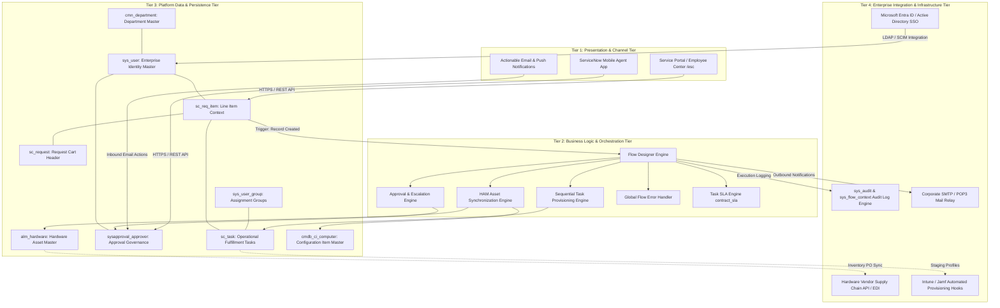
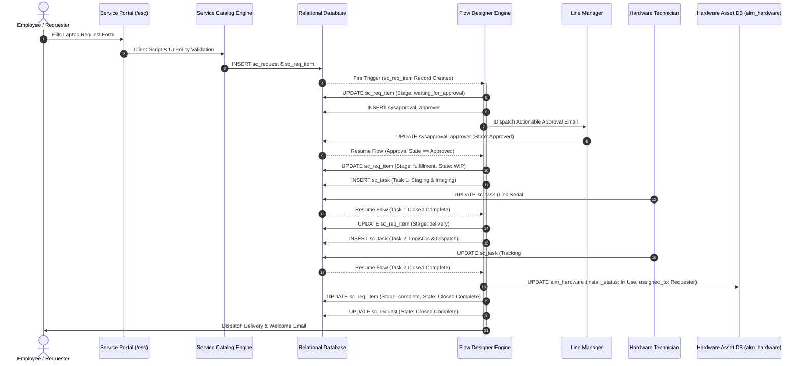
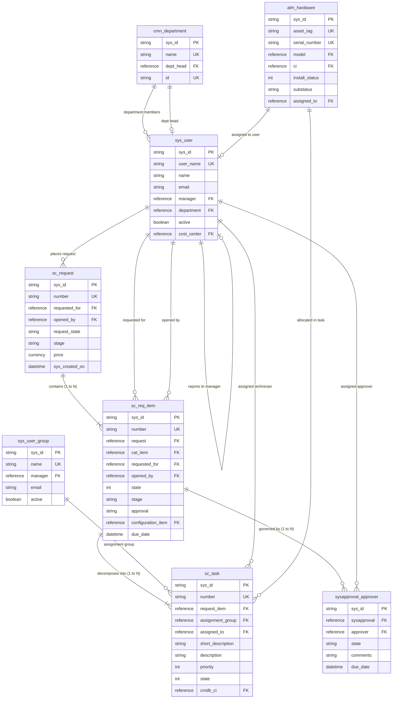
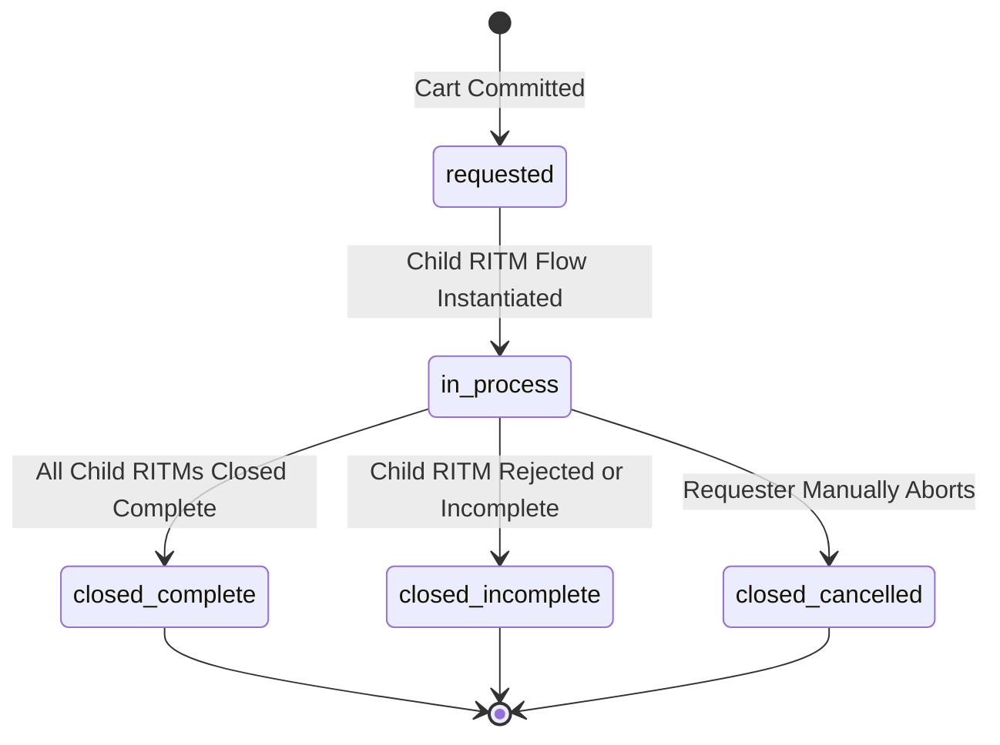
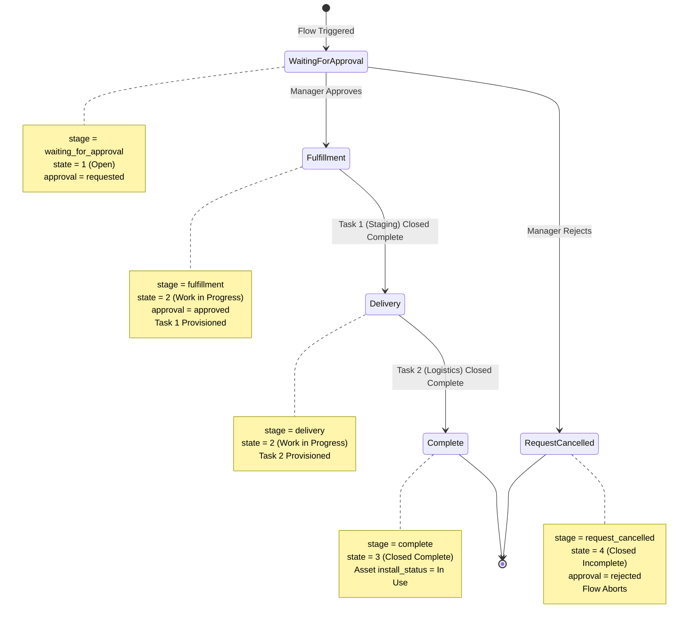
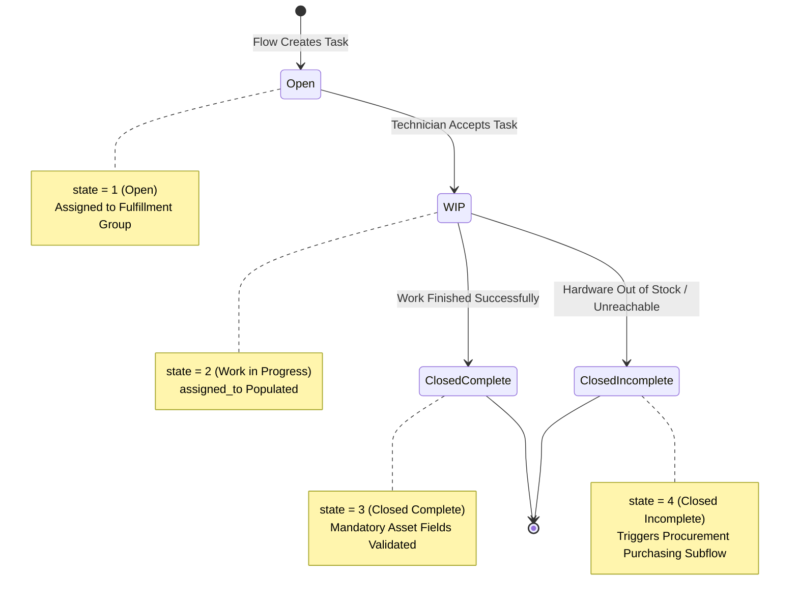
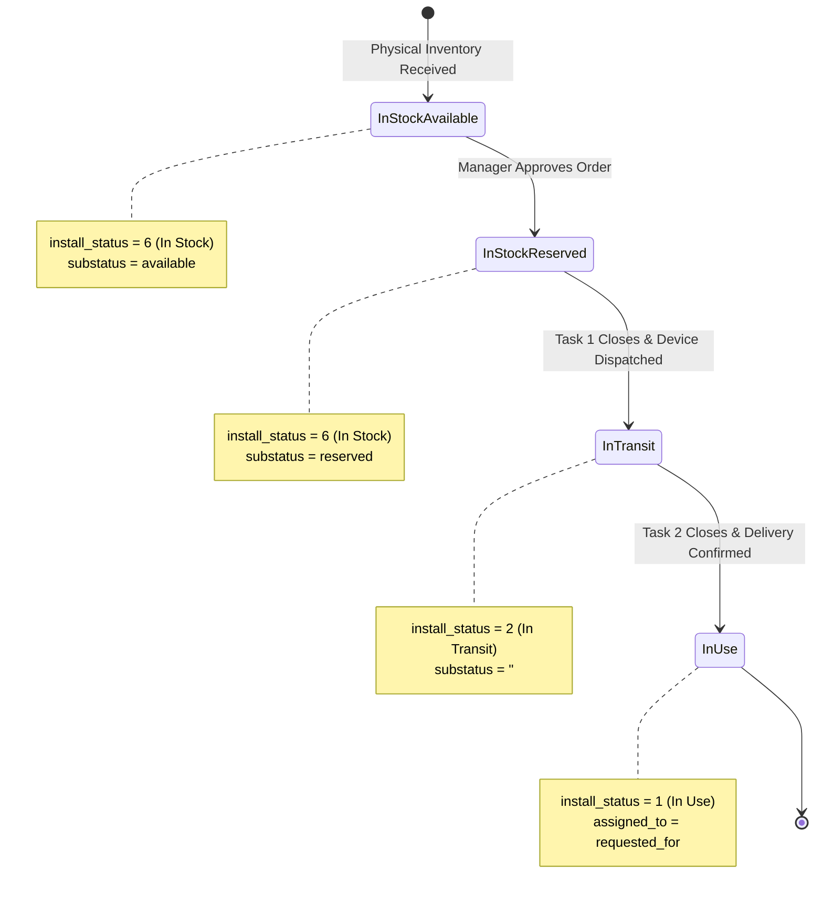
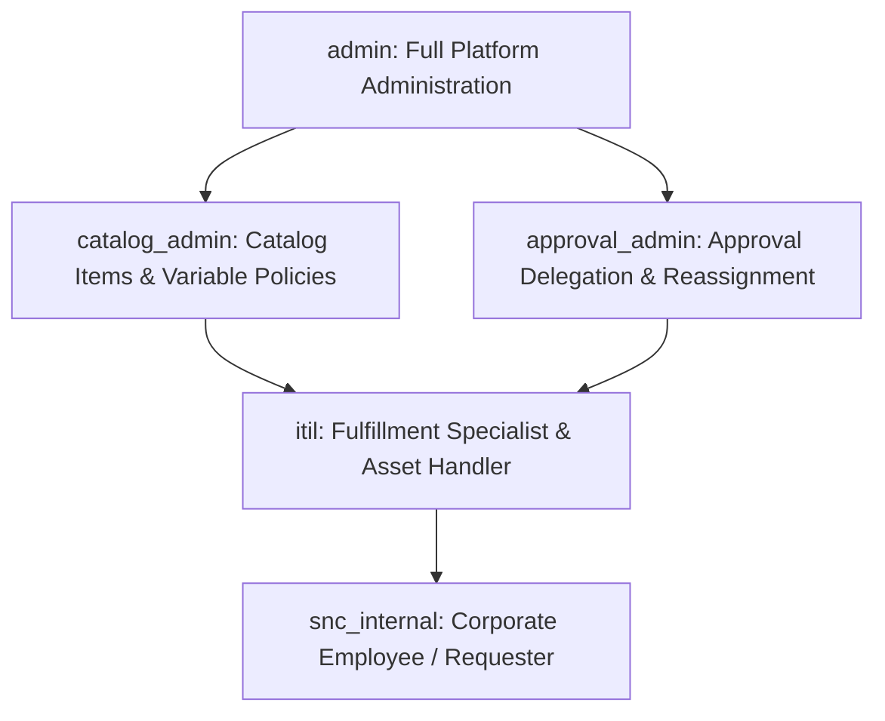

# Phase 3: Project Design Deliverables
# Document 03: Solution Architecture & Technical Data Models

**Project Title**: Streamlining IT Procurement: Automating Standard Laptop Orders with Flow Designer  
**Document Identifier**: PROJ-DESIGN-03-ARCH  
**Target Release**: ServiceNow Washington DC / Xanadu / Utah  
**Author**: worker_phase3 (Phase 3 Project Design Deliverables Lead)  
**Status**: Authoritative Architectural Design Deliverable  
**Date**: 2026-09-30  

---

## 1. Architectural Vision & Foundational Principles

The **Automated Standard Laptop Procurement Solution** is architected as an event-driven, decoupled enterprise service model hosted on the ServiceNow Now Platform. By separating user engagement channels, process orchestration, relational data persistence, and external identity/asset integrations, the architecture provides extreme resilience, real-time auditability, and seamless upgradability across platform releases.

### Foundational Architectural Principles
1. **Separation of Concerns (SoC)**: Presentation logic in the Service Portal remains strictly independent of workflow execution, which executes asynchronously in the background.
2. **Strict Schema Conformance**: Relies 100% on out-of-the-box (OOTB) ServiceNow ITIL and ITAM data structures (`sc_request`, `sc_req_item`, `sc_task`, `alm_hardware`, `sysapproval_approver`). Zero custom tables are created, eliminating technical debt and upgrade friction.
3. **Elevated Execution Boundaries**: Workflows execute under the `System User` context, ensuring that cross-table writes to asset and governance records succeed without compromising granular end-user ACL restrictions.
4. **Relational Data Integrity**: Cross-table state synchronization guarantees that parent requests, child line items, operational tasks, and hardware configuration items maintain complete transactional alignment throughout their lifecycle.

---

## 2. High-Level 4-Tier Architecture

The system topology is organized into four distinct logical tiers, providing a clean separation between user interaction, workflow automation, database storage, and external enterprise systems.

### Architectural Tier Descriptions

#### Tier 1: Presentation & Channel Tier
* **Service Portal / Employee Center (`/esc`)**: Exposes the `Standard Laptop Order` catalog item to corporate employees. Provides dynamic field validation, responsive device layout, and real-time visual progress chevrons tracking request fulfillment.
* **ServiceNow Mobile Agent App**: Enables line managers and department heads to review laptop requisitions and execute instant approvals/rejections from mobile devices.
* **Actionable Notification Engine**: Transmits formatted HTML emails containing one-click mailto approval links, empowering approvers to authorize expenditures without logging into the platform UI.

#### Tier 2: Business Logic & Orchestration Tier
* **Flow Designer Engine**: High-performance, low-code event-driven engine executing the 17-step automated procurement workflow asynchronously in the background.
* **Approval & Escalation Subflows**: Manages manager presence validation, automated 48-hour reminders, and 5-day auto-escalation to department heads.
* **Sequential Task Provisioning Engine**: Programmatically generates and assigns `sc_task` records, enforcing prerequisite staging milestones prior to logistics dispatch.
* **HAM Asset Synchronization Engine**: Executes transactional database updates against `alm_hardware` and `cmdb_ci_computer` upon task completion.
* **Global Error Handler**: Intercepts unhandled runtime exceptions, generates Priority 2 incidents, annotates work notes, and notifies platform administrators.
* **Task SLA Engine (`contract_sla`)**: Enforces 72-hour fulfillment commitments across technical staging and delivery logistics.

#### Tier 3: Platform Data & Persistence Tier
* Relational database tables providing persistent, ACID-compliant storage for requests (`sc_request`), line items (`sc_req_item`), tasks (`sc_task`), approvals (`sysapproval_approver`), hardware assets (`alm_hardware`), configuration items (`cmdb_ci_computer`), and foundation organizational data (`sys_user`, `cmn_department`, `sys_user_group`).

#### Tier 4: Enterprise Integration & Infrastructure Tier
* **Microsoft Entra ID / SCIM**: Authoritative source for employee identity, direct manager relationships, cost centers, and departmental assignments.
* **Audit & Logging Engine (`sys_audit`, `sys_flow_context`)**: Immutable historical ledger capturing every parameter change, approver IP, timestamp, and workflow transition.
* **SMTP Gateway**: High-reliability enterprise mail relay managing transactional and actionable email delivery.

---

## 3. Component Integration Architecture

The component integration architecture illustrates the exact sequence of synchronous transactions, asynchronous event triggers, and data pill flows across system boundaries.

---

## 4. Entity Relationship Model (ERD) & Data Schema

The solution strictly adheres to the ServiceNow relational data model, ensuring full data normalization across foundation data, service requests, operational tasks, and asset records.

### Comprehensive Data Dictionary for Core Interacting Tables

#### 1. Table: `sc_request` (Request Header Container)
*Inherits from: `task`* | **Physical Table**: `sc_request`

| Column Name | Label | Data Type | Constraint | Default | Foreign Key Target | Business Description |
|---|---|---|---|---|---|---|
| `sys_id` | Sys ID | GUID (32 hex) | PK, Mandatory | Auto | — | Unique global record identifier. |
| `number` | Number | String (40) | Unique, Indexed | Auto | — | Human-readable identifier (e.g., `REQ0010201`). |
| `requested_for`| Requested for| Reference | Mandatory, FK | Auto | `sys_user.sys_id` | Employee who will receive the requested goods. |
| `opened_by` | Opened by | Reference | Mandatory, FK | `gs.getUserID()`| `sys_user.sys_id` | User who physically submitted the request. |
| `request_state`| Request state| Choice (String) | Mandatory | `requested` | — | Values: `saved`, `requested`, `in_process`, `closed_complete`, `closed_incomplete`. |
| `stage` | Stage | Choice (String) | Mandatory | `requested` | — | Order cart stage: `requested`, `approval`, `fulfillment`, `closed`. |
| `price` | Price | Currency | Mandatory | `0.00` | — | Total price aggregated from child line items. |
| `sys_created_on`| Created | GlideDateTime | Auto | Current Time | — | Exact database creation timestamp. |

#### 2. Table: `sc_req_item` (Requested Line Item)
*Inherits from: `task`* | **Physical Table**: `sc_req_item`

| Column Name | Label | Data Type | Constraint | Default | Foreign Key Target | Business Description |
|---|---|---|---|---|---|---|
| `sys_id` | Sys ID | GUID (32 hex) | PK, Mandatory | Auto | — | Unique global item identifier. |
| `number` | Number | String (40) | Unique, Indexed | Auto | — | Auto-generated item number (e.g., `RITM0010501`). |
| `request` | Request | Reference | Mandatory, FK | — | `sc_request.sys_id` | Foreign key referencing parent cart container. |
| `cat_item` | Item | Reference | Mandatory, FK | — | `sc_cat_item.sys_id`| References 'Standard Laptop Order' catalog item. |
| `requested_for`| Requested for| Reference | Mandatory, FK | — | `sys_user.sys_id` | Target employee receiving the computing equipment. |
| `opened_by` | Opened by | Reference | Mandatory, FK | `gs.getUserID()`| `sys_user.sys_id` | Submitting employee. |
| `state` | State | Integer (Choice)| Mandatory | `1` (Open) | — | Values: `1` (Open), `2` (WIP), `3` (Closed Complete), `4` (Closed Incomplete). |
| `stage` | Stage | Choice (String) | Mandatory | `waiting_for_approval`| — | Values: `waiting_for_approval`, `fulfillment`, `delivery`, `complete`, `request_cancelled`. |
| `approval` | Approval | Choice (String) | Mandatory | `requested` | — | Values: `not_requested`, `requested`, `approved`, `rejected`. |
| `configuration_item`| Configuration Item| Reference | Optional, FK | — | `cmdb_ci_computer.sys_id`| CMDB CI record linked upon successful fulfillment. |
| `due_date` | Due date | GlideDateTime | Calculated | `+72 Hours` | — | SLA target delivery commitment deadline. |
| `work_notes` | Work notes | Journal | Optional | — | — | Internal technical execution and audit log notes. |

#### 3. Table: `sc_task` (Fulfillment Catalog Task)
*Inherits from: `task`* | **Physical Table**: `sc_task`

| Column Name | Label | Data Type | Constraint | Default | Foreign Key Target | Business Description |
|---|---|---|---|---|---|---|
| `sys_id` | Sys ID | GUID (32 hex) | PK, Mandatory | Auto | — | Unique global task identifier. |
| `number` | Number | String (40) | Unique, Indexed | Auto | — | Auto-generated task number (e.g., `SCTASK0012001`). |
| `request_item` | Request item | Reference | Mandatory, FK | — | `sc_req_item.sys_id`| Parent requested line item. |
| `assignment_group`| Assignment group| Reference | Mandatory, FK | — | `sys_user_group.sys_id`| Fulfilling team (`Hardware Fulfillment Group` or `IT Logistics`). |
| `assigned_to` | Assigned to | Reference | Optional, FK | — | `sys_user.sys_id` | Specific technician working the task. |
| `short_description`| Short description| String (160) | Mandatory | — | — | Concise task title populated by Flow Designer. |
| `description` | Description | String (4000) | Optional | — | — | Detailed hardware specifications, OS, bundle, and address. |
| `priority` | Priority | Integer (Choice)| Mandatory | `3` (Moderate) | — | Values: `1` (Critical), `2` (High), `3` (Moderate), `4` (Low). |
| `state` | State | Integer (Choice)| Mandatory | `1` (Open) | — | Values: `1` (Open), `2` (WIP), `3` (Closed Complete), `4` (Closed Incomplete). |
| `cmdb_ci` | Configuration item| Reference | Conditional, FK | — | `cmdb_ci_computer.sys_id`| Mandatory upon closing Task 1 (Staging & Imaging). |

#### 4. Table: `sys_user` (Enterprise User Identity)
**Physical Table**: `sys_user`

| Column Name | Label | Data Type | Constraint | Default | Foreign Key Target | Business Description |
|---|---|---|---|---|---|---|
| `sys_id` | Sys ID | GUID (32 hex) | PK, Mandatory | Auto | — | Unique global user identifier. |
| `user_name` | User ID | String (100) | Unique, Indexed | — | — | Corporate SSO username / login ID (e.g., `jane.smith`). |
| `name` | Name | String (160) | Mandatory | — | — | Full display name. |
| `email` | Email | String (100) | Indexed | — | — | Corporate email address used for notification delivery. |
| `manager` | Manager | Reference | Self-FK | — | `sys_user.sys_id` | Direct line manager responsible for approval sign-off. |
| `department` | Department | Reference | FK | — | `cmn_department.sys_id`| Corporate departmental alignment. |
| `active` | Active | Boolean | Mandatory | `true` | — | Employment status flag; inactive accounts bypass approvals. |
| `cost_center` | Cost center | Reference | FK | — | `cmn_cost_center.sys_id`| Financial accounting cost center charged for hardware. |

#### 5. Table: `sys_user_group` (Assignment Groups)
**Physical Table**: `sys_user_group`

| Column Name | Label | Data Type | Constraint | Default | Foreign Key Target | Business Description |
|---|---|---|---|---|---|---|
| `sys_id` | Sys ID | GUID (32 hex) | PK, Mandatory | Auto | — | Unique group identifier. |
| `name` | Name | String (100) | Unique, Indexed | — | — | Group name (`Hardware Fulfillment Group`, `IT Logistics`). |
| `manager` | Manager | Reference | FK | — | `sys_user.sys_id` | Team manager responsible for group queue oversight. |
| `email` | Group email | String (100) | Optional | — | — | Shared distribution email for queue alerts. |
| `active` | Active | Boolean | Mandatory | `true` | — | Operational status of the group. |

#### 6. Table: `cmn_department` (Department Master)
**Physical Table**: `cmn_department`

| Column Name | Label | Data Type | Constraint | Default | Foreign Key Target | Business Description |
|---|---|---|---|---|---|---|
| `sys_id` | Sys ID | GUID (32 hex) | PK, Mandatory | Auto | — | Unique department identifier. |
| `name` | Name | String (100) | Unique, Indexed | — | — | Department title (e.g., `Engineering`, `Finance`). |
| `dept_head` | Department head| Reference | FK | — | `sys_user.sys_id` | Department Head executive used for approval escalations. |
| `id` | Department ID | String (40) | Unique | — | — | Corporate accounting department identifier. |

#### 7. Table: `alm_hardware` (Hardware Asset Master)
*Inherits from: `alm_asset`* | **Physical Table**: `alm_hardware`

| Column Name | Label | Data Type | Constraint | Default | Foreign Key Target | Business Description |
|---|---|---|---|---|---|---|
| `sys_id` | Sys ID | GUID (32 hex) | PK, Mandatory | Auto | — | Unique asset record identifier. |
| `asset_tag` | Asset tag | String (100) | Unique, Indexed | — | — | Physical barcode label affixed to the laptop. |
| `serial_number` | Serial number | String (100) | Unique, Indexed | — | — | OEM hardware serial number. |
| `model` | Model | Reference | Mandatory, FK | — | `cmdb_model.sys_id` | Reference to hardware specification model. |
| `ci` | Configuration item| Reference | FK | — | `cmdb_ci_computer.sys_id`| Linked Configuration Item record in the CMDB. |
| `install_status`| State | Integer (Choice)| Mandatory | `6` (In Stock) | — | Values: `1` (In Use), `2` (In Transit), `6` (In Stock), `7` (Retired). |
| `substatus` | Substate | Choice (String) | Conditional | `available` | — | Values when In Stock: `available`, `reserved`, `pending_repair`. |
| `assigned_to` | Assigned to | Reference | FK | — | `sys_user.sys_id` | Employee possessing the machine; updated on delivery. |

#### 8. Table: `sysapproval_approver` (Approval Governance Records)
**Physical Table**: `sysapproval_approver`

| Column Name | Label | Data Type | Constraint | Default | Foreign Key Target | Business Description |
|---|---|---|---|---|---|---|
| `sys_id` | Sys ID | GUID (32 hex) | PK, Mandatory | Auto | — | Unique approval record identifier. |
| `sysapproval` | Approval for | Reference | Mandatory, FK | — | `task.sys_id` (`sc_req_item`)| The target line item requiring governance sign-off. |
| `approver` | Approver | Reference | Mandatory, FK | — | `sys_user.sys_id` | Designated authority responsible for authorizing request. |
| `state` | State | Choice (String) | Mandatory | `requested` | — | Values: `not_requested`, `requested`, `approved`, `rejected`. |
| `comments` | Approval comments| Journal | Optional | — | — | Formal justification comments recorded by approver. |
| `due_date` | Due date | GlideDateTime | Calculated | `+5 Days` | — | Deadline for escalation before rerouting to Dept Head. |

---

## 5. State-Transition Architecture & Synchronization Rules

To maintain absolute data integrity across parent requests, child items, operational tasks, and asset inventory, the system enforces a strict **State Machine Architecture**.

### 5.1 Parent Request (`sc_request.request_state`) State Machine

### 5.2 Requested Item (`sc_req_item`) Dual State & Stage Engine

ServiceNow utilizes a dual-layer tracking mechanism: **`stage`** drives the customer-facing progress chevrons in the Service Portal, while **`state`** governs backend SLA calculation and task workflow states.

### 5.3 Catalog Task (`sc_task.state`) State Machine

### 5.4 Hardware Asset (`alm_hardware.install_status` & `substatus`) Lifecycle

---

### 5.5 Unified Cross-Table State Synchronization Matrix

The following matrix defines the exact relational state alignment across all seven core entity attributes at each operational milestone:

| # | Business Milestone | `sc_request.request_state` | `sc_req_item.stage` | `sc_req_item.state` | `sc_req_item.approval` | `sc_task (Task 1)` | `sc_task (Task 2)` | `alm_hardware.install_status` | `alm_hardware.substatus` |
|---|---|---|---|---|---|---|---|---|---|
| **1** | **Order Submitted** | `requested` | `waiting_for_approval` | `1` (Open) | `requested` | *Not Provisioned* | *Not Provisioned* | `6` (In Stock) | `available` |
| **2** | **Manager Approves** | `in_process` | `fulfillment` | `2` (Work in Prog) | `approved` | `1` (Open) | *Not Provisioned* | `6` (In Stock) | `reserved` |
| **3** | **Manager Rejects** | `closed_incomplete`| `request_cancelled` | `4` (Closed Incomp)| `rejected` | *Cancelled / None* | *Not Provisioned* | `6` (In Stock) | `available` |
| **4** | **Tech Begins Staging**| `in_process` | `fulfillment` | `2` (Work in Prog) | `approved` | `2` (Work in Prog) | *Not Provisioned* | `6` (In Stock) | `reserved` |
| **5** | **Staging Completed** | `in_process` | `delivery` | `2` (Work in Prog) | `approved` | `3` (Closed Comp) | `1` (Open) | `2` (In Transit) | `''` (Cleared) |
| **6** | **Tech Ships Device** | `in_process` | `delivery` | `2` (Work in Prog) | `approved` | `3` (Closed Comp) | `2` (Work in Prog) | `2` (In Transit) | `''` (Cleared) |
| **7** | **Verified Delivery** | `closed_complete` | `complete` | `3` (Closed Comp) | `approved` | `3` (Closed Comp) | `3` (Closed Comp) | `1` (In Use) | `''` (Cleared) |

#### Synchronization Enforcement Mechanisms
* **Flow Designer Actions**: Primary orchestrator driving all progressive forward transitions from Milestone 1 through 7.
* **ServiceNow Business Rules (Fail-Safe)**: An out-of-the-box business rule (`sc_req_item closure checks`) validates parent `sc_request` state upon child closure to prevent orphaned open request containers.
* **Race Condition Mitigation**: Database row locks (`GlideRecord.setWorkflow(true)`) and sequential `Wait for Condition` action blocks ensure that Task 2 cannot be created until the database commit for Task 1 closure has completed.

---

## 6. Security, Governance & Role Architecture

Platform security enforces the principle of least privilege, strict segregation of duties, and regulatory compliance across all interacting personas.

### 6.1 Role Definitions & Permission Scope

| Role Identifier | Security Scope | Key Capabilities & Functional Privileges |
|---|---|---|
| **`snc_internal`** | Employee Center, `sc_cat_item`, self `sc_req_item` | Standard corporate employee. Can submit catalog items, view own submitted requests (`requested_for == gs.getUserID()`), post public comments. Cannot view internal technician work notes, task queues, or asset tables. |
| **`itil`** | `sc_task`, `sc_req_item`, `alm_hardware`, `cmdb_ci` | Operational fulfiller role. Can view team task queues (`Hardware Fulfillment Group`, `IT Logistics`), update task states, enter work notes, scan serial numbers, and perform asset allocations. |
| **`approval_admin`** | `sysapproval_approver` | Governance oversight role. Can reassign stalled approvals, manage approval delegation during extended manager absences, and review enterprise approval audit logs. |
| **`catalog_admin`** | `sc_cat_item`, `item_option_new`, `catalog_ui_policy` | Service catalog management. Can configure catalog item specifications, variable sets, dynamic UI policies, and client scripts. Cannot alter core platform ACLs or database dictionaries. |
| **`admin`** | Instance-Wide | Full administrative control. Configures global Flow Designer engine properties, system dictionaries, access control lists (ACLs), and platform integration endpoints. |

---

### 6.2 Access Control List (ACL) Matrix

The table below defines the security boundaries across core procurement tables for Create, Read, Write, and Delete operations:

| Table Name | Operation | Role Required | Enforcement Condition / Script Safeguard |
|---|:---:|---|---|
| **`sc_request`** | `create` | `snc_internal` | Created automatically via Service Catalog cart checkout. |
| **`sc_request`** | `read` | `snc_internal` | `opened_by == gs.getUserID() || requested_for == gs.getUserID() || gs.hasRole('itil')` |
| **`sc_request`** | `write` | `itil` | User possesses `itil` role and parent record is not in a closed state. |
| **`sc_request`** | `delete` | `admin` | Blocked in production; requests must be closed or cancelled, never deleted. |
| **`sc_req_item`**| `create` | `snc_internal` | Created automatically via Service Catalog submission. |
| **`sc_req_item`**| `read` | `snc_internal` | `opened_by == gs.getUserID() || requested_for == gs.getUserID() || gs.getUser().isMemberOf(current.assignment_group) || gs.hasRole('itil')` |
| **`sc_req_item`**| `write` | `itil` | System flow executes with elevated `System User` rights; manual fulfiller writes restricted to work notes. |
| **`sc_task`** | `create` | `system` / `admin` | Programmatic creation restricted strictly to Flow Designer engine; manual user creation disabled. |
| **`sc_task`** | `read` | `itil` | User has `itil` role and is a member of `assignment_group` or holds `admin`. |
| **`sc_task`** | `write` | `itil` | Technician must be an active member of `current.assignment_group` to edit or close task. |
| **`alm_hardware`**| `read` | `itil` | Read access permitted to ITIL users for asset tagging and verification. |
| **`alm_hardware`**| `write` | `asset` / `itil` | Enforces mandatory audit logging when `install_status` or `assigned_to` fields are modified. |
| **`sysapproval_approver`**| `read` | `snc_internal` | `approver == gs.getUserID() || sysapproval.opened_by == gs.getUserID() || gs.hasRole('approval_admin')` |
| **`sysapproval_approver`**| `write`| `snc_internal` | `approver == gs.getUserID() || gs.hasRole('approval_admin')` (Only assigned approver can approve). |

---

### 6.3 Data Privacy, PII Isolation & Audit Immutability

1. **PII Isolation for Remote Deliveries**:
   - Variables containing private home delivery details (`shipping_address`, `contact_phone`) are protected using **Variable Read Roles**. General employees browsing portal requests cannot view private residential addresses; visibility is restricted strictly to the submitting employee, their line manager, and members of `IT Logistics & Deskside Support`.
2. **Read-Only Data Lock Post-Approval**:
   - A Catalog UI Policy automatically locks all hardware option choices as Read-Only once the request transitions out of the initial `Open` state. This prevents tampering or modifying specifications while orders are actively being fulfilled.
3. **Immutable Forensic Audit Ledger**:
   - High-fidelity auditing is active on `sc_req_item`, `sc_task`, and `sysapproval_approver` via the platform audit engine (`sys_audit`). All field updates, approval decisions, user IPs, and workflow engine transitions are permanently archived, guaranteeing compliance with enterprise regulatory standards (SOX, ISO 27001).

---

## 7. Document Sign-off & Revision History

| Version | Date | Author | Role | Description of Change |
|---|---|---|---|---|
| **1.0** | 2026-09-30 | worker_phase3 | Phase 3 Design Lead | Authoritative Deliverable: 4-Tier Architecture Diagram, Component Integration Model, Full 8-Table ERD & Data Dictionary, State-Transition Architecture, and RBAC Security Matrix. |
