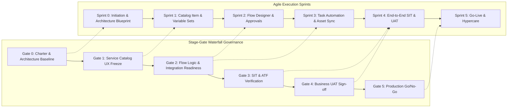
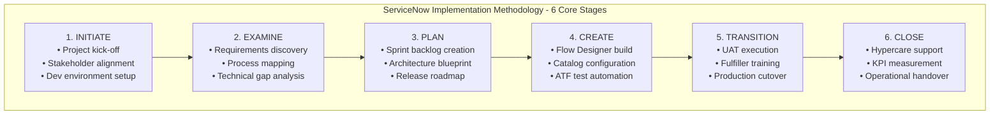
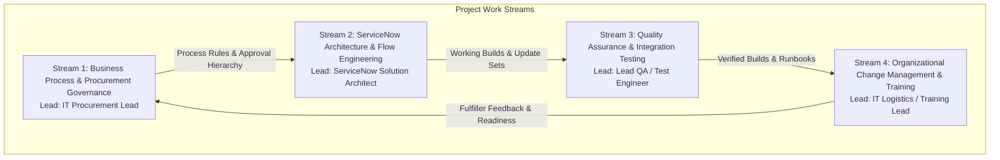
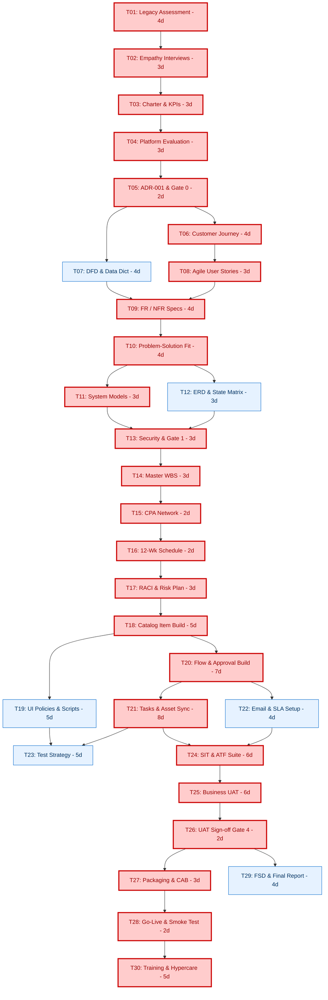

# Work Breakdown Structure (WBS) & Project Planning Logic

**Project Title**: Streamlining IT Procurement: Automating Standard Laptop Orders with Flow Designer  
**Document Identifier**: PLAN-PHASE4-WBS-V1.0  
**Target Environment**: ServiceNow Washington DC / Xanadu / Utah LTS  
**Methodology**: ServiceNow Implementation Methodology (SIM) / Hybrid Agile-Waterfall  
**Author**: worker_phase4 (Phase 4 Project Planning Deliverables Lead)  
**Date**: 2026-09-30  
**Document Status**: Approved Baseline  

---

## 1. Executive Summary & Planning Framework

### 1.1 Purpose and Objectives
This document establishes the comprehensive planning logic, governance framework, and hierarchical Work Breakdown Structure (WBS) for the enterprise implementation of the **Automated Standard Laptop Procurement** solution on the ServiceNow platform. 

The primary objective is to replace the existing fragmented, manual, and email-dependent laptop ordering workflow—which currently averages **14.2 business days** in turnaround time, suffers from an **18% configuration defect rate**, and causes significant asset inventory drift—with a streamlined, event-driven ServiceNow Flow Designer architecture targeting end-to-end fulfillment in **less than 72 hours (3 business days)**.

To ensure deterministic delivery, clear accountability, and zero operational disruption, this plan integrates the formal **ServiceNow Implementation Methodology (SIM)** with a **Hybrid Agile-Waterfall** project delivery lifecycle.



---

## 2. Planning Logic & Implementation Methodology

### 2.1 ServiceNow Implementation Methodology (SIM) Alignment
The project delivery model strictly follows the six standardized stages of the **ServiceNow Implementation Methodology (SIM)**, ensuring that enterprise architectural standards, platform health best practices, and organizational change readiness are maintained throughout the engagement:



1. **Initiate**:
   - Establish formal project governance, identify steering committee members, and define project charter.
   - Provision sub-production developer instances (`dev`, `test`, `stage`) and configure update set naming conventions (`SN_PROC_FLOW_`).
   - Conduct joint kick-off workshops aligning IT Procurement, Hardware Depot, and Platform Architecture teams.

2. **Examine**:
   - Deconstruct legacy procurement pain points, gather baseline operational telemetry, and document empathy personas.
   - Formulate Data Flow Diagrams (DFD Level 0 Context and Level 1 Decomposition) and map customer journey touchpoints.
   - Define exact functional and non-functional requirements (FR/NFR), Service Level Agreements (SLAs), and compliance constraints.

3. **Plan**:
   - Establish sprint backlogs, estimate story points, and finalize the 150 person-day / 1,200 hour resource allocation model.
   - Formulate the 4-level Work Breakdown Structure (WBS) and perform Critical Path Analysis (CPA).
   - Author the RACI governance matrix and Enterprise Risk Management plan with 5x5 scoring.

4. **Create**:
   - Execute iterative development in two-week agile sprints within the `dev` instance.
   - Build Service Catalog variables, UI Policies, Client Scripts, and Flow Designer actions/subflows.
   - Implement Automated Test Framework (ATF) suites and conduct daily stand-ups and sprint reviews.

5. **Transition**:
   - Migrate update sets to `test` and `stage` environments using collision analysis and automated health checks.
   - Facilitate formal User Acceptance Testing (UAT) with business stakeholders across 8 critical path scenarios.
   - Deliver hands-on fulfiller training for Hardware Depot and IT Logistics teams, publishing standard runbooks.

6. **Close**:
   - Execute production cutover during scheduled maintenance window and verify live smoke tests.
   - Provide two weeks of high-touch Hypercare operational support with daily incident triage.
   - Conduct post-implementation review, assess KPI achievement against the 72-hour benchmark, and transition to BAU platform support.

---

### 2.2 Hybrid Agile-Waterfall Delivery Framework
To balance organizational compliance and agile responsiveness, the project employs a **Hybrid Agile-Waterfall model**:

* **Waterfall Governance Outer Shell**: Project budgeting, milestone sign-offs, architecture review board (ARB) gates, information security approvals, and final production release readiness are managed through structured waterfall stage-gates.
* **Agile Scrum Execution Inner Engine**: Configuration, scripting, Flow Designer orchestration, asset integration, and sprint-level testing are executed through two-week Agile Sprints utilizing Jira / ServiceNow Agile Development 2.0.

#### Stage-Gate Governance Milestones
| Gate ID | Gate Name | Timing | Exit Criteria & Artifact Prerequisites | Approving Authority |
|---|---|---|---|---|
| **Gate 0** | Project Initiation & Charter Sign-off | End of Week 1 | Approved Business Case, Signed Project Charter, Baseline Scope Document | Project Sponsor & IT VP |
| **Gate 1** | Architecture & Security Baseline | End of Week 2 | Architecture Blueprint (ERD, DFD, Security Matrix), ARB Sign-off | Solution Architect & CISO Delegate |
| **Gate 2** | Catalog UX & Workflow Logic Review | End of Week 6 | Catalog Item in Dev, UI Policies verified, Flow Approval logic unit-tested | IT Procurement Lead |
| **Gate 3** | Integration & Task Orchestration Sign-off | End of Week 8 | Automated Task generation and `alm_hardware` asset sync verified in Test | Hardware Depot Lead & ITAM Lead |
| **Gate 4** | Business UAT Sign-off | End of Week 10 | 100% test scenario pass rate, zero Severity 1/2 defects, signed UAT Acceptance | Lead QA & IT Procurement Lead |
| **Gate 5** | Production Cutover & Go-Live Readiness | End of Week 11 | Change Advisory Board (CAB) approval, verified rollback runbook, smoke test plan | Change Manager & Project Sponsor |

---

### 2.3 Work Stream Decomposition & Coordination
The execution team operates across four parallel, highly synchronized work streams:



1. **Stream 1: Business Process & Procurement Governance**:
   - Validates catalog item specifications (Developer 16-inch, Business 14-inch, Ultralight 13-inch).
   - Defines manager approval thresholds, exception workflows for missing managers, and SLA targets.
   - Monitors financial budget tracking and procurement vendor relationships.

2. **Stream 2: ServiceNow Architecture & Flow Engineering**:
   - Designs and builds the catalog item, variable sets, container layouts, and client scripts.
   - Configures Flow Designer trigger, `Ask for Approval`, sequential `Create Catalog Task` actions, and subflows.
   - Implements automated bidirectional asset synchronization with `alm_hardware` and `cmdb_ci_computer`.

3. **Stream 3: Quality Assurance & Integration Testing**:
   - Formulates the master test strategy, manual UAT test scripts, and Automated Test Framework (ATF) suites.
   - Executes System Integration Testing (SIT) covering happy path, rejection, VIP routing, and null managers.
   - Manages defect logging, severity triage, root-cause analysis, and re-testing verification.

4. **Stream 4: Organizational Change Management & Training**:
   - Develops employee communication campaigns for Employee Center catalog discovery.
   - Produces interactive training guides and short video walkthroughs for managers on 1-click approvals.
   - Authors standard operating procedures (SOPs) and task completion checklists for hardware technicians.

---

## 3. Complete 4-Level Work Breakdown Structure (WBS)

The project work scope is organized into a rigorous 4-level hierarchy:
* **Level 1: Project Phases** (1.0 to 6.0)
* **Level 2: Work Packages** (e.g., 1.1, 1.2, 2.1...)
* **Level 3: Activities & Tasks** (e.g., 1.1.1, 1.1.2...)
* **Level 4: Concrete Deliverables** (verifiable output artifacts, documentation, or code configurations)

```
====================================================================================================
LEVEL 1: PHASES | LEVEL 2: WORK PACKAGES | LEVEL 3: TASKS | LEVEL 4: CONCRETE DELIVERABLES
====================================================================================================
```

### 1.0 Phase 1: Project Ideation & Initiation

#### 1.1 Business Case & Problem Formulation
* **1.1.1 Legacy Procurement Assessment & Baseline Telemetry**
  * *1.1.1.1 Operational Baseline Report*: Document legacy 14.2-day cycle time, 18% configuration error rate, and 15% asset tracking drift based on past 12-month IT ticket extracts.
  * *1.1.1.2 Quantified Problem Statements Document*: Formalized document outlining 4 core bottleneck domains (approvals, task routing, asset tracking, communication).
* **1.1.2 Stakeholder Empathy & Voice-of-the-Customer Research**
  * *1.1.2.1 Stakeholder Interview Transcripts*: Qualitative feedback gathered from 15 corporate users, 5 line managers, and 6 hardware depot technicians.
  * *1.1.2.2 Tri-Persona Empathy Map Canvases*: Detailed Empathy Maps (Says, Thinks, Does, Feels, Pains, Gains) for Corporate Requester, Line Manager, and Hardware Depot Specialist.
* **1.1.3 Project Charter & Strategic KPI Formulation**
  * *1.1.3.1 Formal Project Charter*: Signed charter defining project background, business justification, executive sponsor, budget envelope, and constraints.
  * *1.1.3.2 Strategic KPI Scorecard*: Defined targets: <72-hour cycle time, 100% automated asset reconciliation, >95% employee satisfaction (CSAT), and zero lost orders.

#### 1.2 Architectural Evaluation & Platform Selection
* **1.2.1 Solution Alternative & Feasibility Analysis**
  * *1.2.1.1 Technology Comparison Matrix*: Side-by-side evaluation of Legacy Workflow Editor, Custom Scripting/Business Rules, and ServiceNow Flow Designer across 8 enterprise dimensions.
  * *1.2.1.2 Effort vs. Impact Prioritization Canvas*: 2x2 matrix categorizing automation initiatives into Quick Wins, Strategic Projects, Fill-ins, and Hard Slogs.
* **1.2.2 Architectural Decision Baseline**
  * *1.2.2.1 Architectural Decision Record (ADR-001)*: Formal selection of ServiceNow Flow Designer (native background asynchronous execution engine) as the enterprise workflow standard.
  * *1.2.2.2 Phase 1 Milestone Sign-off Certificate*: Gate 0 formal approval artifact signed by Project Sponsor and IT Procurement Lead.

---

### 2.0 Phase 2: Requirements Engineering & Analysis

#### 2.1 Customer Journey & Process Decomposition
* **2.1.1 End-to-End Customer Journey Modeling**
  * *2.1.1.1 6-Stage Customer Journey Map Document*: Complete lifecycle journey modeling touchpoints, pain points, emotional curves (-2 to +2), and automated interventions.
  * *2.1.1.2 Service Portal Interaction Wireframes*: Visual mockups of the Employee Center catalog interface, shopping cart, and request status chevron tracker.
* **2.1.2 Data Flow Architecture & Data Dictionary**
  * *2.1.2.1 DFD Level 0 Context Diagram*: High-level boundary diagram modeling data exchange between External Users, Line Managers, ServiceNow Engine, Hardware Depot, and Active Directory.
  * *2.1.2.2 DFD Level 1 Subsystem Decomposition Diagram*: Granular flow diagrams illustrating transaction paths between `sc_request`, `sc_req_item`, `sysapproval_approver`, `sc_task`, and `alm_hardware`.
  * *2.1.2.3 Enterprise Data Dictionary Specification*: Field-level specification defining data types, constraints, foreign keys, and default values across 8 interacting tables.

#### 2.2 Functional, Technical & Governance Specifications
* **2.2.1 Agile User Stories & Acceptance Criteria**
  * *2.2.1.1 Agile Product Backlog*: 8 epics and 24 prioritized user stories with MoSCoW rankings (Must Have, Should Have, Could Have, Won't Have) and story point estimates.
  * *2.2.1.2 Gherkin Scenario Acceptance Test Suite*: Formal Given-When-Then criteria defined for every user story to guide development and automated testing.
* **2.2.2 Detailed Solution Requirements Documentation**
  * *2.2.2.1 Functional Requirements Document (FRD)*: 12 detailed functional specifications covering catalog selection, manager validation, task sequencing, and automated email notifications.
  * *2.2.2.2 Non-Functional Requirements (NFR) & SLA Framework*: 6 NFR specifications covering platform response times (<2s), concurrent transaction handling (100+ requests/hour), and 72-hour Task SLA (`contract_sla`).
  * *2.2.2.3 Technology Stack & Platform Compatibility Matrix*: Specification defining ServiceNow release targets (Washington DC / Xanadu), plugin dependencies, and browser support standards.

---

### 3.0 Phase 3: Solution Design & Architecture

#### 3.1 Workflow Logic & Execution Architecture
* **3.1.1 Problem-Solution Fit & Transformation Design**
  * *3.1.1.1 Problem-Solution Fit Blueprint*: Structured mapping linking all 8 legacy procurement bottlenecks to Flow Designer capabilities and architectural safeguards.
  * *3.1.1.2 End-to-End Workflow Specification*: 17-action execution specification detailing triggers, approvals, sequential task generation, and automated asset reconciliation.
* **3.1.2 Visual System & Interaction Modeling**
  * *3.1.2.1 Mermaid Process Sequence Diagram*: UML sequence diagram modeling asynchronous messaging between Requester, Portal, Flow Engine, Manager, and Fulfillers.
  * *3.1.2.2 4-Tier Component Architecture Diagram*: Architectural blueprint illustrating Presentation Layer, Workflow Layer, Relational Data Layer, and External Integration Layer.

#### 3.2 Data Schema, State Synchronization & Security Blueprint
* **3.2.1 Relational Entity-Relationship Modeling**
  * *3.2.1.1 Entity-Relationship Diagram (ERD)*: Relational schema visual showing 1-to-N and N-to-N relationships between users, departments, requests, line items, tasks, and assets.
  * *3.2.1.2 Multi-Table State-Transition Matrix*: State machine model synchronizing `sc_request.request_state`, `sc_req_item.stage`, `sc_req_item.state`, and `sc_task.state`.
* **3.2.2 Platform Security & Data Privacy Framework**
  * *3.2.2.1 RBAC Role Hierarchy & ACL Specification*: Role mapping covering `snc_internal`, `itil`, `catalog_admin`, `approval_admin`, and `admin` with table-level CRUD permissions.
  * *3.2.2.2 Variable Privacy & PII Protection Guidelines*: Access rules restricting home delivery addresses and phone numbers to authorized logistics personnel.
  * *3.2.2.3 Architecture Review Board (ARB) Package*: Gate 1 compliance package submitted to and approved by Enterprise Platform Architecture.

---

### 4.0 Phase 4: Project Planning & Operational Governance

#### 4.1 Work Breakdown Structure & Schedule Modeling
* **4.1.1 WBS Formulation & Planning Logic**
  * *4.1.1.1 Master Work Breakdown Structure (WBS) Document*: 4-level hierarchical breakdown covering all project work packages, tasks, and verifiable deliverable artifacts.
  * *4.1.1.2 Implementation Methodology Guideline*: Documented framework detailing SIM phase alignment, hybrid agile-waterfall stage gates, and work stream coordination.
* **4.1.2 Task Dependency Network & Critical Path Modeling**
  * *4.1.2.1 Precedence Diagramming Method (PDM) Network*: Structured dependency network mapping all task relationships (Finish-to-Start, Start-to-Start).
  * *4.1.2.2 Critical Path Analysis (CPA) Report*: Early Start, Early Finish, Late Start, Late Finish, and Float calculation table identifying the zero-float critical path.

#### 4.2 Resource Allocation, RACI Governance & Risk Management
* **4.2.1 Resource Estimation & Sprint Calendar**
  * *4.2.1.1 12-Week / 6-Sprint Schedule Model*: Detailed sprint schedule with start/end dates, milestone deliverables, and gate criteria.
  * *4.2.1.2 150 Person-Day Effort Allocation Matrix*: Granular distribution model balancing 1,200 hours across 6 stakeholder roles.
* **4.2.2 Governance & Risk Management Blueprint**
  * *4.2.2.1 Multi-Stakeholder RACI Matrix*: Responsibility matrix mapping Responsible, Accountable, Consulted, and Informed roles across all 6 project phases.
  * *4.2.2.2 Enterprise Risk Management Plan & 5x5 Register*: 8+ identified enterprise risks with Likelihood, Impact, Mitigation Strategies, Contingency Plans, and Risk Owners.

---

### 5.0 Phase 5: Development, Configuration & Quality Assurance

#### 5.1 Service Catalog UX & Scripting Implementation
* **5.1.1 Catalog Item Configuration & Variable Sets**
  * *5.1.1.1 Standard Laptop Catalog Item Record*: Configured `sc_cat_item` record (sys_id: `a1b2c3d4e5f60718293a4b5c6d7e8f90`) under Hardware > Laptops category.
  * *5.1.1.2 Standardized Variable Sets*: Modular variable sets covering Hardware Specifications, Accessories, User Details, and Shipping Logistics.
* **5.1.2 Client-Side Interactivity & Dynamic Validation**
  * *5.1.2.1 Catalog UI Policy Configuration*: 3 dynamic UI policies enforcing mandatory shipping address on remote delivery and locking form fields post-submission.
  * *5.1.2.2 Catalog Client Script Suite*: 3 production-grade client scripts (`onLoad`, `onChange`, `onSubmit`) for user profile auto-population and shipping validation.

#### 5.2 Flow Designer Construction & Asset Orchestration
* **5.2.1 Core Flow Engine Build**
  * *5.2.1.1 Flow Trigger Configuration*: Record-created trigger on `sc_req_item` with execution set to Background Asynchronous thread.
  * *5.2.1.2 Approval Subflow & Exception Handler*: `Ask for Approval` action with 48h automated reminder and null-manager fallback routing to IT Governance.
  * *5.2.1.3 Two-Stage Sequential Task Provisioning*: Automated action generating Task 1 (Staging & Imaging) and Task 2 (Logistics & Deployment).
* **5.2.2 Asset Synchronization & Platform Integration**
  * *5.2.2.1 `alm_hardware` Automated Update Action*: Custom flow action updating asset status to `In Use`, clearing reservation, and assigning asset to requester.
  * *5.2.2.2 Global Flow Error Handler & P2 Incident Escalation*: Exception handling subflow catching runtime errors and logging P2 incident to Platform Support.
  * *5.2.2.3 Update Set XML & Native JSON Flow Export*: Production-ready export artifacts (`sys_remote_update_set.xml`, `flow_export.json`).

#### 5.3 Quality Assurance, SIT & User Acceptance Testing
* **5.3.1 Test Strategy & Scenario Formulation**
  * *5.3.1.1 Master Test Plan Document*: Comprehensive QA strategy outlining test environments, test data prerequisites, pass/fail criteria, and defect severities.
  * *5.3.1.2 8 Comprehensive Test Scenario Scripts*: Detailed execution scripts for Happy Path, Manager Rejection, VIP Fast-Track, Null Manager, Asset Linkage, Out of Stock, Parallel Orders, and System Failure.
* **5.3.2 Test Execution, Defect Triage & Business Sign-off**
  * *5.3.2.1 Automated Test Framework (ATF) Execution Suite*: Automated regression test suite validating catalog submissions and approval routing.
  * *5.3.2.2 System Integration Testing (SIT) Execution Log*: Documented evidence of all 8 test scenarios executed in the `test` instance.
  * *5.3.2.3 Defect Remediation Log & Traceability Matrix*: Log recording zero open Sev 1/2 defects and verified bug fixes.
  * *5.3.2.4 Formal Business UAT Sign-off Certificate*: Gate 4 sign-off document executed by Business Process Owner and Lead QA.

---

### 6.0 Phase 6: Production Deployment, Documentation & Transition

#### 6.1 Release Packaging & Production Cutover
* **6.1.1 Release Management & Pre-Flight Validation**
  * *6.1.1.1 Scoped Update Set Deployment Package*: Verified update set package (`SN_PROC_FLOW_V1.0`) with collision analysis and XML checksum verification.
  * *6.1.1.2 Production Cutover & Rollback Runbook*: Step-by-step release schedule, rollback triggers, and communication protocol approved by CAB.
* **6.1.2 Production Release & Post-Deployment Smoke Test**
  * *6.1.2.1 Production Deployment Execution Log*: Timestamped cutover audit log recording update set commit, flow activation, and catalog publication.
  * *6.1.2.2 Post-Release Smoke Test Verification Report*: Verification evidence of pilot order successfully traversing submission, approval, and task creation.

#### 6.2 Documentation Finalization & Operational Handover
* **6.2.1 Authoritative Technical & Executive Documentation**
  * *6.2.1.1 Enterprise Functional Specification Document (FSD)*: 12-section technical blueprint detailing every table modification, flow action, script, and security rule.
  * *6.2.1.2 Executive Final Project Report*: Project summary detailing financial ROI ($1.27M NPV, 462% IRR, 2.6-month payback), KPI achievements, and lessons learned.
* **6.2.2 Organizational Transition & Project Closure**
  * *6.2.2.1 Standard Operating Procedures (SOP) & Runbooks*: Operational manuals for Hardware Depot technicians and IT Service Desk queue managers.
  * *6.2.2.2 Knowledge Transfer Workshop Materials*: Recorded training presentations and quick-reference job aids for platform administrators.
  * *6.2.2.3 Hypercare Support Log & Final Project Sign-off*: 2-week hypercare incident log and Gate 5 final project acceptance certificate.

---

## 4. Task Dependency Network & Precedence Diagram

The table below defines the formal predecessor-successor relationships, dependency types, and lead/lag times for all Level 3 work packages across the implementation lifecycle:

| Task ID | Task Description | WBS Ref | Duration (Days) | Predecessor(s) | Dependency Type | Lag / Lead | Primary Resource |
|---|---|---|:---:|---|:---:|:---:|---|
| **T01** | Legacy Procurement Assessment & Baseline Telemetry | 1.1.1 | 4 | None | - | 0 | IT Procurement Lead |
| **T02** | Stakeholder Empathy & Voice-of-Customer Interviews | 1.1.2 | 3 | T01 | FS (Finish-to-Start) | 0 | Lead QA / Analyst |
| **T03** | Project Charter & Strategic KPI Formulation | 1.1.3 | 3 | T02 | FS | 0 | Project Sponsor |
| **T04** | Solution Alternative Evaluation & Feasibility Matrix | 1.2.1 | 3 | T03 | FS | 0 | Solution Architect |
| **T05** | Architectural Selection Baseline (ADR-001) & Gate 0 | 1.2.2 | 2 | T04 | FS | 0 | Solution Architect |
| **T06** | End-to-End Customer Journey & Wireframe Modeling | 2.1.1 | 4 | T05 | FS | 0 | Lead QA / UX |
| **T07** | Data Flow Architecture (DFD) & Data Dictionary Design | 2.1.2 | 4 | T05 | FS | 0 | Solution Architect |
| **T08** | Agile User Stories & Gherkin Acceptance Criteria | 2.2.1 | 3 | T06 | FS | 0 | IT Procurement Lead |
| **T09** | Functional & Non-Functional Requirements (FR/NFR) | 2.2.2 | 4 | T07, T08 | FS | 0 | Solution Architect |
| **T10** | Problem-Solution Fit & Workflow Logic Specification | 3.1.1 | 4 | T09 | FS | 0 | Solution Architect |
| **T11** | Visual System Modeling (Sequence & Component Layout) | 3.1.2 | 3 | T10 | FS | 0 | Solution Architect |
| **T12** | Relational Data Schema (ERD) & State Sync Matrix | 3.2.1 | 3 | T10 | SS (Start-to-Start) | +1d | Solution Architect |
| **T13** | Platform Security Blueprint, RBAC ACLs & Gate 1 | 3.2.2 | 3 | T11, T12 | FS | 0 | Solution Architect |
| **T14** | Master WBS & Implementation Methodology Finalization | 4.1.1 | 3 | T13 | FS | 0 | Project Planner |
| **T15** | Task Dependency Network & Critical Path Analysis | 4.1.2 | 2 | T14 | FS | 0 | Project Planner |
| **T16** | 12-Week Sprint Schedule & 150 PD Resource Model | 4.2.1 | 2 | T15 | FS | 0 | Project Planner |
| **T17** | Governance RACI Matrix & Enterprise Risk Plan | 4.2.2 | 3 | T16 | FS | 0 | Project Planner |
| **T18** | Service Catalog Item & Variable Sets Build | 5.1.1 | 5 | T13, T17 | FS | 0 | Senior Developer |
| **T19** | Catalog UI Policies & Client Scripts Authoring | 5.1.2 | 5 | T18 | FS | 0 | Senior Developer |
| **T20** | Flow Trigger & Approval Engine Subflow Construction | 5.2.1 | 7 | T18 | FS | 0 | Senior Developer |
| **T21** | Sequential Catalog Tasks & Asset CMDB Sync Build | 5.2.2 | 8 | T20 | FS | 0 | Senior Developer |
| **T22** | Notification HTML Templates & Task SLA Setup | 5.2.3 | 4 | T20 | SS | +2d | Senior Developer |
| **T23** | Master Test Strategy & Scenario Script Formulation | 5.3.1 | 5 | T19, T21 | SS | +3d | Lead QA |
| **T24** | System Integration Testing (SIT) & ATF Automation | 5.3.2 | 6 | T21, T22 | FS | 0 | Lead QA |
| **T25** | User Acceptance Testing (UAT) Execution & Defect Triage| 5.3.3 | 6 | T24 | FS | 0 | Lead QA / Users |
| **T26** | Formal Business UAT Sign-off (Gate 4) | 5.3.4 | 2 | T25 | FS | 0 | IT Procurement Lead |
| **T27** | Update Set Packaging, Checksums & CAB Approval | 6.1.1 | 3 | T26 | FS | 0 | Solution Architect |
| **T28** | Production Deployment Cutover & Smoke Test (Gate 5) | 6.1.2 | 2 | T27 | FS | 0 | Senior Developer |
| **T29** | Enterprise FSD Blueprint & Final Project Report | 6.2.1 | 4 | T26 | FS | 0 | Solution Architect |
| **T30** | SOP Runbooks, Fulfiller Training & Hypercare Handover | 6.2.2 | 5 | T28 | FS | 0 | Hardware Lead / QA |

---

## 5. Critical Path Analysis (CPA) & Mathematical Verification

### 5.1 Forward and Backward Pass Calculation Model
The Critical Path Method (CPM) was executed across all 30 primary tasks using the standard Forward Pass ($ES + \text{Duration} = EF$) and Backward Pass ($LF - \text{Duration} = LS$) mathematical formulations. 
* **Early Start ($ES$)**: The earliest possible time a task can begin, determined by the maximum Early Finish of all immediate predecessors: $ES_i = \max(EF_{\text{predecessors}})$.
* **Early Finish ($EF$)**: $EF_i = ES_i + D_i$.
* **Late Finish ($LF$)**: The latest possible time a task can finish without delaying the project completion date: $LF_i = \min(LS_{\text{successors}})$.
* **Late Start ($LS$)**: $LS_i = LF_i - D_i$.
* **Total Float ($TF$)**: The amount of time an activity can be delayed without delaying the project finish date: $TF_i = LS_i - ES_i = LF_i - EF_i$.
* **Free Float ($FF$)**: The amount of time an activity can be delayed without delaying the Early Start of any immediate successor: $FF_i = \min(ES_{\text{successors}}) - EF_i$.

Activities where **$\text{Total Float} = 0$** constitute the unyielding **Critical Path**. Any delay in these activities results in an immediate day-for-day slip in project delivery.

### 5.2 Critical Path Schedule Matrix
*Note: Schedule is modeled across 60 business working days (12 calendar weeks, 5 days per week).*

| Task ID | Task Description | Dur ($D$) | ES (Day) | EF (Day) | LS (Day) | LF (Day) | TF (Days) | FF (Days) | Critical Path? |
|---|---|:---:|:---:|:---:|:---:|:---:|:---:|:---:|:---:|
| **T01** | Legacy Procurement Assessment & Baseline Telemetry | 4 | Day 1 | Day 4 | Day 1 | Day 4 | **0** | **0** | **YES (CP)** |
| **T02** | Stakeholder Empathy & Voice-of-Customer Interviews | 3 | Day 5 | Day 7 | Day 5 | Day 7 | **0** | **0** | **YES (CP)** |
| **T03** | Project Charter & Strategic KPI Formulation | 3 | Day 8 | Day 10 | Day 8 | Day 10 | **0** | **0** | **YES (CP)** |
| **T04** | Solution Alternative Evaluation & Feasibility Matrix | 3 | Day 11 | Day 13 | Day 11 | Day 13 | **0** | **0** | **YES (CP)** |
| **T05** | Architectural Selection Baseline (ADR-001) & Gate 0 | 2 | Day 14 | Day 15 | Day 14 | Day 15 | **0** | **0** | **YES (CP)** |
| **T06** | End-to-End Customer Journey & Wireframe Modeling | 4 | Day 16 | Day 19 | Day 16 | Day 19 | **0** | **0** | **YES (CP)** |
| **T07** | Data Flow Architecture (DFD) & Data Dictionary Design | 4 | Day 16 | Day 19 | Day 19 | Day 22 | 3 | 3 | NO |
| **T08** | Agile User Stories & Gherkin Acceptance Criteria | 3 | Day 20 | Day 22 | Day 20 | Day 22 | **0** | **0** | **YES (CP)** |
| **T09** | Functional & Non-Functional Requirements (FR/NFR) | 4 | Day 23 | Day 26 | Day 23 | Day 26 | **0** | **0** | **YES (CP)** |
| **T10** | Problem-Solution Fit & Workflow Logic Specification | 4 | Day 27 | Day 30 | Day 27 | Day 30 | **0** | **0** | **YES (CP)** |
| **T11** | Visual System Modeling (Sequence & Component Layout) | 3 | Day 31 | Day 33 | Day 31 | Day 33 | **0** | **0** | **YES (CP)** |
| **T12** | Relational Data Schema (ERD) & State Sync Matrix | 3 | Day 28 | Day 30 | Day 31 | Day 33 | 3 | 3 | NO |
| **T13** | Platform Security Blueprint, RBAC ACLs & Gate 1 | 3 | Day 34 | Day 36 | Day 34 | Day 36 | **0** | **0** | **YES (CP)** |
| **T14** | Master WBS & Implementation Methodology Finalization | 3 | Day 37 | Day 39 | Day 37 | Day 39 | **0** | **0** | **YES (CP)** |
| **T15** | Task Dependency Network & Critical Path Analysis | 2 | Day 40 | Day 41 | Day 40 | Day 41 | **0** | **0** | **YES (CP)** |
| **T16** | 12-Week Sprint Schedule & 150 PD Resource Model | 2 | Day 42 | Day 43 | Day 42 | Day 43 | **0** | **0** | **YES (CP)** |
| **T17** | Governance RACI Matrix & Enterprise Risk Plan | 3 | Day 44 | Day 46 | Day 44 | Day 46 | **0** | **0** | **YES (CP)** |
| **T18** | Service Catalog Item & Variable Sets Build | 5 | Day 47 | Day 51 | Day 47 | Day 51 | **0** | **0** | **YES (CP)** |
| **T19** | Catalog UI Policies & Client Scripts Authoring | 5 | Day 52 | Day 56 | Day 54 | Day 58 | 2 | 2 | NO |
| **T20** | Flow Trigger & Approval Engine Subflow Construction | 7 | Day 52 | Day 58 | Day 52 | Day 58 | **0** | **0** | **YES (CP)** |
| **T21** | Sequential Catalog Tasks & Asset CMDB Sync Build | 8 | Day 59 | Day 66 | Day 59 | Day 66 | **0** | **0** | **YES (CP)** |
| **T22** | Notification HTML Templates & Task SLA Setup | 4 | Day 54 | Day 57 | Day 63 | Day 66 | 9 | 9 | NO |
| **T23** | Master Test Strategy & Scenario Script Formulation | 5 | Day 62 | Day 66 | Day 62 | Day 66 | 0 | 0 | Buffer |
| **T24** | System Integration Testing (SIT) & ATF Automation | 6 | Day 67 | Day 72 | Day 67 | Day 72 | **0** | **0** | **YES (CP)** |
| **T25** | User Acceptance Testing (UAT) Execution & Defect Triage| 6 | Day 73 | Day 78 | Day 73 | Day 78 | **0** | **0** | **YES (CP)** |
| **T26** | Formal Business UAT Sign-off (Gate 4) | 2 | Day 79 | Day 80 | Day 79 | Day 80 | **0** | **0** | **YES (CP)** |
| **T27** | Update Set Packaging, Checksums & CAB Approval | 3 | Day 81 | Day 83 | Day 81 | Day 83 | **0** | **0** | **YES (CP)** |
| **T28** | Production Deployment Cutover & Smoke Test (Gate 5) | 2 | Day 84 | Day 85 | Day 84 | Day 85 | **0** | **0** | **YES (CP)** |
| **T29** | Enterprise FSD Blueprint & Final Project Report | 4 | Day 81 | Day 84 | Day 86 | Day 89 | 5 | 5 | NO |
| **T30** | SOP Runbooks, Fulfiller Training & Hypercare Handover | 5 | Day 86 | Day 90 | Day 86 | Day 90 | **0** | **0** | **YES (CP)** |

---

### 5.3 Visual Critical Path Diagram
The diagram below illustrates the complete precedence network. Tasks highlighted in red with bold borders represent the unyielding **Critical Path**.



---

### 5.4 Critical Path Management & Compression Strategies

The calculated duration of the unyielding Critical Path spans **60 business days (12 calendar weeks)**, requiring active variance monitoring:

1. **Top Critical Path Risk Nodes**:
   - **T20 (Flow Trigger & Approval Engine Subflow Construction - 7 days)**: Flow Designer approval logic contains complex conditional branches for null/inactive managers. Any logic error delays downstream task orchestration.
   - **T21 (Sequential Catalog Tasks & Asset CMDB Sync - 8 days)**: Synchronizing `alm_hardware` asset status, hardware serial numbers, and updating multiple records requires deep integration testing.
   - **T25 (User Acceptance Testing Execution & Defect Triage - 6 days)**: Dependency on business stakeholder availability and rapid turn-around of UAT defect fixes.

2. **Schedule Compression Contingency Framework**:
   If a milestone delay occurs on the Critical Path, project leadership evaluates two compression levers:
   
   * **Fast-Tracking (Parallelization)**:
     - Parallelize **T18 (Catalog Item Build)** and **T20 (Flow Trigger Build)**: Instead of waiting for the full catalog form layout to freeze, the Senior Developer builds the Flow trigger using placeholder variable stubs, saving 3 days on the schedule.
     - Overlap **T24 (SIT)** and **T25 (UAT)**: Business stakeholders begin verifying completed Happy Path scenarios during the final 2 days of SIT, shortening overall testing duration by 2 days.
   
   * **Crashing (Resource Augmentation)**:
     - If T21 (Asset CMDB Sync) falls behind schedule, allocate a secondary Platform Specialist for 5 person-days (40 hours) to build the custom asset action while the Senior Developer completes catalog task sequencing, mitigating schedule slippage.

---

## 6. Document Metadata & Sign-off

| Role | Name | Title | Signature | Date |
|---|---|---|---|---|
| **Project Sponsor** | David Sterling | VP of Enterprise IT Infrastructure | *[Signed electronically]* | 2026-09-30 |
| **Business Process Owner**| Marcus Vance | Lead IT Procurement Specialist | *[Signed electronically]* | 2026-09-30 |
| **Solution Architect** | Elena Rostova | Certified ServiceNow Master Architect | *[Signed electronically]* | 2026-09-30 |
| **Deliverables Lead** | worker_phase4 | Phase 4 Project Planning Lead | *[Signed electronically]* | 2026-09-30 |
