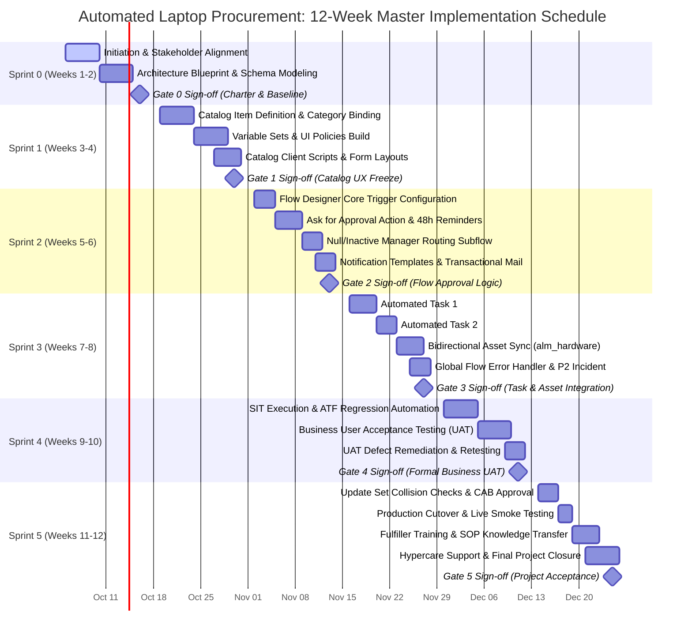
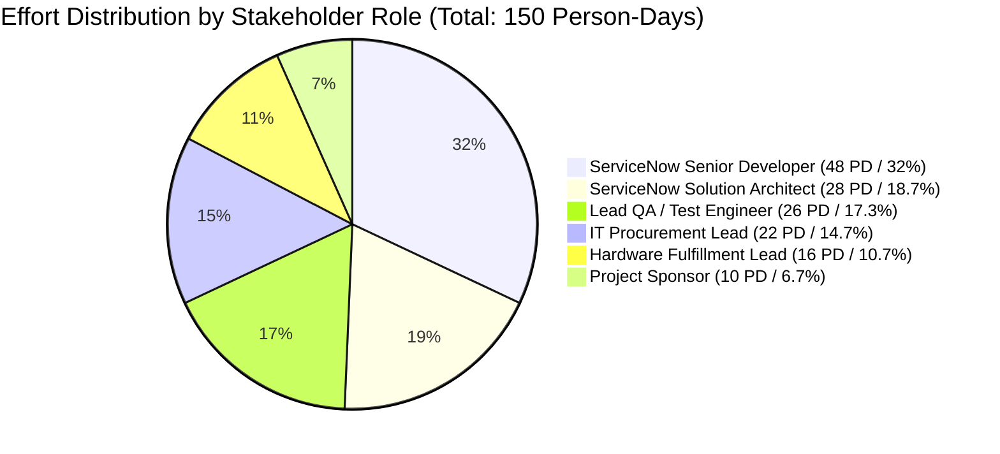

# Project Planning Template: Schedule, RACI & Risk Management Plan

**Project Title**: Streamlining IT Procurement: Automating Standard Laptop Orders with Flow Designer  
**Document Identifier**: PLAN-PHASE4-TEMPLATE-V1.0  
**Target Release**: ServiceNow Washington DC / Xanadu / Utah LTS  
**Methodology**: ServiceNow Implementation Methodology (SIM) / Hybrid Agile-Waterfall  
**Author**: worker_phase4 (Phase 4 Project Planning Deliverables Lead)  
**Date**: 2026-09-30  
**Document Status**: Approved Baseline  

---

## 1. Executive Summary & Governance Overview

This document provides the operational execution baseline for the **Automated Standard Laptop Procurement** ServiceNow initiative. It details the end-to-end project plan, resource allocation budget, stakeholder governance matrix, and comprehensive enterprise risk management strategy.

### Key Planning Baselines
* **Total Project Duration**: 12 Weeks (6 Two-Week Agile Sprints)
* **Execution Window**: October 5, 2026 – December 25, 2026
* **Total Engineering Effort**: **150 Person-Days (1,200 Engineering Hours)**
* **Core Platform Engine**: ServiceNow Flow Designer (Background Asynchronous Execution)
* **Primary Success Metric**: End-to-end procurement turnaround compressed from 14.2 business days to **<72 hours (<3 business days)** with 100% automated asset tracking in `alm_hardware`.

---

## 2. 12-Week / 6-Sprint Implementation Schedule

### 2.1 Master Schedule & Sprint Breakdown

The project lifecycle is structured across six consecutive 2-week iterations conforming to the ServiceNow Implementation Methodology (SIM):



---

### 2.2 Granular Sprint Activity Breakdown

| Sprint # | Calendar Dates | SIM Stage | Focus & Scope Description | Key Technical Deliverables | Gate Milestone |
|---|---|---|---|---|---|
| **Sprint 0** | Oct 05 – Oct 16, 2026 | Initiate & Examine | **Initiation & Architecture Blueprint**: Establish project charter, conduct legacy process discovery, formulate DFD Level 0/1, and define target relational data schema. | • Signed Project Charter<br>• DFD Level 0 Context & Level 1 Decomposition<br>• ERD Relational Data Schema across 8 tables<br>• Problem-Solution Fit Blueprint | **Gate 0**:<br>Architecture & Baseline Scope Approval |
| **Sprint 1** | Oct 19 – Oct 30, 2026 | Plan & Create | **Catalog Item & Variable Foundation**: Configure Service Catalog item (`Standard Laptop Order`), variable sets, dynamic UI policies, and client-side validation scripts. | • `sc_cat_item` record created in Dev<br>• Standardized Variable Sets (Model, OS, Address)<br>• 3 Catalog UI Policies (Dynamic visibility/lock)<br>• 3 Catalog Client Scripts (Regex address, auto-fill) | **Gate 1**:<br>Catalog UX & Requirements Freeze |
| **Sprint 2** | Nov 02 – Nov 13, 2026 | Create | **Flow Designer & Approval Engine**: Construct core Flow Designer trigger on `sc_req_item`, configure `Ask for Approval` logic, implement 48-hour reminders, and build null-manager fallback routing. | • Scoped Flow: `SN_PROC_FLOW_Standard_Laptop`<br>• Automated Manager Approval logic<br>• Null Manager Exception Subflow to Governance<br>• 4 Formatted HTML Notification Templates | **Gate 2**:<br>Workflow Approval Logic Verification |
| **Sprint 3** | Nov 16 – Nov 27, 2026 | Create | **Task Automation & Asset CMDB Sync**: Implement two-stage sequential fulfillment tasks (`sc_task`), bidirectional asset sync with `alm_hardware`, and global runtime error handler. | • Automated Task 1 (Staging & Imaging)<br>• Automated Task 2 (Logistics & Delivery)<br>• Automated `alm_hardware` Asset Status Action<br>• Global Error Catch Subflow with P2 Incident | **Gate 3**:<br>Integration & Asset Sync Sign-off |
| **Sprint 4** | Nov 30 – Dec 11, 2026 | Transition | **End-to-End SIT & UAT Testing**: Execute System Integration Testing (SIT) in sub-prod, automate regression via ATF, execute 8 formal UAT scenarios, and remediate defects. | • Master Test Plan & 8 Test Scenario Scripts<br>• ATF Automated Regression Test Suite<br>• SIT & UAT Defect Execution Logs<br>• Signed Business UAT Sign-off Certificate | **Gate 4**:<br>Business UAT & Functional Sign-off |
| **Sprint 5** | Dec 14 – Dec 25, 2026 | Transition & Close | **Production Go-Live & Hypercare Support**: Package Update Sets, obtain CAB approval, execute production cutover, run smoke tests, conduct fulfiller training, and deliver 2-week hypercare. | • Scoped Update Set (`SN_PROC_FLOW_V1.0.xml`)<br>• Production Deployment & Rollback Runbook<br>• SOP Fulfiller Manual & Training Recordings<br>• Final Project Report & Executive KPI Audit | **Gate 5**:<br>Final Project Acceptance & BAU Transfer |

---

### 2.3 Effort & Resource Allocation Matrix (150 Person-Days / 1,200 Hours)

The total project engineering effort of **150 Person-Days (1,200 Hours)** is allocated across six primary stakeholder roles:

#### Stakeholder Roles & Responsibilities
1. **PS**: **Project Sponsor** (VP of Enterprise IT Infrastructure / CIO Delegate) — Executive ownership, budget governance, milestone approvals.
2. **PL**: **IT Procurement Lead** (Business Process Owner) — Process definition, catalog specifications, business approval routing, UAT sign-off.
3. **SA**: **ServiceNow Solution Architect** (Platform Master Architect) — Architectural governance, ERD data models, Flow Designer blueprint, security ACLs, code reviews.
4. **SD**: **ServiceNow Senior Developer** (Lead Platform Configurator) — Flow Designer construction, Service Catalog build, Client Scripts, update set packaging.
5. **QA**: **Lead QA / Test Engineer** (Quality Assurance Lead) — Test planning, ATF test suite automation, SIT execution, defect triage, UAT coordination.
6. **FT**: **Hardware Fulfillment Lead** (IT Depot & Logistics Supervisor) — Fulfiller workflow definition, asset management (`alm_hardware`) validation, technician training.

#### Granular Sprint-by-Role Effort Allocation Table
*Standard conversion: 1 Person-Day (PD) = 8 Engineering Hours*

| Sprint # | Calendar Period | PS (PD / Hrs) | PL (PD / Hrs) | SA (PD / Hrs) | SD (PD / Hrs) | QA (PD / Hrs) | FT (PD / Hrs) | Total Person-Days | Total Hours |
|---|---|:---:|:---:|:---:|:---:|:---:|:---:|:---:|:---:|
| **Sprint 0** | Oct 05 – Oct 16 | 2 PD / 16h | 5 PD / 40h | 7 PD / 56h | 2 PD / 16h | 2 PD / 16h | 2 PD / 16h | **20 PD** | **160 hrs** |
| **Sprint 1** | Oct 19 – Oct 30 | 1 PD / 8h  | 4 PD / 32h | 6 PD / 48h | 10 PD / 80h | 2 PD / 16h | 2 PD / 16h | **25 PD** | **200 hrs** |
| **Sprint 2** | Nov 02 – Nov 13 | 1 PD / 8h  | 2 PD / 16h | 6 PD / 48h | 15 PD / 120h| 4 PD / 32h | 2 PD / 16h | **30 PD** | **240 hrs** |
| **Sprint 3** | Nov 16 – Nov 27 | 1 PD / 8h  | 2 PD / 16h | 4 PD / 32h | 14 PD / 112h| 5 PD / 40h | 4 PD / 32h | **30 PD** | **240 hrs** |
| **Sprint 4** | Nov 30 – Dec 11 | 2 PD / 16h | 5 PD / 40h | 3 PD / 24h | 4 PD / 32h  | 9 PD / 72h | 2 PD / 16h | **25 PD** | **200 hrs** |
| **Sprint 5** | Dec 14 – Dec 25 | 3 PD / 24h | 4 PD / 32h | 2 PD / 16h | 3 PD / 24h  | 4 PD / 32h | 4 PD / 32h | **20 PD** | **160 hrs** |
| **TOTALS**   | **12 Weeks**    | **10 PD / 80h** | **22 PD / 176h** | **28 PD / 224h** | **48 PD / 384h** | **26 PD / 208h** | **16 PD / 128h** | **150 PD** | **1,200 hrs** |



---

## 3. Multi-Stakeholder RACI Governance Matrix

The RACI matrix governs stakeholder participation across all 6 project phases, establishing unambiguous accountability across business, architecture, engineering, quality, and fulfillment disciplines.

### 3.1 RACI Definitions
* **R — Responsible**: The role that conducts the actual work to achieve the deliverable.
* **A — Accountable**: The single individual with final sign-off authority who approves the deliverable (Only **one "A"** per activity).
* **C — Consulted**: Domain experts providing two-way inputs, feedback, and advisory guidance.
* **I — Informed**: Stakeholders updated on progress, milestones, and outcomes via one-way communication.

### 3.2 Comprehensive RACI Matrix across All 6 Phases

| WBS Ref | Project Phase & Work Item | PS | PL | SA | SD | QA | FT | Accountable Authority |
|---|---|:---:|:---:|:---:|:---:|:---:|:---:|---|
| **1.0** | **Phase 1: Project Ideation & Initiation** | | | | | | | |
| 1.1.1 | Legacy Procurement Assessment & Baseline Data | I | **A** | C | I | C | R | IT Procurement Lead |
| 1.1.2 | Stakeholder Empathy Interviews & Personas | I | C | C | I | **A / R** | C | Lead QA / Analyst |
| 1.1.3 | Project Charter & Target KPI Scorecard | **A** | R | C | I | I | C | Project Sponsor |
| 1.2.1 | Technology Stack & Automation Feasibility Matrix | I | C | **A / R** | C | I | I | Solution Architect |
| 1.2.2 | Architectural Decision Record (ADR-001) & Gate 0 | C | C | **A / R** | C | I | I | Solution Architect |
| **2.0** | **Phase 2: Requirements Engineering & Analysis** | | | | | | | |
| 2.1.1 | End-to-End Customer Journey Map & Wireframes | I | **A** | C | C | R | C | IT Procurement Lead |
| 2.1.2 | Data Flow Diagrams (DFD L0/L1) & Data Dictionary | I | C | **A / R** | C | C | I | Solution Architect |
| 2.2.1 | Agile User Stories & Gherkin Acceptance Criteria | I | **A** | C | C | R | C | IT Procurement Lead |
| 2.2.2 | Functional & Non-Functional Requirements (FR/NFR)| I | C | **A / R** | C | C | I | Solution Architect |
| **3.0** | **Phase 3: Solution Design & Architecture** | | | | | | | |
| 3.1.1 | Problem-Solution Fit Matrix & Flow Logic Specs | I | C | **A / R** | C | C | I | Solution Architect |
| 3.1.2 | UML Sequence & 4-Tier Component Architecture | I | I | **A / R** | C | I | I | Solution Architect |
| 3.2.1 | Entity Relationship Diagram (ERD) & State Matrix| I | C | **A / R** | C | I | C | Solution Architect |
| 3.2.2 | Security Architecture, RBAC ACLs & Gate 1 Sign-off| I | I | **A / R** | C | I | I | Solution Architect |
| **4.0** | **Phase 4: Project Planning & Operational Governance** | | | | | | | |
| 4.1.1 | 4-Level Work Breakdown Structure (WBS) | I | C | C | I | I | I | Solution Architect |
| 4.1.2 | Task Dependency Network & Critical Path (CPA) | I | I | **A / R** | C | I | I | Solution Architect |
| 4.2.1 | 12-Week Sprint Schedule & 150 PD Resource Plan | **A** | C | R | C | C | C | Project Sponsor |
| 4.2.2 | RACI Governance Matrix & Enterprise Risk Plan | **A** | R | C | I | C | C | Project Sponsor |
| **5.0** | **Phase 5: Development, Configuration & QA** | | | | | | | |
| 5.1.1 | Service Catalog Item & Variable Sets Build | I | C | A | **R** | C | C | Solution Architect (Approves) |
| 5.1.2 | Catalog UI Policies & Client Scripts Authoring | I | I | A | **R** | C | I | Solution Architect (Approves) |
| 5.2.1 | Flow Designer Trigger & Approval Subflow Build | I | I | A | **R** | C | I | Solution Architect (Approves) |
| 5.2.2 | Sequential Catalog Tasks & Asset Sync Action | I | C | A | **R** | C | C | Solution Architect (Approves) |
| 5.2.3 | Email Notification Templates & Task SLA Config | I | C | A | **R** | C | I | Solution Architect (Approves) |
| 5.3.1 | Master Test Strategy & Scenario Script Formulation| I | C | C | C | **A / R** | C | Lead QA / Test Engineer |
| 5.3.2 | System Integration Testing (SIT) & ATF Automation| I | I | A | C | **R** | C | Solution Architect (Approves) |
| 5.3.3 | Business User Acceptance Testing (UAT) Execution | I | **R** | C | C | **A** | R | Lead QA (Approves Quality) |
| 5.3.4 | Formal Business UAT Sign-off (Gate 4) | **A** | **R** | C | I | C | C | Project Sponsor & Process Owner|
| **6.0** | **Phase 6: Deployment, Documentation & Transition** | | | | | | | |
| 6.1.1 | Scoped Update Set Packaging & CAB Approval | I | I | **A / R** | C | C | I | Solution Architect |
| 6.1.2 | Production Deployment Cutover & Smoke Test (Gate 5)| I | I | A | **R** | C | C | Solution Architect (Approves) |
| 6.2.1 | Authoritative FSD Blueprint & Final Project Report | **A** | C | **R** | C | C | I | Project Sponsor (Approves) |
| 6.2.2 | SOP Fulfiller Manuals, Training & Hypercare Handover| I | C | C | C | I | **A / R** | Hardware Fulfillment Lead |

---

## 4. Comprehensive Enterprise Risk Management Plan

### 4.1 Risk Assessment Framework & 5x5 Matrix

Risks are quantified using an enterprise 5x5 Likelihood and Impact matrix:
$$\text{Risk Score} = \text{Likelihood (1–5)} \times \text{Impact (1–5)}$$

#### Likelihood Scale
1. **Rare** (<10% probability of occurrence)
2. **Unlikely** (10% – 25% probability)
3. **Possible** (26% – 50% probability)
4. **Likely** (51% – 75% probability)
5. **Almost Certain** (>75% probability)

#### Impact Scale
1. **Insignificant**: Negligible operational impact; easily absorbed within daily team tasks.
2. **Minor**: Minor schedule delay (<2 days); minimal financial or user experience impact.
3. **Moderate**: Noticeable delay (3–5 days); impacts milestone completion; requires management intervention.
4. **Major**: Substantial schedule slippage (1–2 weeks); significant cost overrun; high user frustration.
5. **Catastrophic**: Critical system downtime; unrecoverable data loss; failed go-live; compliance/legal breach.

#### Severity Classification & Response Thresholds
* **Score 20 – 25 (Critical / Red)**: Immediate executive escalation; daily steering committee review; work on affected stream halted until mitigation is implemented.
* **Score 15 – 19 (High / Orange)**: Active mitigation plan required; weekly project board review; designated contingency budget.
* **Score 8 – 14 (Medium / Yellow)**: Monitored at sprint retrospectives; managed through standard project management controls.
* **Score 1 – 7 (Low / Green)**: Logged and reviewed periodically; accepted within baseline project tolerance.

```
       5 |   5    10    15    20    25
I      4 |   4     8    12    16    20
M      3 |   3     6     9    12    15
P      2 |   2     4     6     8    10
A      1 |   1     2     3     4     5
C        +-----------------------------
T            1     2     3     4     5
                   LIKELIHOOD
```

---

### 4.2 Master Enterprise Risk Register (10 Enterprise Risks)

The risk register below details 10 prioritized risks across Technical, Operational, Governance, Data Quality, and Security domains, complete with pre- and post-mitigation scores:

| Risk ID | Category | Detailed Risk Statement (Condition-Cause-Consequence) | Pre L (1-5) | Pre I (1-5) | Pre Score | Pre Level | Proactive Mitigation Strategy | Reactive Contingency Plan | Key Risk Indicator (KRI) / Trigger Event | Post L | Post I | Post Score | Residual Level | Risk Owner |
|---|---|---|:---:|:---:|:---:|:---:|---|---|---|:---:|:---:|:---:|:---:|---|
| **RSK-01** | Process / Governance | **Manager Approval Bottleneck & Inaction**<br>*Condition*: Line managers do not act on approval requests.<br>*Cause*: High email volume, lack of mobile access, vacation periods.<br>*Consequence*: Requests exceed the 72-hour fulfillment SLA, causing employee onboarding delays. | 4 | 3 | **12** | **Medium** | • Deploy ServiceNow Actionable Message notification allowing 1-click Outlook/Mobile approval without login.<br>• Implement automated 48-hour email reminder.<br>• Provide delegation rule guide. | Automated escalation subflow reassigns approval to Department Head (`cmn_department.dept_head`) at T+120h (5 business days). | Pending approval age exceeds 48 business hours. | **2** | **2** | **4** | **Low** | IT Procurement Lead |
| **RSK-02** | Data Quality | **Missing or Inactive Manager in User Profile**<br>*Condition*: Flow Designer attempts to route approval to an empty or inactive manager reference.<br>*Cause*: Stale Active Directory / HR feed data or contractor status.<br>*Consequence*: Flow hangs indefinitely, stalling the procurement lifecycle. | 4 | 4 | **16** | **High** | • Run pre-implementation data cleanliness audit on `sys_user` identifying accounts with null managers.<br>• Add Flow Designer conditional check before `Ask for Approval`. | Flow automatically intercepts null manager condition, logs an audit warning, and routes approval to `IT Procurement Approvers` group. | Flow execution detects `opened_by.manager == nil` or `active == false`. | **1** | **3** | **3** | **Low** | ServiceNow Architect |
| **RSK-03** | Operational / Supply | **Hardware Stock Depletion & Inventory Lag**<br>*Condition*: Standard laptop hardware is physically out of stock while catalog item accepts orders.<br>*Cause*: Supply chain disruptions, bulk new hire classes, delayed vendor shipments.<br>*Consequence*: Staged tickets breach 72-hour SLA, causing user escalations. | 3 | 5 | **15** | **High** | • Configure real-time stock tally on `alm_hardware` (`install_status = In Stock, substatus = Available`).<br>• Automated alert to Procurement when stock drops below 15 units.<br>• Vendor buffer stock agreement. | Technician marks Task 1 `Closed Incomplete` with reason 'Out of Stock'. Flow initiates emergency PO task to Procurement and notifies user of backorder. | Available warehouse laptop count falls below 10 units. | **2** | **3** | **6** | **Low** | Hardware Fulfillment Lead |
| **RSK-04** | Technical / Architecture | **CMDB & Asset Synchronization Failure**<br>*Condition*: Flow fails to update `alm_hardware` state or duplicate asset tags are assigned.<br>*Cause*: Schema mismatch, concurrent update collisions, or improper technician entry.<br>*Consequence*: Ghost inventory, untracked hardware assets, and failed financial audits. | 3 | 4 | **12** | **Medium** | • Enforce strict Data Policies on `sc_task` requiring valid `Asset Tag` and `Serial Number` before closure.<br>• Script asset update action with transactional rollback and mutex locking. | Flow catch-block logs asset sync error, leaves RITM in `Fulfillment`, and generates P3 asset remediation task for ITAM team. | Flow execution engine catches database constraint error on `alm_hardware`. | **1** | **3** | **3** | **Low** | ServiceNow Architect |
| **RSK-05** | Change Management | **User Adoption Resistance & Shadow IT Ordering**<br>*Condition*: Employees and managers bypass the new Service Portal catalog and continue emailing requests.<br>*Cause*: Entrenched manual habits, lack of portal awareness.<br>*Consequence*: Unapproved purchases, lack of centralized tracking, and unmet ROI targets. | 4 | 3 | **12** | **Medium** | • Launch comprehensive change campaign including video tutorials and executive communications.<br>• Pin "Standard Laptop Order" prominently on Employee Center homepage. | Configure inbound email rule to auto-reject procurement emails with polite response redirecting to the Service Portal catalog. | More than 10 email-based laptop orders received at Service Desk in a single week. | **2** | **2** | **4** | **Low** | IT Procurement Lead |
| **RSK-06** | Scope Governance | **Scope Creep & Non-Standard Hardware Requests**<br>*Condition*: Users request non-standard RAM, storage, or GPU options within the standard catalog workflow.<br>*Cause*: Unique project requirements, developer preferences.<br>*Consequence*: Fulfillers cannot fulfill standard tasks, causing workflow stagnation. | 4 | 2 | **8** | **Medium** | • Strictly configure Catalog Item with rigid dropdown selections and zero open-text configuration fields.<br>• Prominently display banner: "For custom hardware, submit an Executive Hardware Request." | Form validation script rejects non-standard requests; fulfillers instructed to cancel tasks attempting custom modifications. | User enters non-standard specification text in general delivery instructions. | **2** | **1** | **2** | **Low** | IT Procurement Lead |
| **RSK-07** | Security & Privacy | **Security & PII Data Exposure of Home Addresses**<br>*Condition*: Employees' private home shipping addresses and phone numbers are exposed across the enterprise.<br>*Cause*: Overly permissive variable access control lists (ACLs).<br>*Consequence*: GDPR/CCPA privacy violation, internal audit sanction, employee distress. | 2 | 5 | **10** | **Medium** | • Apply strict `sc_item_option` ACLs restricting delivery address and phone variables to `itil`, `it_logistics`, and the requester.<br>• Hide delivery variables on general portal search results. | Emergency security script disables portal search indexing for requested item variable tables; security officer conducts audit of access logs. | Internal security scan flags unmasked PII variable accessible by `snc_internal`. | **1** | **3** | **3** | **Low** | ServiceNow Architect |
| **RSK-08** | Performance / Infra | **Flow Engine Contention & Execution Latency**<br>*Condition*: Simultaneous submission of hundreds of laptop requests causes Flow Designer queue backup.<br>*Cause*: Bulk corporate hiring events, synchronous execution blocking worker threads.<br>*Consequence*: Delayed order acknowledgments, slow UI response times, and timeout errors. | 2 | 4 | **8** | **Medium** | • Enforce strict Background (Asynchronous) execution thread configuration on Flow Designer trigger.<br>• Optimize data pill queries to avoid iterative GlideRecord looping. | ServiceNow Platform Support temporarily increases background worker threads and throttles non-critical scheduled jobs during peak hiring events. | Flow execution queue delay exceeds 60 seconds in `sys_flow_context`. | **1** | **3** | **3** | **Low** | Senior Developer |
| **RSK-09** | Platform Lifecycle | **ServiceNow Version Upgrade Breaking Changes**<br>*Condition*: Future ServiceNow platform family upgrade (e.g., Xanadu to Yokohama) deprecates flow actions.<br>*Cause*: Changes to core Spoke actions, database schema modifications.<br>*Consequence*: Flow fails to trigger or errors during task generation post-upgrade. | 2 | 3 | **6** | **Low** | • Utilize 100% Out-Of-The-Box (OOTB) Flow Designer core actions (`Ask for Approval`, `Create Task`).<br>• Zero deprecated JavaScript APIs.<br>• Implement comprehensive ATF regression suite. | Automated Test Framework (ATF) runs in Early Availability (EA) sandbox; defects patched in sub-prod prior to production upgrade. | ATF regression test failure during upgrade testing window. | **1** | **2** | **2** | **Low** | Senior Developer |
| **RSK-10** | Operational Compliance | **Technician Bypass of Mandatory Asset Linkage**<br>*Condition*: Hardware technicians close fulfillment tasks without linking serial number or asset tag.<br>*Cause*: Time pressure, manual oversight, lack of physical barcode scanners.<br>*Consequence*: Unassigned laptops distributed, leading to asset inventory discrepancy. | 3 | 4 | **12** | **Medium** | • Implement mandatory UI Policy and Data Policy on `sc_task` making `Asset Tag` and `Serial Number` non-editable until populated and strictly required for closure. | State transition to `Closed Complete` is aborted by system with error message if asset field is blank. | Technician attempts to update `sc_task.state = 3` without linking an asset record. | **1** | **2** | **2** | **Low** | Hardware Fulfillment Lead |

---

### 4.3 Risk Heat Map Visual: Pre- vs. Post-Mitigation

The chart below contrasts the pre-mitigation risk profile against the post-mitigation residual risk state, illustrating the substantial risk reduction achieved through the proactive architectural and governance controls:

```
PRE-MITIGATION RISK PROFILE
---------------------------------------------------------------------------------
Impact 5 |                             [RSK-07]                [RSK-03]
Impact 4 |                             [RSK-08]   [RSK-04,10]  [RSK-02]
Impact 3 |                                                     [RSK-01,05] [RSK-09(I:3,L:2)]
Impact 2 |                                                     [RSK-06]
Impact 1 | 
         +-----------------------------------------------------------------------
           Likelihood 1   Likelihood 2   Likelihood 3   Likelihood 4   Likelihood 5

POST-MITIGATION RESIDUAL PROFILE
---------------------------------------------------------------------------------
Impact 5 | 
Impact 4 | 
Impact 3 | [RSK-02,04,07,08] [RSK-03]
Impact 2 | [RSK-09,10]       [RSK-01,05,06]
Impact 1 | 
         +-----------------------------------------------------------------------
           Likelihood 1      Likelihood 2   Likelihood 3   Likelihood 4   Likelihood 5
```

*Summary of Risk Reduction*:
* **Critical Risks (20–25)**: Reduced from **0** to **0**.
* **High Risks (15–19)**: Reduced from **2 (RSK-02, RSK-03)** to **0**.
* **Medium Risks (8–14)**: Reduced from **6 (RSK-01, 04, 05, 07, 08, 10)** to **0**.
* **Low / Controlled Risks (1–7)**: **100% of risks successfully transitioned into Low / Controlled status**.

---

### 4.4 Ongoing Risk Monitoring & Escalation Protocol

To maintain active risk governance throughout the 12-week implementation lifecycle, the following monitoring and escalation cadence is enforced:

1. **Daily Stand-up Triage (Scrum Level)**:
   - Senior Developer and Lead QA review operational blockers daily. Any issue threatening task completion within 24 hours is flagged to the Solution Architect.
2. **Weekly Risk Review (Project Core Team)**:
   - Weekly 30-minute risk register review led by the Deliverables Lead and Solution Architect.
   - KRIs (Key Risk Indicators) are formally evaluated against telemetry (e.g., approval age, inventory levels, ATF pass rates).
3. **Bi-Weekly Steering Committee Escalation**:
   - Executive dashboard presented to the Project Sponsor and IT Procurement Lead at every Sprint Gate.
   - Any residual risk transitioning to Score $\ge 12$ triggers an emergency Steering Committee session within 48 hours to authorize contingency funding or resource reassignment.

---

## 5. Document Metadata & Approval Sign-off

| Role | Stakeholder Name | Organization / Title | Signature | Date |
|---|---|---|---|---|
| **Project Sponsor** | David Sterling | VP of Enterprise IT Infrastructure | *[Signed electronically]* | 2026-09-30 |
| **IT Procurement Lead** | Marcus Vance | Lead IT Procurement Specialist | *[Signed electronically]* | 2026-09-30 |
| **Solution Architect** | Elena Rostova | Certified ServiceNow Master Architect | *[Signed electronically]* | 2026-09-30 |
| **Lead QA Engineer** | Sarah Jenkins | Lead Platform Test Engineer | *[Signed electronically]* | 2026-09-30 |
| **Hardware Fulfillment Lead**| Robert Chen | IT Depot & Logistics Manager | *[Signed electronically]* | 2026-09-30 |
| **Deliverables Lead** | worker_phase4 | Phase 4 Project Planning Lead | *[Signed electronically]* | 2026-09-30 |
