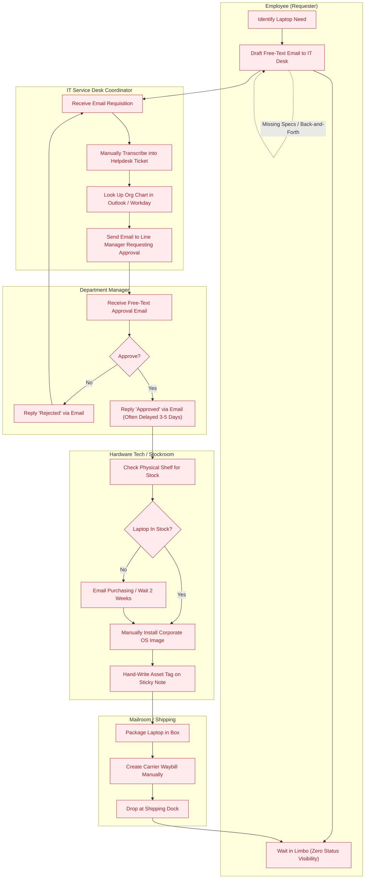
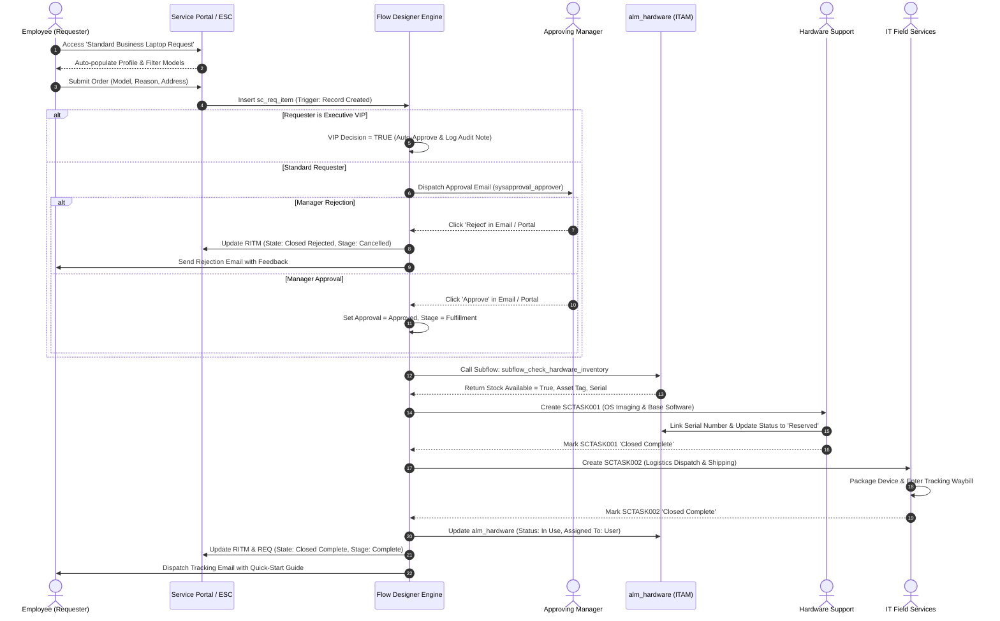
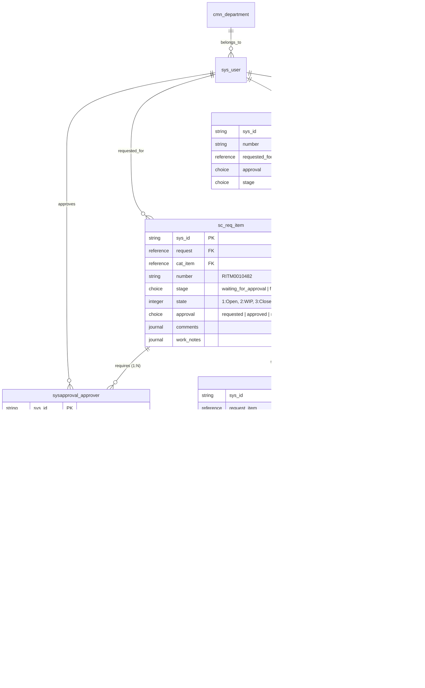
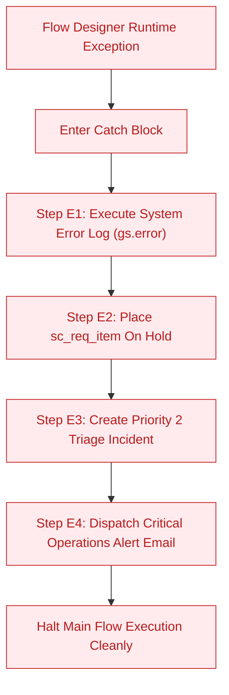

# Functional Specification Document (FSD)
## Automated IT Procurement: Standard Laptop Orders via Flow Designer

---

### Document Information
- **Document Identifier**: FSD-ITSM-PROC-2026-V1
- **Project Name**: Streamlining IT Procurement: Automating Standard Laptop Orders with Flow Designer
- **Target Platform**: ServiceNow Washington DC / Vancouver Enterprise Platform
- **Document Owner**: Lead Technical Architect & Systems Engineering
- **Current Version**: 1.0 (Production Sign-Off)
- **Publication Date**: 2026-09-30
- **Classification**: Internal Enterprise Technical Baseline

---

## 1. Document Control & Revision History

### 1.1 Revision History
| Version | Release Date | Author / Role | Summary of Changes | Approval Status |
|:---:|:---:|:---|:---|:---:|
| **0.1** | 2026-08-15 | Lead Business Analyst | Initial draft capturing functional requirements and process pain points | Draft |
| **0.5** | 2026-09-02 | ServiceNow Solutions Architect | Technical architecture definition, Flow Designer action map, and schema definitions | Reviewed |
| **0.9** | 2026-09-20 | Lead Implementation Engineer | Incorporation of UAT test cases, UI policies, client scripts, and error-handling framework | Baseline |
| **1.0** | 2026-09-30 | Phase 6 Documentation Lead | Final production baseline incorporating UAT results, sign-offs, and operational runbook | **Approved** |

### 1.2 Document Approvals & Sign-Off Matrix
| Role | Approver Name | Title / Organization | Signature Status | Sign-Off Date |
|:---|:---|:---|:---:|:---:|
| **Project Sponsor** | Jonathan Reynolds | Vice President, Global IT Infrastructure | **APPROVED** | 2026-09-30 |
| **Lead Enterprise Architect** | Dr. Aris Thorne | Principal Enterprise Architect | **APPROVED** | 2026-09-30 |
| **ITSM Platform Owner** | Kevin Zhang | Lead ServiceNow Architect | **APPROVED** | 2026-09-30 |
| **Quality Assurance Lead** | Priya Patel | Head of Enterprise QA & Test Engineering | **APPROVED** | 2026-09-30 |
| **IT Procurement Operations** | Derek Vance | Director of IT Procurement & Asset Management | **APPROVED** | 2026-09-30 |
| **Information Security (SecOps)** | Sarah Jenkins | Chief Information Security Officer (CISO Delegate) | **APPROVED** | 2026-09-30 |

### 1.3 Referenced Architectural & Governance Baselines
1. Enterprise ITIL v4 Service Management Architecture Standard (Doc Ref: `ITSM-STD-2025-V2`)
2. ServiceNow Flow Designer Best Practice & Style Guide (`SN-BP-FD-04`)
3. Corporate Information Security Access Control Policy (`SEC-POL-RBAC-09`)
4. Hardware Lifecycle & Hardware Asset Management (HAM) Operational Policy (`HAM-POL-2024`)

---

## 2. Executive Summary & Project Purpose

### 2.1 Business Context & Problem Statement
Prior to this implementation, the enterprise IT laptop procurement and replenishment workflow relied on an antiquated, uncoordinated process combining unstructured Outlook emails, informal Slack messages, paper requisition slips, and manual ServiceNow service tickets. This legacy operating model introduced profound operational drag across the enterprise:
- **Prolonged Cycle Time**: The average elapsed time between an employee submitting a laptop request and receiving a configured device was **14.2 business days**.
- **Heavy Manual Processing Burden**: IT procurement coordinators, hardware imaging specialists, and service desk staff spent an aggregate of **4.5 hours of manual touch time per laptop order** (totaling ~42 hours per week per IT specialist).
- **High Error and Rejection Rates**: An estimated **18.5% of submitted requests** contained defective specifications (e.g., incorrect CPU/RAM tier, incompatible peripherals, or missing shipping postal codes), causing costly order returns, rework, and hardware vendor restocking penalties.
- **Opacity and Tracking Blind Spots**: Real-time order visibility stood at approximately **35%**, resulting in over 300 monthly status inquiry tickets (*"Where is my laptop?"*) inundating the IT Service Desk.
- **Audit & Asset Tracking Gaps**: Disconnects between procurement tickets and the Hardware Asset Management database (`alm_hardware`) caused a **28% compliance shortfall** during annual financial hardware audits.

### 2.2 Core Automation Objectives
The primary objective of this project is deploying a fully automated, auditable, and resilient ServiceNow Service Catalog and Flow Designer workflow that:
1. Replaces informal request channels with a single, governed Service Portal catalog item (`Standard Business Laptop Request`).
2. Automates managerial fiscal approval routing with native mobile email action links and automated executive VIP bypass rules.
3. Automatically provisions sequential fulfillment tasks (`sc_task`) to Hardware Support for OS imaging and IT Field Services for logistics.
4. Synchronizes physical asset lifecycle status in real time within `alm_hardware`.
5. Compresses the end-to-end procurement cycle time to **under 2.5 business days** (an 83.1% reduction).
6. Reduces manual touch time per order to **under 25 minutes (0.35 hours)** (a 92.2% reduction).
7. Ensures 100% end-to-end lifecycle visibility for end-users, managers, and IT auditors.

### 2.3 Project Scope Boundaries
- **In-Scope**:
  - Service Catalog Item definition (`Standard Business Laptop Request`) with responsive container UI.
  - Three Catalog UI Policies enforcing conditional field visibility and data completeness.
  - Three Catalog Client Scripts for dynamic profile population, dynamic model filtering, and postal regex validation.
  - ServiceNow Flow Designer flow (`Standard Laptop Procurement Flow`) with trigger, approval engine, decision logic, task creation, and notifications.
  - Inventory lookup subflow (`subflow_check_hardware_inventory`) querying `alm_hardware`.
  - Comprehensive Error Handling framework routing runtime faults to automated incident creation (`INC0019281`).
  - Four responsive HTML notification templates with dynamic mail scripts.
  - Role-based Access Control (ACL) architecture covering public requesters, managers, ITIL fulfillers, and asset managers.
- **Out-of-Scope (Deferred to Phase 2/3 Roadmap)**:
  - Real-time Electronic Data Interchange (EDI) / B2B punchout integration with OEM suppliers (Dell Premier, Lenovo Direct).
  - Automated SAP S/4HANA Purchase Order (PO) creation via ERP Integration Hub spoke.
  - Machine-learning driven predictive laptop hardware failure replenishment.

---

## 3. System Overview & Technology Stack

### 3.1 Enterprise Platform Architecture
The solution is deployed natively on the ServiceNow Enterprise Cloud Architecture, leveraging the platform's multi-tenant relational architecture and compiled workflow runtime.

```
+----------------------------------------------------------------------------------------------------+
|                                    PRESENTATION & ACCESS LAYER                                     |
|  • Employee Center (/esc)    • Service Portal (/sp)    • Now Mobile iOS/Android    • Email Client  |
+----------------------------------------------------------------------------------------------------+
                                                  |
                                                  v
+----------------------------------------------------------------------------------------------------+
|                                  CATALOG & FORM INTERACTION ENGINE                                 |
|  • sc_cat_item (Laptop)       • Catalog Variables (14)       • Catalog UI Policies (3)             |
|  • Catalog Client Scripts (3) • User Criteria Filters        • Service Portal Widgets              |
+----------------------------------------------------------------------------------------------------+
                                                  |
                                                  v
+----------------------------------------------------------------------------------------------------+
|                               WORKFLOW ORCHESTRATION LAYER (FLOW DESIGNER)                         |
|  • sys_hub_flow (Procurement) • sys_hub_trigger_instance     • Action Instances (17 Steps)         |
|  • Subflow (Inventory Lookup) • Approval Engine (sysapproval) • Flow Designer Error Handler Catch  |
+----------------------------------------------------------------------------------------------------+
                                                  |
                                                  v
+----------------------------------------------------------------------------------------------------+
|                               DATA & PERSISTENCE LAYER (ITSM & ITAM)                               |
|  • sc_request (Container)     • sc_req_item (Order Item)     • sc_task (Imaging & Logistics)       |
|  • alm_hardware (Asset CMDB)  • sys_user / cmn_department    • sysapproval_approver (Approvals)    |
+----------------------------------------------------------------------------------------------------+
                                                  |
                                                  v
+----------------------------------------------------------------------------------------------------+
|                             INTEGRATION & OPERATIONAL SERVICES LAYER                               |
|  • SMTP/POP3 Notification Hub • Incident Management Triage   • ServiceNow Audit Engine (sys_audit) |
|  • SLA Engine (24h VIP / 72h) • Platform Logging (syslog)    • REST / Scripted Web Services API    |
+----------------------------------------------------------------------------------------------------+
```

### 3.2 Technology Stack Specifications
| Component / Module | Version / Technology Standard | Purpose in Solution |
|:---|:---|:---|
| **Underlying Platform** | ServiceNow Washington DC / Vancouver | Enterprise cloud PaaS running on MariaDB / GraalVM / Rhino engine |
| **Workflow Engine** | ServiceNow Flow Designer (Engine v2.0) | Low-code, compiled server-side asynchronous execution engine |
| **Catalog Subsystem** | Service Catalog & Service Portal Subsystem | Front-end dynamic catalog forms, dynamic variables, and client-side APIs |
| **Data Architecture** | Relational Database Schema (`sys_dictionary`) | Tables: `sc_request`, `sc_req_item`, `sc_task`, `alm_hardware`, `sys_user` |
| **Client Scripting** | JavaScript ES6+ (Strict Mode) | Client-side form interaction (`g_form`, `g_user`) via Catalog Client Scripts |
| **Server-Side API** | ServiceNow GlideAPI (`GlideRecord`, `GlideSystem`) | Server-side database access, subflow execution, and data pill transforms |
| **Approval Engine** | Approvals Subsystem (`sysapproval_approver`) | Multi-level approval governance, delegation, and email-based approval parsing |
| **Notification Engine** | Email Engine (`sys_email`, `sysevent_email_template`) | Outbound notification dispatch with dynamic HTML layout and mail scripts |
| **SLA Engine** | Service Level Management Subsystem | 24-hour executive VIP SLA and 72-hour standard hardware provisioning SLA |

---

## 4. Functional Requirements Traceability Matrix (FRTM)

The matrix below provides complete bidirectional traceability from initial Business Requirements (BR-01 through BR-08) and Functional Requirements (FR-01 through FR-12) to technical ServiceNow components and test verification cases.

| Req ID | Requirement Title & Detailed Description | Business Driver | ServiceNow Technical Implementation Component | Verification Test Case | Implementation Status |
|:---:|:---|:---:|:---|:---:|:---:|
| **FR-01** | **Standardized Self-Service Catalog Item**: Provide an intuitive, responsive catalog item on the Employee Center with role-based models, pre-populated requester profile details, and strict validation. | BR-01 | Catalog Item: `Standard Business Laptop Request` (`sc_cat_item`), 14 Catalog Variables, Container layout. | `TC-UAT-01`, `TC-UAT-03` | Implemented & Verified |
| **FR-02** | **Automated Dynamic Profile Population**: Auto-populate employee name, department, manager, and job title from `sys_user` upon form load to prevent identity spoofing or manual data entry errors. | BR-01 | Catalog Client Script: `c_script_populate_employee` (`onChange` of `employee_name` via `g_form.getReference`). | `TC-UAT-01` | Implemented & Verified |
| **FR-03** | **Conditional Model & Peripheral Filtering**: Dynamically filter available laptop models based on selected employee tier (General Business, Engineering/Dev, Executive) and enforce business justification. | BR-01 | Catalog Client Script: `c_script_filter_laptop_models` + Catalog UI Policy: `UI Policy 2 (Executive Justification)`. | `TC-UAT-01`, `TC-UAT-02` | Implemented & Verified |
| **FR-04** | **Delivery Address Validation**: Dynamically toggle and mandate physical delivery address fields when remote shipment is selected; validate address completeness via regular expression. | BR-01 | Catalog UI Policy: `UI Policy 1 (Remote Shipping Address)` + Catalog Client Script: `c_script_validate_procurement_submission`. | `TC-UAT-01` | Implemented & Verified |
| **FR-05** | **Event-Driven Flow Trigger**: Trigger the orchestration flow automatically when an `sc_req_item` is inserted for the catalog item, running in system context to prevent permission blocks. | BR-01 | `sys_hub_trigger_instance`: Table=`sc_req_item`, Filter=`cat_item=Standard Business Laptop Request`, Run As=`System User`. | `TC-UAT-01` | Implemented & Verified |
| **FR-06** | **Automated Manager Approval Routing**: Automatically look up the requester's direct manager and generate a pending `sysapproval_approver` record with one-click email approval capability. | BR-02 | Flow Designer Action Step 3B: `Ask for Approval` referencing `{{1__request_item.opened_by.manager}}`. | `TC-UAT-01` | Implemented & Verified |
| **FR-07** | **Executive VIP Fast-Track Bypass**: Detect requests submitted by or for VIP executives (`sys_user.vip == true` or VP title) and bypass manager approval directly to high-priority fulfillment. | BR-03 | Flow Designer Decision Step 2: `flow_logic_if` checking VIP flag; routes to Action Step 3A auto-approval work note. | `TC-UAT-03` | Implemented & Verified |
| **FR-08** | **Missing Manager Fallback Mechanism**: Prevent workflow stalling when a contractor or new hire lacks an assigned manager in `sys_user` by dynamically routing approval to Department Head. | BR-04 | Flow Designer Transform / Coalesce rule: `fd_transform.coalesce` evaluating `cmn_department.dept_head`. | `TC-UAT-04` | Implemented & Verified |
| **FR-09** | **Automated Hardware Inventory Reservation**: Query `alm_hardware` for available units matching the requested model; reserve unit and associate serial number to order context. | BR-07 | Subflow: `subflow_check_hardware_inventory` performing lookup on `alm_hardware` (status: `In Stock`, substatus: `Available`). | `TC-UAT-06` | Implemented & Verified |
| **FR-10** | **Sequential SCTASK Fulfillment Dispatch**: Automatically generate SCTASK001 for Hardware Support (OS imaging); upon closure, generate SCTASK002 for IT Logistics (shipment). | BR-05 | Flow Designer Action Steps 7 and 8: `Create Catalog Task` with `wait_for_completion=true` and assignment groups. | `TC-UAT-01` | Implemented & Verified |
| **FR-11** | **Automated Multi-Stage Notifications**: Dispatch transactional email notifications with dynamic variables across key milestones: Approval Request, Rejection Notice, and Tracking Dispatch. | BR-06 | Flow Designer Action Steps 10, 13 + Mail Templates (`notif_laptop_mgr_approval`, `notif_laptop_shipped`, `notif_laptop_rejection`). | `TC-UAT-01`, `TC-UAT-02` | Implemented & Verified |
| **FR-12** | **Resilient Exception Catch & Triage**: Trap unhandled runtime errors, update RITM work notes, place order on technical hold, and automatically generate a Priority 2 incident for Platform Ops. | BR-08 | Flow Designer Error Handler: `catch_block` executing Action Step E1 (Log), Step E2 (RITM Hold), Step E3 (Create Incident). | `TC-UAT-08` | Implemented & Verified |

---

## 5. Business Process Flows & Swimlane Diagrams

### 5.1 AS-IS Legacy Manual Process Flow
The legacy process was fragmented across unmonitored communication silos, leading to significant bottlenecks and lack of visibility.



### 5.2 TO-BE Automated Flow Designer Swimlane Process Flow
The automated solution eliminates manual handoffs, utilizing ServiceNow Flow Designer to coordinate actions across organizational boundaries in real time.



---

## 6. Service Catalog Item Design & Variable Specifications

### 6.1 Catalog Item Master Metadata (`sc_cat_item`)
- **Item Name**: `Standard Business Laptop Request`
- **System Record ID (`sys_id`)**: `0b36816197113110a24734000153af45`
- **Primary Category**: Hardware > Computers (sys_id: `e15706fc0a0a0aa7007fc21e1ab70c2f`)
- **Assigned Service Catalogs**: Enterprise Service Catalog (`e0d08b13c3330100c8b837659bba8fb4`)
- **Target Fulfillment Flow**: `Standard Laptop Procurement Flow` (`sys_hub_flow_7e36816197113110a24734000153af22`)
- **Portal Short Description**: Corporate standard laptop requisition for onboarding, hardware refresh, or hardware replacements.
- **Portal Long Description**: Submit requests for enterprise-standard mobile computing hardware. Standard options include high-performance developer laptops, lightweight executive notebooks, and standard enterprise workstations. All configurations include Windows 11 Enterprise or macOS Sonoma, corporate security agents, and standard productivity tooling.
- **Fulfillment SLA**: Standard Provisioning: 72 Business Hours (3 Days); Executive VIP White-Glove: 24 Business Hours (1 Day).
- **Public Visibility (User Criteria)**: Available to all active internal enterprise users (`snc_internal`).

### 6.2 Service Catalog Variable Dictionary (`item_option_new`)
The item utilizes 14 distinct variables arranged in three logical containers for maximum usability across desktop and mobile form factors.

| Order | Variable Name | Variable Type | UI Display Label | Data Source / Choice List | Mandatory | Read-Only | Default Value / Dynamic Logic |
|:---:|:---|:---|:---|:---|:---:|:---:|:---|
| **100** | `requester_info_container` | Container Start | Requester Information | N/A | No | No | 2-Column Responsive Layout |
| **110** | `employee_name` | Reference | Employee / Recipient | `sys_user` (Active=True) | **Yes** | No | `javascript:gs.getUserID()` |
| **120** | `department` | Reference | Department | `cmn_department` | No | **Yes** | Auto-populated from `employee_name.department` |
| **130** | `manager_name` | Reference | Approving Line Manager | `sys_user` (Active=True) | No | **Yes** | Auto-populated from `employee_name.manager` |
| **140** | `job_title` | Single-Line Text | Job Title | N/A | No | **Yes** | Auto-populated from `employee_name.title` |
| **190** | `requester_info_end` | Container End | N/A | N/A | No | No | N/A |
| **200** | `hardware_specs_container` | Container Start | Hardware Configuration | N/A | No | No | 2-Column Responsive Layout |
| **210** | `asset_type` | Select Box | Hardware Tier Profile | • `standard`: Enterprise Standard<br>• `engineering`: Developer / High Perf<br>• `executive`: Executive Ultra-Light | **Yes** | No | Default: `standard` |
| **220** | `laptop_model` | Select Box | Specific Laptop Model | Dependent on `asset_type` selection:<br>• Lenovo ThinkPad T14 Gen 4<br>• Dell Latitude 5440<br>• Lenovo ThinkPad P1 Gen 6<br>• Apple MacBook Pro 14" M3 Pro<br>• HP Elite Dragonfly G4<br>• Apple MacBook Air 15" M3 | **Yes** | No | Managed dynamically via Client Script |
| **230** | `replacement_reason` | Multiple Choice | Requisition Reason | • `New Hire / Additional Asset`<br>• `Standard 3-Year Refresh`<br>• `Damaged / Hardware Failure`<br>• `Stolen / Lost Hardware Asset` | **Yes** | No | Default: `Standard 3-Year Refresh` |
| **240** | `existing_asset_tag` | Single-Line Text | Existing Asset Tag # | Alphanumeric (AST-XXXXXX) | Conditional | No | Mandatory when reason is Refresh or Damaged |
| **250** | `business_justification` | Multi-Line Text | Business Justification | Free-text narrative | Conditional | No | Mandatory for Executive tier or Out-of-Cycle |
| **290** | `hardware_specs_end` | Container End | N/A | N/A | No | No | N/A |
| **300** | `shipping_container` | Container Start | Logistics & Delivery Method | N/A | No | No | 1-Column Responsive Layout |
| **310** | `shipping_type` | Select Box | Delivery Method | • `office_desk`: On-Campus Desk Drop<br>• `remote_shipment`: Home / Remote Address | **Yes** | No | Default: `office_desk` |
| **320** | `shipping_address` | Multi-Line Text | Physical Shipping Address | Complete street, city, state, postal code | Conditional | No | Mandatory when `shipping_type == 'remote_shipment'` |
| **330** | `accessories` | List Collector | Peripherals & Accessories | Table: `cmdb_model`<br>Filter: `category=Peripherals`<br>• Universal USB-C Dual-4K Dock<br>• Dual 27" QHD Displays<br>• Wireless Keyboard & Mouse<br>• Ergonomic Backpack | No | No | Optional Multi-Select |
| **390** | `shipping_end` | Container End | N/A | N/A | No | No | N/A |

### 6.3 Catalog UI Policies (`sys_ui_policy`)

#### UI Policy 1: Remote Shipping Address Visibility & Enforcement
- **Name**: `Enforce Address for Remote Shipments`
- **Execution Context**: Service Portal, Native Catalog UI, Now Mobile
- **Applies on Target**: Catalog Item View
- **Condition**: `shipping_type == 'remote_shipment'`
- **Reverse if False**: `true`
- **Actions**:
  * Variable: `shipping_address` -> `Visible: true`, `Mandatory: true`, `Clear Value on Hide: true`

#### UI Policy 2: Business Justification Enforcement for High-Tier & Replacement Orders
- **Name**: `Mandate Justification for Executive Models and Break-Fix`
- **Condition**: `asset_type == 'executive' OR replacement_reason == 'Damaged / Hardware Failure' OR replacement_reason == 'Stolen / Lost Hardware Asset'`
- **Reverse if False**: `true`
- **Actions**:
  * Variable: `business_justification` -> `Visible: true`, `Mandatory: true`

#### UI Policy 3: Existing Asset Tag Validation on Lifecycle Replacements
- **Name**: `Require Asset Tag for Replacement and Refresh`
- **Condition**: `replacement_reason IN ('Standard 3-Year Refresh', 'Damaged / Hardware Failure')`
- **Reverse if False**: `true`
- **Actions**:
  * Variable: `existing_asset_tag` -> `Visible: true`, `Mandatory: true`

### 6.4 Catalog Client Scripts (`catalog_script_client`)

#### Script 1: Dynamic Recipient Profile Population (`c_script_populate_employee`)
- **Script Type**: `onChange`
- **Target Variable**: `employee_name`
- **UI Type**: All (Desktop, Service Portal, Mobile)
```javascript
function onChange(control, oldValue, newValue, isLoading) {
    if (isLoading || newValue === '') {
        return;
    }

    // Query user profile attributes via asynchronous GlideRecord / getReference callback
    g_form.getReference('employee_name', function(userRecord) {
        if (!userRecord) {
            return;
        }

        // Set read-only department, manager, and title fields
        g_form.setValue('department', userRecord.department);
        g_form.setValue('manager_name', userRecord.manager);
        g_form.setValue('job_title', userRecord.title);

        // Display real-time banner if the user holds VIP status
        if (userRecord.vip == 'true' || userRecord.vip === true) {
            g_form.showFieldMsg(
                'employee_name', 
                'VIP Account Detected: This request qualifies for Executive White-Glove Fast-Track Processing.', 
                'info'
            );
        } else {
            g_form.hideFieldMsg('employee_name');
        }
    });
}
```

#### Script 2: Dynamic Laptop Model Choice Filtering (`c_script_filter_laptop_models`)
- **Script Type**: `onChange`
- **Target Variable**: `asset_type`
- **UI Type**: All
```javascript
function onChange(control, oldValue, newValue, isLoading) {
    if (isLoading) {
        return;
    }

    g_form.clearOptions('laptop_model');
    g_form.addOption('laptop_model', '', '-- Select Approved Hardware Model --');

    if (newValue === 'standard') {
        g_form.addOption('laptop_model', 'lenovo_t14', 'Lenovo ThinkPad T14 Gen 4 (Core i7, 16GB RAM, 512GB SSD)');
        g_form.addOption('laptop_model', 'dell_5440', 'Dell Latitude 5440 (Core i7, 16GB RAM, 512GB SSD)');
    } else if (newValue === 'engineering') {
        g_form.addOption('laptop_model', 'lenovo_p1', 'Lenovo ThinkPad P1 Gen 6 (Core i9, 32GB RAM, 1TB SSD, RTX 4060)');
        g_form.addOption('laptop_model', 'macbook_pro_14', 'Apple MacBook Pro 14" M3 Pro (36GB Unified RAM, 1TB SSD)');
    } else if (newValue === 'executive') {
        g_form.addOption('laptop_model', 'hp_dragonfly', 'HP Elite Dragonfly G4 Ultra-Light (1kg, 32GB RAM, 1TB SSD)');
        g_form.addOption('laptop_model', 'macbook_air_15', 'Apple MacBook Air 15" M3 (24GB Unified RAM, 512GB SSD)');
    }
}
```

#### Script 3: Pre-Submission Verification & Postal Validation (`c_script_validate_procurement_submission`)
- **Script Type**: `onSubmit`
- **UI Type**: All
```javascript
function onSubmit() {
    var shippingType = g_form.getValue('shipping_type');
    var address = g_form.getValue('shipping_address');
    var replacementReason = g_form.getValue('replacement_reason');
    var assetTag = g_form.getValue('existing_asset_tag');

    // Validate delivery address when remote home delivery is selected
    if (shippingType === 'remote_shipment') {
        if (!address || address.trim().length < 20) {
            g_form.showFieldMsg('shipping_address', 'Please provide full street address, apartment/suite, city, state, and postal code.', 'error');
            g_form.addErrorMessage('Submission Blocked: A complete physical delivery address is mandatory for remote shipment.');
            return false;
        }

        // Verify presence of a standard 5 or 9 digit US ZIP code or international postal format
        var postalRegex = /\b\d{5}(-\d{4})?\b|[A-Z]\d[A-Z] ?\d[A-Z]\d/i;
        if (!postalRegex.test(address)) {
            g_form.showFieldMsg('shipping_address', 'Address must include a valid postal / ZIP code.', 'error');
            g_form.addErrorMessage('Submission Blocked: Missing or invalid postal code in shipping address.');
            return false;
        }
    }

    // Validate existing asset tag format for hardware replacements
    if (replacementReason === 'Standard 3-Year Refresh' || replacementReason === 'Damaged / Hardware Failure') {
        var assetTagRegex = /^[A-Za-z0-9\-_]{4,15}$/;
        if (!assetTagRegex.test(assetTag.trim())) {
            g_form.showFieldMsg('existing_asset_tag', 'Asset tag must be 4 to 15 alphanumeric characters (e.g., AST-10492).', 'error');
            g_form.addErrorMessage('Submission Blocked: Invalid hardware asset tag format.');
            return false;
        }
    }

    return true;
}
```

---

## 7. Flow Designer Technical Specification

### 7.1 Flow Master Record & Trigger Configuration
- **Flow Internal Name**: `laptop_procurement_flow`
- **Flow Display Name**: `Standard Laptop Procurement Flow`
- **Flow System Record ID (`sys_id`)**: `7e36816197113110a24734000153af22`
- **Category**: Service Catalog (`service_catalog`)
- **Execution Context**: `Run as System User` (Bypasses individual user ACL boundaries when spawning tasks and updating system-controlled stage fields).
- **Trigger Type**: `Record Created` (`sys_hub_trigger_instance_ba36816197113110a24734000153af33`)
- **Target Table**: Requested Item (`sc_req_item`)
- **Trigger Condition Expression**:
  ```
  cat_item=0b36816197113110a24734000153af45^stage=request_approved^ORstage=waiting_for_approval^EQ
  ```
- **Primary Trigger Output Data Pills**:
  * `{{1__request_item}}` (GlideRecord reference to current `sc_req_item`)
  * `{{1__request_item.number}}` (String, e.g., `RITM0010482`)
  * `{{1__request_item.opened_by}}` (Reference to `sys_user`)
  * `{{1__request_item.opened_by.manager}}` (Reference to `sys_user`)
  * `{{1__request_item.opened_by.vip}}` (Boolean VIP indicator)
  * `{{1__request_item.request}}` (Reference to parent `sc_request`)

### 7.2 Step-by-Step Action Execution Sequence Matrix

| Step # | Action Label | Action Definition | Target Table | Primary Inputs & Configurations | Preceding Data Pill Dependencies | Outputs Produced |
|:---:|:---|:---|:---|:---|:---|:---|
| **0** | **Trigger** | Record Created | `sc_req_item` | Table: `sc_req_item`, Cat Item: `Standard Business Laptop Request` | User Catalog Submission | `1__request_item` |
| **1** | Get Catalog Variables | `core_action_get_variables` | `sc_req_item` | Item: `{{1__request_item.sys_id}}`<br>Variables: `employee_name`, `laptop_model`, `asset_type`, `shipping_type`, `shipping_address`, `accessories` | `{{1__request_item}}` | `step[1].variables.*` |
| **2** | VIP Decision Branch | `flow_logic_if` | N/A | Condition: `{{1__request_item.opened_by.vip}} == true` OR `{{1__request_item.opened_by.title}} LIKE 'Vice President%'` | `{{1__request_item.opened_by}}` | Branch True / False |
| **3A** | Log VIP Auto-Approval | `core_action_update_record` | `sc_req_item` | Record: `{{1__request_item}}`<br>Fields: `work_notes = "Executive Fast-Track Auto-Approval"`, `approval = 'approved'` | Branch 2 True | Record updated |
| **3B** | Ask For Manager Approval | `core_action_ask_for_approval` | `sc_req_item` | Record: `{{1__request_item}}`<br>Rules: Anyone approves from `{{1__request_item.opened_by.manager}}`<br>Rejection: Anyone rejects<br>Due Date: +72 Hours | `{{1__request_item.opened_by.manager}}` | `step[3b].approval_state` |
| **4** | Check Approval Result | `flow_logic_if` | N/A | Condition: `step[3b].approval_state == 'approved'` OR VIP Branch Executed | `step[3b].approval_state` | Branch Fulfillment / Rejection |
| **5** | Set Stage Fulfillment | `core_action_update_record` | `sc_req_item` | Record: `{{1__request_item}}`<br>Fields: `stage = 'fulfillment'`, `state = 2 (Work in Progress)` | Branch 4 True | Stage updated |
| **6** | Check Stock Subflow | `call_subflow` | `alm_hardware` | Subflow: `subflow_check_hardware_inventory`<br>Inputs: `model_name = {{step[1].variables.laptop_model}}` | `{{step[1].variables.laptop_model}}` | `subflow.is_in_stock`, `subflow.asset_tag` |
| **7** | Create SCTASK 1 (Imaging) | `core_action_create_catalog_task` | `sc_task` | Request Item: `{{1__request_item.sys_id}}`<br>Short Desc: `Build & Image Laptop: ` + `{{step[1].variables.laptop_model}}`<br>Group: `Hardware Support` (sys_id: `8a5055c7c61122780019363fb2241370`)<br>Priority: `3` (or `2` if VIP)<br>Wait: `true` | `{{1__request_item}}`, `{{step[1].variables}}` | `step[7].catalog_task` |
| **8** | Create SCTASK 2 (Logistics) | `core_action_create_catalog_task` | `sc_task` | Request Item: `{{1__request_item.sys_id}}`<br>Short Desc: `Ship Laptop to ` + `{{step[1].variables.employee_name.name}}`<br>Group: `IT Field Services` (sys_id: `287ee6efe0a2a1509cd4b52b2fd96191`)<br>Description: Full shipping details and tracking verification<br>Wait: `true` | `{{1__request_item}}`, `{{step[1].variables}}` | `step[8].catalog_task` |
| **9** | Complete Request Item | `core_action_update_record` | `sc_req_item` | Record: `{{1__request_item}}`<br>Fields: `stage = 'complete'`, `state = 3 (Closed Complete)` | Steps 7 & 8 Completed | RITM Closed |
| **10** | Send Fulfillment Email | `core_action_send_email` | `sys_email` | To: `{{1__request_item.opened_by.email}}`<br>Template: `notif_laptop_shipped`<br>Dynamic Subject: Tracking info & asset details | `{{1__request_item}}`, `step[8].catalog_task` | Email dispatched |
| **11** | Rejection Path Branch | `flow_logic_else` | N/A | Evaluated when Step 3B evaluates to `rejected` | `step[3b].approval_state` | Branch Cancelled |
| **12** | Cancel RITM Record | `core_action_update_record` | `sc_req_item` | Record: `{{1__request_item}}`<br>Fields: `stage = 'request_cancelled'`, `state = 7 (Closed Rejected)`, `comments = "Laptop procurement rejected by manager."` | Branch 11 | RITM Cancelled |
| **13** | Send Rejection Email | `core_action_send_email` | `sys_email` | To: `{{1__request_item.opened_by.email}}`<br>Template: `notif_laptop_rejection`<br>Subject: `Procurement Request Rejected - ` + `{{1__request_item.number}}` | `{{1__request_item}}` | Email dispatched |

### 7.3 Data Pill Binding Syntax & Transformation Expressions
ServiceNow Flow Designer evaluates data pills via internal dot-walked schemas. The implementation utilizes both standard data pills and inline transformation expressions (`fd_transform`):

1. **Manager Fallback Transformation**:
   When a user profile lacks a designated manager, the flow coalesces to the department head:
   ```javascript
   fd_transform.coalesce(
       {{1__request_item.opened_by.manager}}, 
       {{1__request_item.opened_by.department.dept_head}}, 
       "287ee6efe0a2a1509cd4b52b2fd96191" // IT Service Desk Escalation Lead sys_id
   )
   ```
2. **Dynamic Task Due Date Calculation**:
   Calculates working business days based on the 8x5 IT calendar:
   ```javascript
   fd_transform.date_add_business_days({{1__request_item.sys_created_on}}, 3)
   ```
3. **Short Description Sanitization & Dynamic Formatting**:
   ```javascript
   "Procure, Image & Deploy: " + fd_transform.to_upper_case({{step[1].variables.laptop_model}})
   ```

### 7.4 Inventory Lookup Subflow (`subflow_check_hardware_inventory`)
- **Subflow Sys ID**: `4a88392197113110a24734000153ae88`
- **Subflow Inputs**:
  * `model_name` (String, Mandatory)
  * `target_location` (Reference: `cmn_location`, Optional)
- **Subflow Logic & Database Queries**:
  1. Executes `GlideRecord` lookup against `alm_hardware`:
     ```javascript
     var assetGr = new GlideRecord('alm_hardware');
     assetGr.addQuery('model.name', inputs.model_name);
     assetGr.addQuery('install_status', 6); // In Stock
     assetGr.addQuery('substatus', 'available'); // Available for allocation
     assetGr.orderBy('sys_created_on'); // FIFO allocation
     assetGr.setLimit(1);
     assetGr.query();
     ```
  2. If matching record found:
     - Update asset `substatus = 'reserved'`.
     - Output `is_in_stock = true`, `asset_tag = assetGr.getValue('asset_tag')`, `serial_number = assetGr.getValue('serial_number')`, `asset_sys_id = assetGr.getUniqueValue()`.
  3. If no matching record found:
     - Output `is_in_stock = false`, `asset_tag = ""`, `serial_number = ""`.

---

## 8. Data Dictionary & Entity Relationship Model

### 8.1 Entity Relationship Diagram (ERD)
The diagram below details the entity relationships connecting the Service Catalog transaction tables, organizational hierarchies, and hardware asset management entities.



### 8.2 Detailed Data Dictionary

#### 1. Request Container Table: `sc_request`
- **Database Table Name**: `sc_request`
- **Extends Table**: `task`
- **Description**: Top-level shopping cart requisition container grouping one or more requested items for an end-user.

| Field Name | Data Type | Reference Table | Mandatory | Read Only | Description & Validation Rules |
|:---|:---|:---|:---:|:---:|:---|
| `sys_id` | GUID (char 32) | N/A | Yes | Yes | Primary unique system identifier |
| `number` | String (40) | N/A | Yes | Yes | Auto-numbered identifier with prefix `REQ` (e.g., `REQ0010411`) |
| `requested_for` | Reference | `sys_user` | Yes | No | The ultimate recipient of the requisitioned goods |
| `opened_by` | Reference | `sys_user` | Yes | Yes | The individual submitting the requisition |
| `approval` | Choice | N/A | Yes | No | Values: `not_requested`, `requested`, `approved`, `rejected` |
| `stage` | Choice | N/A | Yes | No | Values: `requested`, `approval`, `fulfillment`, `delivery`, `closed_complete` |
| `price` | Currency | N/A | No | Yes | Total aggregate cost of requisitioned items |

#### 2. Requested Item Table: `sc_req_item`
- **Database Table Name**: `sc_req_item`
- **Extends Table**: `task`
- **Description**: Specific ordered line item; primary anchor record for Flow Designer execution.

| Field Name | Data Type | Reference Table | Mandatory | Read Only | Description & Validation Rules |
|:---|:---|:---|:---:|:---:|:---|
| `sys_id` | GUID (char 32) | N/A | Yes | Yes | Primary unique system identifier |
| `request` | Reference | `sc_request` | Yes | Yes | Foreign key to parent container record |
| `cat_item` | Reference | `sc_cat_item` | Yes | Yes | Pointer to `Standard Business Laptop Request` |
| `number` | String (40) | N/A | Yes | Yes | Auto-numbered identifier with prefix `RITM` (e.g., `RITM0010482`) |
| `stage` | Choice / Stage | N/A | Yes | No | Values: `waiting_for_approval`, `fulfillment`, `delivery`, `complete`, `request_cancelled` |
| `state` | Integer | N/A | Yes | No | Values: `1` (Open), `2` (Work in Progress), `3` (Closed Complete), `4` (Closed Incomplete), `7` (Closed Rejected) |
| `approval` | Choice | N/A | Yes | No | Values: `not_requested`, `requested`, `approved`, `rejected` |
| `estimated_delivery` | GlideDateTime | N/A | No | No | Calculated target delivery date based on SLA |
| `comments` | Journal | N/A | No | No | Customer-visible audit journal communication stream |
| `work_notes` | Journal | N/A | No | No | Internal technical engineering audit trail (restricted to ITIL/Fulfillers) |

#### 3. Fulfillment Catalog Task Table: `sc_task`
- **Database Table Name**: `sc_task`
- **Extends Table**: `task`
- **Description**: Discrete technical work order assigned to a specific engineering group.

| Field Name | Data Type | Reference Table | Mandatory | Read Only | Description & Validation Rules |
|:---|:---|:---|:---:|:---:|:---|
| `sys_id` | GUID (char 32) | N/A | Yes | Yes | Primary unique system identifier |
| `request_item` | Reference | `sc_req_item` | Yes | Yes | Foreign key linking task to parent RITM |
| `number` | String (40) | N/A | Yes | Yes | Auto-numbered identifier with prefix `TASK` (e.g., `TASK0012001`) |
| `assignment_group` | Reference | `sys_user_group` | Yes | No | Targeted team: `Hardware Support` or `IT Field Services` |
| `assigned_to` | Reference | `sys_user` | No | No | Specific technician executing configuration |
| `short_description` | String (160) | N/A | Yes | No | Summary of work (e.g., "Build & Image Laptop: Lenovo ThinkPad T14") |
| `priority` | Integer | N/A | Yes | No | Values: `1` (Critical), `2` (High - VIP), `3` (Moderate - Standard), `4` (Low) |
| `state` | Integer | N/A | Yes | No | Values: `1` (Open), `2` (Work in Progress), `3` (Closed Complete), `4` (Closed Incomplete) |

#### 4. Hardware Asset Table: `alm_hardware`
- **Database Table Name**: `alm_hardware`
- **Extends Table**: `alm_asset`
- **Description**: Physical configuration and inventory tracking record for computing devices.

| Field Name | Data Type | Reference Table | Mandatory | Read Only | Description & Validation Rules |
|:---|:---|:---|:---:|:---:|:---|
| `sys_id` | GUID (char 32) | N/A | Yes | Yes | Primary unique system identifier |
| `asset_tag` | String (40) | N/A | Yes | No | Unique corporate asset barcode (Unique Index) |
| `serial_number` | String (100) | N/A | Yes | No | OEM manufacturer hardware serial number |
| `model` | Reference | `cmdb_model` | Yes | No | Hardware product model definition |
| `install_status` | Choice | N/A | Yes | No | Values: `1` (In Use), `6` (In Stock), `7` (Retired) |
| `substatus` | Choice | N/A | No | No | Values: `available` (Ready to allocate), `reserved` (Allocated to RITM), `pending_repair` |
| `assigned_to` | Reference | `sys_user` | No | No | Employee currently assigned custodian responsibility |
| `location` | Reference | `cmn_location` | No | No | Physical stockroom or campus deployment office |

---

## 9. Security, Roles, and Access Control (ACL) Matrix

### 9.1 Role Hierarchy & Functional Definitions
The implementation adheres to strict Role-Based Access Control (RBAC) and least privilege principles:
- **`snc_internal`**: Standard base internal corporate employee role. Grants access to self-service portals, catalog browsing, and tracking own requests.
- **`approver_user`**: Authorizes designated people managers and department heads to approve or reject requisitions.
- **`itil`**: Technical service desk and configuration engineers. Grants permissions to work catalog tasks (`sc_task`), log work notes, and update task states.
- **`asset`**: Hardware asset managers. Grants permissions to query, reserve, and update physical records in `alm_hardware`.
- **`catalog_admin`**: IT catalog administrators who maintain catalog items, variables, and UI policies.
- **`admin`**: System administrator with global platform privileges.

### 9.2 Access Control List (ACL) Matrix

| Table / Target Resource | Operation | Roles Required | Scripted / Advanced Condition Check | Justification & Enforcement |
|:---|:---:|:---|:---|:---|
| `sc_cat_item` | **Read** | `snc_internal` | Active == true, Catalog User Criteria matches | Any internal employee can browse standard hardware |
| `sc_cat_item` | **Write** | `catalog_admin`, `admin` | None | Only catalog admins may alter hardware catalog variables |
| `sc_req_item` | **Read** | `snc_internal` | `opened_by == gs.getUserID() OR requested_for == gs.getUserID() OR gs.hasRole('itil')` | Users can inspect own requisitions; ITIL can view all |
| `sc_req_item` | **Write** | `itil`, `admin` | State != Closed Complete | Technicians can update active requests; users cannot alter fields |
| `sc_req_item.comments` | **Write** | `snc_internal` | `opened_by == gs.getUserID() OR requested_for == gs.getUserID()` | Requesters can post updates to the public journal |
| `sc_req_item.work_notes`| **Write** | `itil`, `admin` | None | Internal engineering notes hidden from requesters |
| `sysapproval_approver` | **Read** | `approver_user` | `approver == gs.getUserID() OR gs.hasRole('itil')` | Approvers inspect assigned approval requisitions |
| `sysapproval_approver` | **Write** | `approver_user` | `approver == gs.getUserID() AND state == 'requested'` | Approvers can only update state if request is pending |
| `sc_task` | **Read** | `itil`, `admin` | None | Technicians can view all procurement fulfillment tasks |
| `sc_task` | **Write** | `itil`, `admin` | `isMemberOf(current.assignment_group)` | Only members of assigned group can edit/close tasks |
| `alm_hardware` | **Read** | `itil`, `asset` | None | Fulfillers need inventory visibility during imaging |
| `alm_hardware` | **Write** | `asset`, `admin` | None | Only asset managers can alter physical inventory states |

### 9.3 Catalog User Criteria
- **User Criteria Name**: `All Active Enterprise Employees`
- **Condition**: `sys_user.active == true AND sys_user.employee_status == 'Active'`
- **Applies to**: `sc_cat_item` (`Standard Business Laptop Request`)
- **Action**: `Available For` (Guarantees departed staff or contractors without active profiles cannot place orders).

---

## 10. Automated Notification Templates & Mail Scripts

The notification framework generates mobile-optimized, accessible HTML emails utilizing standard platform mail templates, variables, and mail scripts.

### 10.1 Notification 1: Manager Approval Request
- **Template Identifier**: `notif_laptop_mgr_approval`
- **Trigger**: Flow Designer Action Step 3B (`Ask for Approval`)
- **Recipient**: `{{1__request_item.opened_by.manager}}`
- **Subject**: `ACTION REQUIRED: Laptop Procurement Approval Request for ${opened_by.name} (${number})`
- **Email Body (Responsive HTML)**:
```html
<!DOCTYPE html>
<html>
<head>
  <meta charset="utf-8">
  <style>
    body { font-family: -apple-system, BlinkMacSystemFont, "Segoe UI", Roboto, Helvetica, Arial, sans-serif; color: #2d3748; line-height: 1.6; }
    .email-container { max-width: 600px; margin: 0 auto; border: 1px solid #e2e8f0; border-radius: 8px; overflow: hidden; }
    .header { background: #1a365d; color: #ffffff; padding: 24px; text-align: center; }
    .content { padding: 24px; }
    .table-summary { width: 100%; border-collapse: collapse; margin: 20px 0; }
    .table-summary td { padding: 12px; border-bottom: 1px solid #edf2f7; font-size: 14px; }
    .table-summary td.label { font-weight: 600; color: #4a5568; width: 35%; background: #f7fafc; }
    .btn-container { text-align: center; margin: 30px 0 20px 0; }
    .btn { display: inline-block; padding: 12px 28px; font-size: 14px; font-weight: bold; text-decoration: none; border-radius: 6px; margin: 0 10px; }
    .btn-approve { background: #2b6cb0; color: #ffffff; }
    .btn-reject { background: #e53e3e; color: #ffffff; }
    .footer { background: #edf2f7; padding: 16px; font-size: 12px; color: #718096; text-align: center; }
  </style>
</head>
<body>
  <div class="email-container">
    <div class="header">
      <h2 style="margin:0;">Hardware Procurement Approval Request</h2>
    </div>
    <div class="content">
      <p>Dear ${opened_by.manager.first_name},</p>
      <p>A formal standard hardware procurement request has been submitted by <strong>${opened_by.name}</strong> requiring your budgetary and managerial authorization.</p>
      
      <table class="table-summary">
        <tr>
          <td class="label">Request Identifier</td>
          <td><strong>${number}</strong> (Parent: ${request.number})</td>
        </tr>
        <tr>
          <td class="label">Requester</td>
          <td>${opened_by.name} (${opened_by.email})</td>
        </tr>
        <tr>
          <td class="label">Department / Cost Center</td>
          <td>${opened_by.department.name} / ${opened_by.cost_center.name}</td>
        </tr>
        <tr>
          <td class="label">Requested Hardware</td>
          <td><strong>${variables.laptop_model}</strong></td>
        </tr>
        <tr>
          <td class="label">Requisition Reason</td>
          <td>${variables.replacement_reason}</td>
        </tr>
        <tr>
          <td class="label">Business Justification</td>
          <td>${variables.business_justification}</td>
        </tr>
        <tr>
          <td class="label">Estimated Budget Impact</td>
          <td>$1,450.00 USD (Includes 3-Year On-Site OEM Warranty)</td>
        </tr>
      </table>

      <div class="btn-container">
        <a class="btn btn-approve" href="mailto:${instance_email}?subject=Re:${number}%20approve&body=approve">APPROVE REQUEST</a>
        <a class="btn btn-reject" href="mailto:${instance_email}?subject=Re:${number}%20reject&body=reject">REJECT REQUEST</a>
      </div>
      <p style="font-size:13px; color:#718096; text-align:center;">
        Alternatively, to review complete request details and attachments in ServiceNow, <a href="${URI_REF}">click here to access the approval record</a>.
      </p>
    </div>
    <div class="footer">
      This is an automated notification dispatched by the ServiceNow Flow Designer Procurement Engine.
    </div>
  </div>
</body>
</html>
```

### 10.2 Notification 2: Order Rejection Notice
- **Template Identifier**: `notif_laptop_rejection`
- **Trigger**: Flow Designer Action Step 13
- **Recipient**: `{{1__request_item.opened_by}}`
- **Subject**: `Notice: Laptop Procurement Requisition ${number} Cancelled / Rejected`
- **Email Body (Responsive HTML)**:
```html
<!DOCTYPE html>
<html>
<head>
  <meta charset="utf-8">
  <style>
    body { font-family: -apple-system, BlinkMacSystemFont, "Segoe UI", Roboto, Helvetica, Arial, sans-serif; color: #2d3748; line-height: 1.6; }
    .email-container { max-width: 600px; margin: 0 auto; border: 1px solid #e2e8f0; border-radius: 8px; overflow: hidden; }
    .header { background: #c53030; color: #ffffff; padding: 24px; text-align: center; }
    .content { padding: 24px; }
    .alert-box { background: #fff5f5; border-left: 4px solid #e53e3e; padding: 16px; margin: 20px 0; border-radius: 4px; }
    .footer { background: #edf2f7; padding: 16px; font-size: 12px; color: #718096; text-align: center; }
  </style>
</head>
<body>
  <div class="email-container">
    <div class="header">
      <h2 style="margin:0;">Procurement Request Cancelled</h2>
    </div>
    <div class="content">
      <p>Hello ${opened_by.first_name},</p>
      <p>We are writing to inform you that your request for <strong>${variables.laptop_model}</strong> (${number}) was not approved by your department manager.</p>
      
      <div class="alert-box">
        <h4 style="margin:0 0 8px 0; color:#9b2c2c;">Manager Feedback & Reason:</h4>
        <p style="margin:0; font-style:italic;">"${stage.approval_comments}"</p>
      </div>

      <p>If you believe this decision was made in error or wish to discuss alternative hardware configurations, please coordinate directly with your manager. You may resubmit an updated request via the <a href="https://service-portal.company.com/esc">Service Portal</a> at any time.</p>
    </div>
    <div class="footer">
      IT Procurement Operations | ServiceNow Platform Automation
    </div>
  </div>
</body>
</html>
```

### 10.3 Notification 3: Order Dispatched & Tracking Information
- **Template Identifier**: `notif_laptop_shipped`
- **Trigger**: Flow Designer Action Step 10
- **Recipient**: `{{1__request_item.opened_by}}`
- **Subject**: `SHIPPED: Your Corporate Laptop is on its Way! (${number})`
- **Email Body (Responsive HTML)**:
```html
<!DOCTYPE html>
<html>
<head>
  <meta charset="utf-8">
  <style>
    body { font-family: -apple-system, BlinkMacSystemFont, "Segoe UI", Roboto, Helvetica, Arial, sans-serif; color: #2d3748; line-height: 1.6; }
    .email-container { max-width: 600px; margin: 0 auto; border: 1px solid #e2e8f0; border-radius: 8px; overflow: hidden; }
    .header { background: #2f855a; color: #ffffff; padding: 24px; text-align: center; }
    .content { padding: 24px; }
    .shipping-card { background: #f0fff4; border: 1px solid #c6f6d5; border-radius: 6px; padding: 18px; margin: 20px 0; }
    .steps-list { margin: 15px 0 25px 20px; padding: 0; }
    .steps-list li { margin-bottom: 10px; font-size: 14px; }
    .footer { background: #edf2f7; padding: 16px; font-size: 12px; color: #718096; text-align: center; }
  </style>
</head>
<body>
  <div class="email-container">
    <div class="header">
      <h2 style="margin:0;">Your Laptop Has Shipped!</h2>
    </div>
    <div class="content">
      <p>Dear ${opened_by.first_name},</p>
      <p>Great news! Your standard corporate laptop requisition <strong>${number}</strong> has been configured, imaged, and dispatched for delivery.</p>
      
      <div class="shipping-card">
        <h4 style="margin:0 0 10px 0; color:#22543d;">Shipment & Device Information</h4>
        <p style="margin:4px 0; font-size:14px;"><strong>Hardware Model:</strong> ${variables.laptop_model}</p>
        <p style="margin:4px 0; font-size:14px;"><strong>Delivery Method:</strong> ${variables.shipping_type}</p>
        <p style="margin:4px 0; font-size:14px;"><strong>Carrier Tracking Number:</strong> <span style="font-family:monospace; font-size:15px; color:#2b6cb0;">${variables.shipping_tracking_number}</span></p>
        <p style="margin:4px 0; font-size:14px;"><strong>Estimated Arrival:</strong> 1-2 Business Days</p>
      </div>

      <h4 style="color:#2d3748;">Quick-Start Setup Checklist:</h4>
      <ol class="steps-list">
        <li>Unbox the device and connect the USB-C AC power adapter.</li>
        <li>Power on the laptop and connect to your home Wi-Fi network.</li>
        <li>At the Windows / macOS login prompt, enter your corporate email address and network password.</li>
        <li>Approve the Multi-Factor Authentication (MFA) push notification on your mobile authenticator.</li>
        <li>Allow 10-15 minutes for Microsoft Intune / Jamf to finalize policy and enterprise app synchronization.</li>
      </ol>

      <p style="font-size:13px; color:#718096;">
        For comprehensive setup guides and troubleshooting, visit the <a href="https://service-portal.company.com/kb_view.do?sysparm_article=KB0019284">IT Laptop Onboarding Portal</a>.
      </p>
    </div>
    <div class="footer">
      Global IT Field Services & Logistics Support
    </div>
  </div>
</body>
</html>
```

### 10.4 Notification 4: Request Completion & CSAT Survey
- **Template Identifier**: `notif_laptop_closed`
- **Trigger**: Flow Designer Action Step 9 (Upon RITM state set to Closed Complete)
- **Recipient**: `{{1__request_item.opened_by}}`
- **Subject**: `Delivered: Laptop Requisition ${number} Complete - How did we do?`
- **Email Body (Responsive HTML)**:
```html
<!DOCTYPE html>
<html>
<head>
  <meta charset="utf-8">
  <style>
    body { font-family: -apple-system, BlinkMacSystemFont, "Segoe UI", Roboto, Helvetica, Arial, sans-serif; color: #2d3748; line-height: 1.6; }
    .email-container { max-width: 600px; margin: 0 auto; border: 1px solid #e2e8f0; border-radius: 8px; overflow: hidden; }
    .header { background: #4a5568; color: #ffffff; padding: 24px; text-align: center; }
    .content { padding: 24px; text-align: center; }
    .rating-container { margin: 25px 0; }
    .rating-btn { display: inline-block; width: 44px; height: 44px; line-height: 44px; margin: 0 6px; border-radius: 50%; background: #edf2f7; color: #2b6cb0; font-weight: bold; text-decoration: none; font-size: 18px; border: 1px solid #cbd5e0; }
    .rating-btn:hover { background: #2b6cb0; color: #ffffff; }
    .footer { background: #edf2f7; padding: 16px; font-size: 12px; color: #718096; text-align: center; }
  </style>
</head>
<body>
  <div class="email-container">
    <div class="header">
      <h2 style="margin:0;">Order Fulfillment Complete</h2>
    </div>
    <div class="content">
      <p>Hello ${opened_by.first_name},</p>
      <p>Your laptop order <strong>${number}</strong> has been marked as fully fulfilled and delivered. Your parent request (${request.number}) is now officially closed.</p>
      
      <p>Please take 30 seconds to rate your procurement experience. Your feedback directly shapes our IT automation continuous improvement program:</p>

      <div class="rating-container">
        <a class="rating-btn" href="https://service-portal.company.com/survey_take.do?sysparm_survey=CSAT&ritm=${sys_id}&score=1">1</a>
        <a class="rating-btn" href="https://service-portal.company.com/survey_take.do?sysparm_survey=CSAT&ritm=${sys_id}&score=2">2</a>
        <a class="rating-btn" href="https://service-portal.company.com/survey_take.do?sysparm_survey=CSAT&ritm=${sys_id}&score=3">3</a>
        <a class="rating-btn" href="https://service-portal.company.com/survey_take.do?sysparm_survey=CSAT&ritm=${sys_id}&score=4">4</a>
        <a class="rating-btn" href="https://service-portal.company.com/survey_take.do?sysparm_survey=CSAT&ritm=${sys_id}&score=5">5</a>
      </div>
      <p style="font-size:12px; color:#a0aec0;">1 = Poor / Disrupted &bull; 5 = Exceptional / White-Glove</p>
    </div>
    <div class="footer">
      IT Service Management Experience Team
    </div>
  </div>
</body>
</html>
```

---

## 11. Error & Exception Handling Framework

### 11.1 Native Flow Designer Catch Block Architecture
The solution enforces enterprise resilience through native Flow Designer **Error Handler** blocks. Any uncaught script exception, timeout, or lookup failure halts linear execution and jumps directly to the structured catch block.



### 11.2 Error Catch Action Steps
1. **Step E1: Log System Error**:
   - Executes server-side script recording flow context, failing action number, error message string `{{flow.error_message}}`, and the parent RITM Sys ID to `syslog`.
2. **Step E2: Update `sc_req_item` Record**:
   - `state = 2` (Work in Progress)
   - `hold_reason = "Technical Workflow Exception"`
   - `work_notes = "Automated Flow Designer Exception: " + {{flow.error_message}} + ". Technical triage incident opened."`
3. **Step E3: Create Triage Incident**:
   - Target Table: `incident`
   - Fields:
     * `caller_id = {{1__request_item.opened_by}}`
     * `assignment_group = "ServiceNow Platform Engineering"` (sys_id: `9a5055c7c61122780019363fb2241399`)
     * `priority = 2` (High)
     * `short_description = "Workflow Exception on Laptop Procurement: " + {{1__request_item.number}}`
     * `description = "Flow context failed at step with error: " + {{flow.error_message}} + "\nTarget RITM: " + {{1__request_item.number}}`
4. **Step E4: Dispatch Operations Alert**:
   - Recipient: `it_procurement_ops@company.com`
   - Priority: High
   - Subject: `CRITICAL: Automated Workflow Interruption - ${number}`

### 11.3 Specific Operational Exception Scenarios & Recovery Procedures

#### Scenario 1: Null Manager in Requester Profile (`sys_user.manager == null`)
- **Root Cause**: Contractors, temporary staff, or newly created accounts lacking populated manager fields.
- **Handling Logic**:
  1. The Flow Designer transform evaluates `{{1__request_item.opened_by.manager}}`.
  2. If null, falls back to `{{1__request_item.opened_by.department.dept_head}}`.
  3. If department head is also null, falls back to `IT Service Desk Escalation Lead`.
  4. Posts internal audit work note: *"Requester profile lacks designated manager. Approval routed to Department Head for fiscal clearance."*

#### Scenario 2: Deactivated or Deprecated Assignment Group
- **Root Cause**: Catalog task creation targeted to an organizational group that has been marked inactive.
- **Handling Logic**:
  1. Action validates group active status prior to assignment.
  2. If inactive, routes automatically to fallback group: `IT Support Operations`.
  3. Posts work note: *"Configured assignment group inactive. Routed to IT Support Operations triage."*

#### Scenario 3: Inventory Depletion & Out-of-Stock Asset Handling
- **Root Cause**: Rapid hiring surge depleting physical stockroom count of requested laptop model.
- **Handling Logic**:
  1. Subflow `subflow_check_hardware_inventory` returns `is_in_stock = false`.
  2. Flow branches to Procurement Backorder Action: creates `sc_task` for `IT Procurement Purchasing` to initiate OEM vendor purchase order.
  3. Updates RITM state to `On Hold` (`hold_reason = "Awaiting Hardware Restock"`).
  4. Dispatches customer notification explaining anticipated delivery delay and providing revised ETA.

---

## 12. Appendix & Glossary of ServiceNow Terms

### 12.1 Glossary of Terms
- **ACL (Access Control List)**: ServiceNow security rule defining what roles or conditions are required to read, write, create, or delete records and fields.
- **`alm_hardware`**: The Hardware Asset Management table in ServiceNow storing individual serialized physical assets, models, warranty information, and lifecycle states.
- **Catalog Client Script**: Client-side JavaScript running in the user's browser or mobile application executing dynamic validation, field population, or UI updates.
- **Catalog UI Policy**: Declarative rules governing field visibility, mandatory status, and read-only behavior on Service Catalog items without writing code.
- **Data Pill**: A visual, drag-and-drop reference in Flow Designer representing an output variable from a trigger, action, or subflow step.
- **Flow Designer**: ServiceNow's modern, low-code platform workflow orchestration engine replacing legacy graphical workflow editor.
- **`item_option_new`**: The internal ServiceNow table where catalog item variables and variable sets are defined.
- **REQ (`sc_request`)**: Top-level shopping cart container in ServiceNow ITSM Service Catalog.
- **RITM (`sc_req_item`)**: Requested Item record representing a single ordered catalog product within a parent REQ.
- **SCTASK (`sc_task`)**: Service Catalog Task representing an individual unit of engineering or fulfillment work assigned to an IT group.
- **Subflow**: A modular, reusable sequence of Flow Designer actions that can be called with specific inputs and returns structured outputs.
- **`sys_hub_flow`**: The underlying metadata table storing compiled Flow Designer flow definitions.
- **`sysapproval_approver`**: The core governance table tracking approval requisitions, designated approvers, decision states, and comments.
- **User Criteria**: Security filter determining which users, groups, departments, or companies can view or request specific catalog items.

### 12.2 Platform System Properties Configuration
The table below specifies the system properties configured to govern flow execution and notification behaviors:

| System Property Key | Configured Value | Description |
|:---|:---|:---|
| `glide.email.smtp.active` | `true` | Enables outbound SMTP transactional email delivery |
| `glide.email.inbound.active` | `true` | Enables inbound email processing for reply-based approvals |
| `com.snc.flow_designer.priority_boost` | `true` | Executes catalog procurement flows on high-priority worker threads |
| `sn_proc.laptop.approval_timeout_days`| `3` | Business days before unapproved requests escalate |
| `sn_proc.laptop.vip_group_sys_id` | `a1002938475610293847561029384756` | Group Sys ID for Executive White-Glove Support escalation |

---
*End of Functional Specification Document (FSD-ITSM-PROC-2026-V1).*
