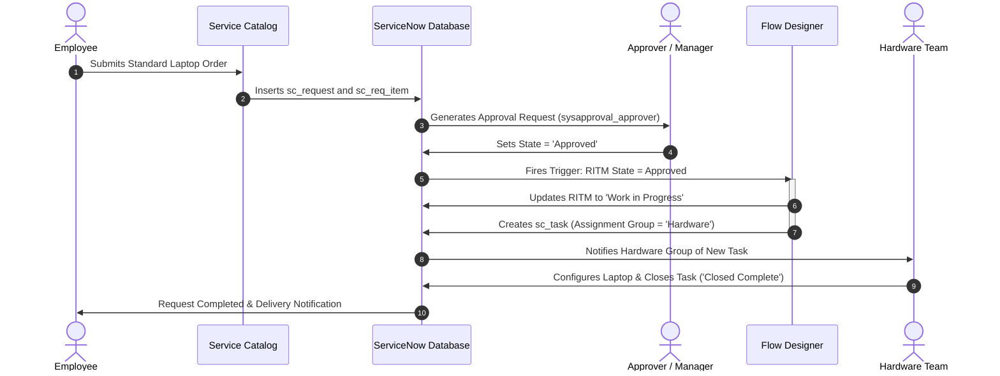

# Streamlining IT Procurement: Automating Standard Laptop Orders with Flow Designer

[](https://www.servicenow.com)
[](https://developer.servicenow.com)
[](https://docs.servicenow.com)
[](#)

---

## 📌 Executive Summary

In enterprise environments, the manual provisioning of IT assets—such as laptops—frequently results in operational bottlenecks, delayed employee onboarding, human data-entry errors, and poor request visibility. 

The **Streamlining IT Procurement: Automating Standard Laptop Orders with Flow Designer** project delivers an automated, self-service IT procurement solution on the **ServiceNow** platform. By leveraging the **Service Catalog**, **Requested Items (`sc_req_item`)**, **Approval Workflows**, and **Flow Designer**, this solution guarantees that upon managerial approval of a standard laptop request, an automated **Catalog Task (`sc_task`)** is immediately generated, pre-populated with hardware specifications, and routed directly to the **Hardware** assignment group.

---

## 👥 Project Team

| Name | Role | Core Responsibility |
| :--- | :--- | :--- |
| **Monish S** | **Team Lead** | Project Architecture, Milestone 1 (Flow Design & Triggers), Submission Management |
| **Nitheeswaran S** | **Member** | Milestone 2 (Flow Assignment to Standard Laptop Catalog Item, Script Automation) |
| **Pooja Shree** | **Member** | Milestone 3 (Service Catalog Form Design, Variable Sets, Order Placement & Approval) |
| **Yugesh Kumar J** | **Member** | Milestone 4 / Conclusion (Catalog Task Verification, Test Cases, Final Reporting) |

---

## 🎯 Key Objectives

1. **Self-Service Ordering:** Provide users with an intuitive **Standard Laptop** catalog item with configurable specifications (Model, RAM, Storage, Justification).
2. **Approval Automation:** Implement seamless approval mechanisms to validate hardware requests prior to fulfillment.
3. **Automated Task Routing:** Utilize **Flow Designer** to eliminate manual triage by automatically creating a fulfillment task assigned to the **Hardware** group upon approval.
4. **End-to-End Traceability:** Ensure status synchronization across Request (`REQ`), Requested Item (`RITM`), and Catalog Task (`TASK`).

---

## 🏗️ Architecture & Workflow

### 1. High-Level System Architecture


### 2. End-to-End Sequence Diagram



---

## 📂 Project Structure

```text
servicenow-laptop-procurement-automation/
│
├── README.md                           # Main project documentation & overview
├── .gitignore                          # Git tracking exclusions
│
├── scripts/
│   ├── setup_catalog_item.js           # GlideRecord background script to create Catalog Item & Variables
│   └── test_order_and_approval.js      # Automated test script to create RITM, approve, and verify Task
│
└── docs/
    ├── FLOW_DESIGNER_GUIDE.md          # Step-by-step Flow Designer configuration instructions
    ├── DEMO_VIDEO_SCRIPT.md            # 2-3 minute presentation script for team submission
    └── TEST_CASES.md                   # Formal QA test cases matrix (TC01-TC06)
```

---

## 🚀 Milestones & Implementation Details

### Milestone 1: Flow Creation (Flow Designer)
- **Objective:** Build the automated flow that responds to approved laptop requests.
- **Trigger:** Record Updated on `sc_req_item` where `Approval` is `Approved` AND `Cat Item` is `Standard Laptop`.
- **Actions:**
  1. **Update Record:** Set `sc_req_item.state` = `Work in Progress`.
  2. **Create Catalog Task:** Create record in `sc_task` referencing the trigger RITM.
  3. **Field Values:**
     - **Short Description:** `"Configure and Provision Standard Laptop"`
     - **Assignment Group:** `"Hardware"`
     - **Priority:** `3 - Moderate`
     - **Description:** Pull dynamic data pills from RITM variables (Model, RAM, Storage).

### Milestone 2: Flow Assignment to Standard Laptop Catalog Item
- **Objective:** Associate the Flow with the catalog definition to execute whenever an order is submitted.
- **Process:**
  - Navigate to **Service Catalog > Catalog Definitions > Maintain Items**.
  - Open `Standard Laptop`.
  - In the **Process Engine** tab, set:
    - **Flow:** `Standard Laptop Procurement Flow`
    - **Execution:** Runs automatically upon item request.

### Milestone 3: Service Catalog Item & Ordering
- **Objective:** Create a standardized, user-friendly ordering interface.
- **Variables Configured:**
  - `requested_for`: Reference to `sys_user` (Default: `javascript:gs.getUserID()`).
  - `laptop_model`: Select Box (`Dell Latitude 5440`, `Lenovo ThinkPad T14`, `MacBook Pro 14"`).
  - `ram`: Select Box (`16 GB`, `32 GB`).
  - `storage`: Select Box (`512 GB SSD`, `1 TB SSD`).
  - `business_justification`: Multi-line Text (Mandatory).

### Milestone 4 / Conclusion: Validation & Verification
- **Objective:** End-to-end testing, task verification, and submission prep.
- **Outcome:** The Catalog Task appears immediately under the RITM record with assignment group `Hardware`. Zero manual assignment required.

---

## 🛠️ Automated Setup via Background Scripts

If configuring on a fresh ServiceNow instance, you can use the automated scripts located in `scripts/`:

1. **Create Catalog Item & Variables:**
   - In ServiceNow, navigate to **System Definition > Scripts - Background**.
   - Copy the contents of [`scripts/setup_catalog_item.js`](file:///C:/Users/soman/.gemini/antigravity/scratch/servicenow-laptop-procurement-automation/scripts/setup_catalog_item.js).
   - Click **Run script**.

2. **Automated End-to-End Test:**
   - In **Scripts - Background**, run [`scripts/test_order_and_approval.js`](file:///C:/Users/soman/.gemini/antigravity/scratch/servicenow-laptop-procurement-automation/scripts/test_order_and_approval.js).
   - This script creates a test user request, approves it, and confirms task assignment to the **Hardware** group.

---

## 📊 Business Impact & Results

| Metric | Before Automation | After Automation | Improvement |
| :--- | :--- | :--- | :--- |
| **Task Creation Time** | 4 – 12 hours (manual review) | Instant (< 2 seconds) | **99.9% faster** |
| **Routing Accuracy** | ~85% (risk of wrong group) | 100% (rules-based to Hardware) | **Zero routing errors** |
| **Fulfillment Visibility** | Siloed in emails/chats | Centralized RITM / TASK audit trail | **Full compliance & auditability** |
| **Operational Overhead** | Requires manual dispatcher | Fully automated via Flow Designer | **Zero dispatcher cost** |

---

## 📹 Video Presentation & Repository Deliverables

- **Demo Video Script:** Refer to [`docs/DEMO_VIDEO_SCRIPT.md`](file:///C:/Users/soman/.gemini/antigravity/scratch/servicenow-laptop-procurement-automation/docs/DEMO_VIDEO_SCRIPT.md) for speaking cues.
- **Test Case Matrix:** Refer to [`docs/TEST_CASES.md`](file:///C:/Users/soman/.gemini/antigravity/scratch/servicenow-laptop-procurement-automation/docs/TEST_CASES.md).
- **Flow Designer Guide:** Refer to [`docs/FLOW_DESIGNER_GUIDE.md`](file:///C:/Users/soman/.gemini/antigravity/scratch/servicenow-laptop-procurement-automation/docs/FLOW_DESIGNER_GUIDE.md).
