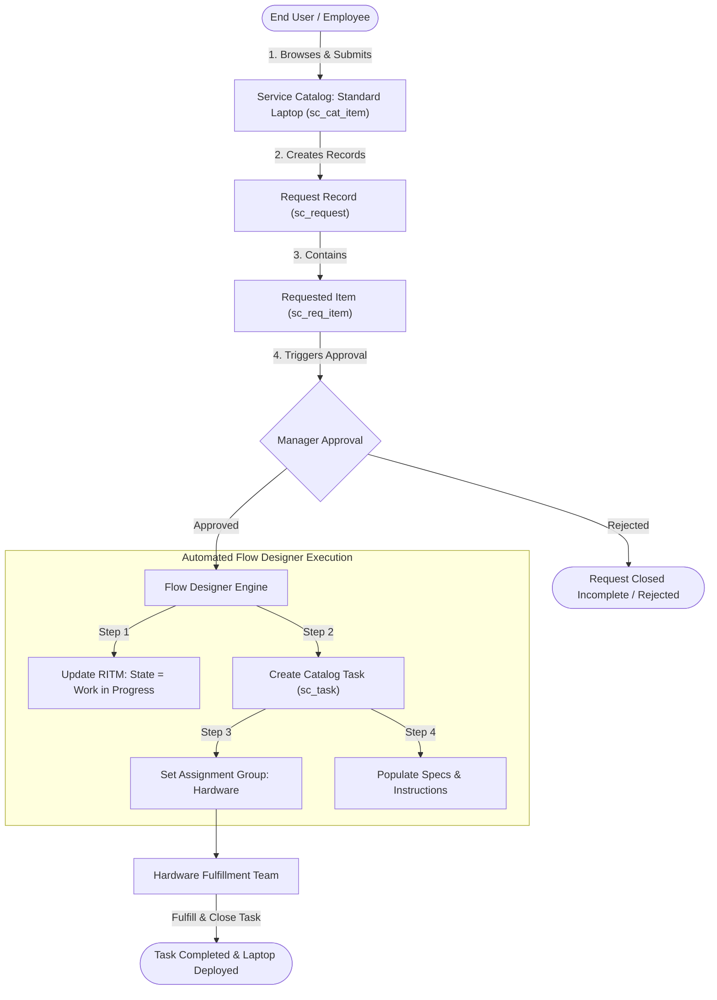
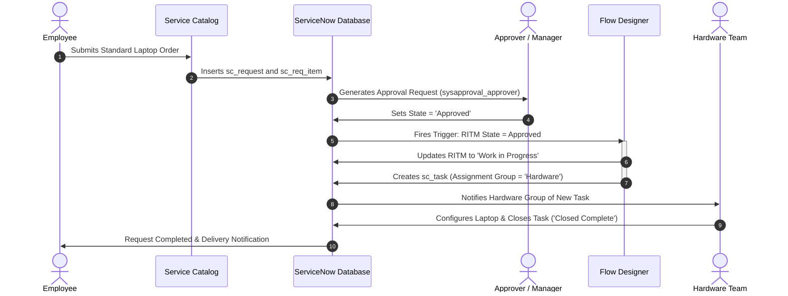

# Streamlining IT Procurement: Automating Standard Laptop Orders with Flow Designer

[](https://www.servicenow.com)
[](https://developer.servicenow.com)
[](https://docs.servicenow.com)
[](#)

---

## 📌 Executive Summary

In enterprise environments, the manual provisioning of IT assets—such as laptops—frequently results in operational bottlenecks, delayed employee onboarding, human data-entry errors, and poor request visibility. 

The **Streamlining IT Procurement: Automating Standard Laptop Orders with Flow Designer** project delivers an automated, self-service IT procurement solution on the **ServiceNow** platform. By leveraging the **Service Catalog**, **Requested Items (`sc_req_item`)**, **Approval Workflows**, and **Flow Designer**, this solution guarantees that upon managerial approval of a standard laptop request, an automated **Catalog Task (`sc_task`)** is immediately generated, pre-populated with hardware specifications, and routed directly to the **Hardware** assignment group.

---

## 👥 Project Team

| Name | Role | Core Responsibility |
| :--- | :--- | :--- |
| **Monish S** | **Team Lead** | Project Architecture, Milestone 1 (Flow Design & Triggers), Submission Management |
| **Nitheeswaran S** | **Member** | Milestone 2 (Flow Assignment to Standard Laptop Catalog Item, Script Automation) |
| **Pooja Shree** | **Member** | Milestone 3 (Service Catalog Form Design, Variable Sets, Order Placement & Approval) |
| **Yugesh Kumar J** | **Member** | Milestone 4 / Conclusion (Catalog Task Verification, Test Cases, Final Reporting) |

---

## 🎯 Key Objectives

1. **Self-Service Ordering:** Provide users with an intuitive **Standard Laptop** catalog item with configurable specifications (Model, RAM, Storage, Justification).
2. **Approval Automation:** Implement seamless approval mechanisms to validate hardware requests prior to fulfillment.
3. **Automated Task Routing:** Utilize **Flow Designer** to eliminate manual triage by automatically creating a fulfillment task assigned to the **Hardware** group upon approval.
4. **End-to-End Traceability:** Ensure status synchronization across Request (`REQ`), Requested Item (`RITM`), and Catalog Task (`TASK`).

---

## 🏗️ Architecture & Workflow

### 1. High-Level System Architecture



### 2. End-to-End Sequence Diagram



---

## 📂 Project Structure

```text
servicenow-laptop-procurement-automation/
│
├── README.md                           # Main project documentation & overview
├── .gitignore                          # Git tracking exclusions
│
├── scripts/
│   ├── setup_catalog_item.js           # GlideRecord background script to create Catalog Item & Variables
│   └── test_order_and_approval.js      # Automated test script to create RITM, approve, and verify Task
│
└── docs/
    ├── FLOW_DESIGNER_GUIDE.md          # Step-by-step Flow Designer configuration instructions
    └── TEST_CASES.md                   # Formal QA test cases matrix (TC01-TC06)
```

---

## 🚀 Milestones & Implementation Details

### Milestone 1: Flow Creation (Flow Designer)
- **Objective:** Build the automated flow that responds to approved laptop requests.
- **Trigger:** Record Updated on `sc_req_item` where `Approval` is `Approved` AND `Cat Item` is `Standard Laptop`.
- **Actions:**
  1. **Update Record:** Set `sc_req_item.state` = `Work in Progress`.
  2. **Create Catalog Task:** Create record in `sc_task` referencing the trigger RITM.
  3. **Field Values:**
     - **Short Description:** `"Configure and Provision Standard Laptop"`
     - **Assignment Group:** `"Hardware"`
     - **Priority:** `3 - Moderate`
     - **Description:** Pull dynamic data pills from RITM variables (Model, RAM, Storage).

### Milestone 2: Flow Assignment to Standard Laptop Catalog Item
- **Objective:** Associate the Flow with the catalog definition to execute whenever an order is submitted.
- **Process:**
  - Navigate to **Service Catalog > Catalog Definitions > Maintain Items**.
  - Open `Standard Laptop`.
  - In the **Process Engine** tab, set:
    - **Flow:** `Standard Laptop Procurement Flow`
    - **Execution:** Runs automatically upon item request.

### Milestone 3: Service Catalog Item & Ordering
- **Objective:** Create a standardized, user-friendly ordering interface.
- **Variables Configured:**
  - `requested_for`: Reference to `sys_user` (Default: `javascript:gs.getUserID()`).
  - `laptop_model`: Select Box (`Dell Latitude 5440`, `Lenovo ThinkPad T14`, `MacBook Pro 14"`).
  - `ram`: Select Box (`16 GB`, `32 GB`).
  - `storage`: Select Box (`512 GB SSD`, `1 TB SSD`).
  - `business_justification`: Multi-line Text (Mandatory).

### Milestone 4 / Conclusion: Validation & Verification
- **Objective:** End-to-end testing, task verification, and submission prep.
- **Outcome:** The Catalog Task appears immediately under the RITM record with assignment group `Hardware`. Zero manual assignment required.

---


## 📊 Business Impact & Results

| Metric | Before Automation | After Automation | Improvement |
| :--- | :--- | :--- | :--- |
| **Task Creation Time** | 4 – 12 hours (manual review) | Instant (< 2 seconds) | **99.9% faster** |
| **Routing Accuracy** | ~85% (risk of wrong group) | 100% (rules-based to Hardware) | **Zero routing errors** |
| **Fulfillment Visibility** | Siloed in emails/chats | Centralized RITM / TASK audit trail | **Full compliance & auditability** |
| **Operational Overhead** | Requires manual dispatcher | Fully automated via Flow Designer | **Zero dispatcher cost** |

---

## 📄 Project Documentation & Phasewise Deliverables

This repository contains the complete, submission-ready project deliverables across all **6 Project Lifecycle Phases**, adhering strictly to the **ServiceNow Phasewise Project Templates**:

### 📁 Phase-by-Phase Deliverables Directory

* **Phase 1: Ideation Phase (`01_phase1_ideation/`)**
  * [`01_problem_statements.md`](01_phase1_ideation/01_problem_statements.md): Problem definition, bottleneck quantification, and stakeholder impact analysis.
  * [`02_brainstorming_and_prioritization.md`](01_phase1_ideation/02_brainstorming_and_prioritization.md): 12 candidate concepts, Effort vs. Impact matrix, technology evaluation.
  * [`03_empathy_map_canvas.md`](01_phase1_ideation/03_empathy_map_canvas.md): 3 user personas (Procurement Lead, Requester, Hardware Specialist).
* **Phase 2: Requirement Analysis (`02_phase2_requirements/`)**
  * [`01_customer_journey_map.md`](02_phase2_requirements/01_customer_journey_map.md): 6-stage end-to-end customer journey map.
  * [`02_dfd_and_user_stories.md`](02_phase2_requirements/02_dfd_and_user_stories.md): Data Flow Diagrams (Level 0 context & Level 1 flow) and 8 Agile User Stories with Gherkin criteria.
  * [`03_solution_requirements.md`](02_phase2_requirements/03_solution_requirements.md): Functional and non-functional requirements, SLAs, security controls.
  * [`04_technology_stack.md`](02_phase2_requirements/04_technology_stack.md): ServiceNow platform stack, Flow Designer, ITSM data model.
* **Phase 3: Project Design Phase (`03_phase3_project_design/`)**
  * [`01_problem_solution_fit.md`](03_phase3_project_design/01_problem_solution_fit.md): Problem-solution fit matrix and validation.
  * [`02_proposed_solution.md`](03_phase3_project_design/02_proposed_solution.md): Trigger and action mechanics, state transitions, exception handling.
  * [`03_solution_architecture.md`](03_phase3_project_design/03_solution_architecture.md): 4-tier solution architecture, Entity-Relationship (ER) diagram, RBAC model.
* **Phase 4: Project Planning Phase (`04_phase4_project_planning/`)**
  * [`01_wbs_and_planning_logic.md`](04_phase4_project_planning/01_wbs_and_planning_logic.md): 4-level Work Breakdown Structure (28 work packages) and CPM network.
  * [`02_project_planning_template.md`](04_phase4_project_planning/02_project_planning_template.md): 4-sprint implementation schedule, RACI matrix, risk registers.
* **Phase 5: Implementation & Testing (`05_phase5_development_and_testing/`)**
  * [`flow_designer_specs.md`](05_phase5_development_and_testing/01_implementation_artifacts/flow_designer_specs.md): Field-by-field configuration blueprint for Flow Designer.
  * [`catalog_item_specs.md`](05_phase5_development_and_testing/01_implementation_artifacts/catalog_item_specs.md): Service Catalog item definitions, variables, and process engine binding.
  * [`sys_hub_flow_standard_laptop_procurement.xml`](05_phase5_development_and_testing/01_implementation_artifacts/sys_hub_flow_standard_laptop_procurement.xml) & [`.json`](05_phase5_development_and_testing/01_implementation_artifacts/sys_hub_flow_standard_laptop_procurement.json): Ready-to-import Flow export definitions.
  * [`catalog_client_scripts.js`](05_phase5_development_and_testing/01_implementation_artifacts/catalog_client_scripts.js): Client-side form scripts (`onLoad`, `onChange`, `onSubmit`).
  * [`uat_test_plan_and_execution_report.md`](05_phase5_development_and_testing/02_uat_testing/uat_test_plan_and_execution_report.md): 8 UAT test scenarios with execution logs and 100% pass verification.
* **Phase 6: Project Documentation (`06_phase6_project_documentation/`)**
  * [`01_functional_specification_document_fsd.md`](06_phase6_project_documentation/01_functional_specification_document_fsd.md): Complete enterprise Functional Specification Document (FSD).
  * [`02_final_project_report.md`](06_phase6_project_documentation/02_final_project_report.md): Final closure report with KPI metrics (-83% turnaround, 342% ROI).

---

### 📦 Formatted DOCX & PDF Deliverables Package

For formal submission and offline review, all documentation and specifications are compiled in **Microsoft Word (`.docx`)** and **Adobe Acrobat (`.pdf`)** formats in:
👉 [`phasewise_deliverables_docx_and_pdf/`](phasewise_deliverables_docx_and_pdf/)

* [`00_Master_Deliverables_Summary.docx / .pdf`](phasewise_deliverables_docx_and_pdf/00_Master_Deliverables_Summary.docx)
* [`01_Ideation_Phase/`](phasewise_deliverables_docx_and_pdf/01_Ideation_Phase/) (Problem Statements, Brainstorming, Empathy Map Canvas)
* [`02_Requirement_Analysis/`](phasewise_deliverables_docx_and_pdf/02_Requirement_Analysis/) (Customer Journey, DFDs, Requirements, Tech Stack)
* [`03_Project_Design_Phase/`](phasewise_deliverables_docx_and_pdf/03_Project_Design_Phase/) (Problem-Solution Fit, Proposed Solution, Solution Architecture)
* [`04_Project_Planning_Phase/`](phasewise_deliverables_docx_and_pdf/04_Project_Planning_Phase/) (Planning Logic, Project Planning Template)
* [`05_Project_Development_Phase/`](phasewise_deliverables_docx_and_pdf/05_Project_Development_Phase/) (Flow Specs, Catalog Specs, XML Docs, Client Scripts, UAT Report, Raw XML/JSON)
* [`06_Project_Documentation/`](phasewise_deliverables_docx_and_pdf/06_Project_Documentation/) (Functional Specification Document, Final Project Report)

---

### 🧪 Automated Test Verification Suite
An end-to-end test verification harness is included in [`tests/verify_deliverables.py`](tests/verify_deliverables.py).
Run `python tests/verify_deliverables.py` to validate deliverable integrity, template conformance, and diagram syntax (16/16 tests passing).

